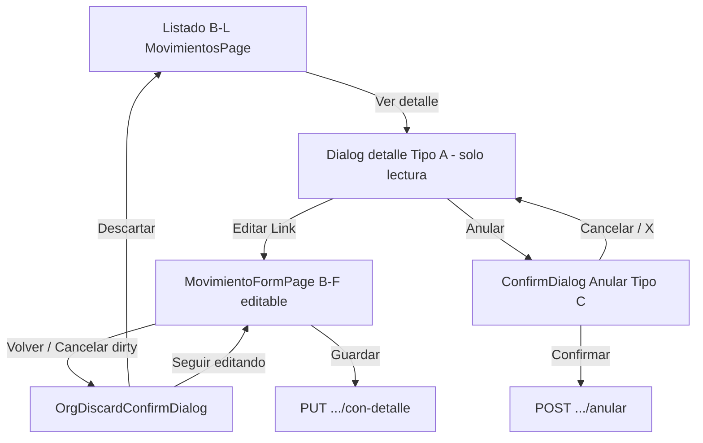

# UX-004 — Auditoría: Dirty Guard en Anular Movimientos

**Fecha:** 10 junio 2026  
**Estado:** Solo auditoría — sin implementación, sin commits  
**ID:** UX-004  
**Alcance:** `MovimientosPage.tsx`, flujo Anular, `ConfirmDialog`, estados dirty/B.1.1, hooks relacionados  
**Norma de referencia:** ERP Frontend Standards **V2.1**  
**Auditorías previas:** `ERP_MODAL_AND_WORKFLOW_UX_AUDIT.md` (D-INV-04), `INV_M2_SEC_AUDIT.md` (SEC-B11-04, SEC-LOSS-06), `UX_003_DIRTY_GUARD_APROBAR_IF_AUDIT.md` (paridad), `UX_003_PRE_IMPLEMENTATION_REVIEW.md` (UX-004 candidato)

---

## 1. Resumen ejecutivo

| Dimensión | Veredicto |
|-----------|-----------|
| **Stacking modal (B11-10/11, PB-13/14)** | ✅ **Conforme** |
| **Semántica variant Anular (UX-06)** | ✅ **Conforme** (`variant="danger"`) |
| **Dirty guard en confirm Anular (motivo)** | ❌ **No implementado** — hallazgo **D-INV-04** |
| **Dirty guard B-F → Anular sin guardar** | ⚠️ **Parcial** — no hay botón Anular en formulario; salida sí tiene guard |
| **Severidad global UX-004** | **P2** — pérdida silenciosa de texto en confirm; riesgo funcional bajo (motivo opcional) |
| **Equivalencia con UX-003** | **Sí** — mismo gap, **menor complejidad** (un campo, sin prefill async) |
| **Recomendación** | **Gap real confirmado** — implementar dirty guard local reutilizando patrón UX-003; no iniciar en esta fase |

---

## 2. Alcance y archivos analizados

| Archivo | Rol en flujo Anular |
|---------|---------------------|
| `src/features/inv/pages/MovimientosPage.tsx` | B-L listado, detalle Tipo A, workflow Anular Tipo C |
| `src/features/inv/pages/MovimientoFormPage.tsx` | B-F edición documento (referencia cruzada — **sin** acción Anular) |
| `src/features/inv/hooks/movimientos.hooks.ts` | `useAnularMovimiento`, queries con-detalle |
| `src/features/inv/hooks/useInvTransactionalFormGuard.ts` | Guard B-F (no usado en listado) |
| `src/features/inv/utils/inv-list-empresa-reset.ts` | Reset estados UI al cambiar empresa (incl. `anularMotivo`) |
| `src/shared/components/ui/ConfirmDialog.tsx` | Primitiva confirm workflow |
| `src/features/org/components/OrgDiscardConfirmDialog.tsx` | B.1.1 discard — **no usado** en MovimientosPage |

**Fuera de alcance explícito:** `InventarioFisicoPage` (Anular IF sin campos — no aplica UX-004), catálogos ORG, backend API, implementación UX-003 ya cerrada en IF Aprobar.

**Confirmación de existencia UX-004:** El gap **existe**, está documentado como **D-INV-04** / **SEC-LOSS-06** / **SEC-10** (backlog R-06), y el alcance exacto es **únicamente** el `ConfirmDialog` Anular en `MovimientosPage` con textarea `anularMotivo`.

---

## 3. Flujo actual documentado

### 3.1 Diagrama de superficies



### 3.2 Escenario A — Usuario en listado/detalle intenta Anular

| Paso | Qué ocurre | Evidencia |
|------|------------|-----------|
| 1 | Abre listado movimientos | `MovimientosPage` |
| 2 | Click **Ver detalle** → abre detalle Radix | `abrirDetalle(row)` → `setSelectedMovimientoId`, `setDetailOpen(true)` |
| 3 | Detalle es **solo lectura** — sin inputs de documento | Labels + tabla líneas |
| 4 | Click **Anular** | `setDetailOpen(false)` → `setAnularOpen(true)` |
| 5 | Radix detalle oculto; confirm visible | `detailDialogOpen = detailOpen && !workflowConfirmOpen` |
| 6 | Usuario escribe **motivo opcional** en children del confirm | `anularMotivo` |
| 7a | **Confirmar** | `ejecutarAnular` → `useAnularMovimiento` con `{ motivo: anularMotivo.trim() \|\| null }` |
| 7b | **Cancelar / X** | `cerrarAnular()` → reset motivo + reabre detalle |

**Respuestas escenario A:**

| Pregunta | Respuesta |
|----------|-----------|
| ¿Existe textarea de motivo? | **Sí** — único campo editable del confirm |
| ¿Existe otro campo editable en el confirm? | **No** |
| ¿Cancelar pierde datos ingresados? | **Sí** — `setAnularMotivo('')` sin aviso |
| ¿Existe dirty guard? | **No** |
| ¿Existe baseline? | **No** |
| ¿Existe confirmación de descarte? | **No** — no hay `OrgDiscardConfirmDialog` |
| ¿B11-10 / B11-11? | **No violados** — detalle cierra antes del confirm |
| ¿Overlays simultáneos? | **No** — `detailDialogOpen` false mientras `anularOpen` |

### 3.3 Escenario B — Usuario modifica documento (B-F) e intenta Anular sin guardar

| Paso | Qué ocurre | Evidencia |
|------|------------|-----------|
| 1 | Desde detalle → **Editar cabecera y líneas** | Link a `/inv/movimientos/{id}/editar` |
| 2 | `MovimientoFormPage` — edita cabecera/líneas | `useInvTransactionalFormGuard` |
| 3 | Usuario intenta **Anular** | **No existe acción Anular** en FormPage |
| 4 | Para Anular debe **salir** al listado | Guard dirty en salida |
| 5 | Si dirty → `OrgDiscardConfirmDialog` | Patrón B-F |
| 6 | Desde listado abre detalle y Anular | Anular opera sobre **datos persistidos en servidor** |

**Respuestas escenario B:**

| Pregunta | Respuesta |
|----------|-----------|
| ¿Se permite Anular con dirty en formulario? | **No directamente** — sin UI Anular en B-F |
| ¿Se pierde borrador B-F al Anular? | **N/A** — flujos separados |
| ¿Existe guard dirty al salir B-F? | **Sí** — `OrgDiscardConfirmDialog` |

### 3.4 Escenario C — Usuario rellena confirm Anular y cancela (núcleo UX-004)

| Paso | Comportamiento | Código |
|------|----------------|--------|
| 1 | Abre confirm, escribe motivo | `anularMotivo` local |
| 2 | Click **Cancelar** o **X** | `onClose={() => cerrarAnular()}` |
| 3 | `cerrarAnular` ejecuta | `setAnularOpen(false)`, `setAnularMotivo('')` |
| 4 | Reabre detalle | `reopenDetailIfSelected()` |
| 5 | **Sin** `OrgDiscardConfirmDialog` | — |

**Hallazgo UX-004:** pérdida silenciosa del motivo escrito — alineado con **D-INV-04** / **SEC-LOSS-06**.

### 3.5 Escenario D — Autorizar / Procesar (referencia — fuera alcance UX-004)

| Confirm | Campos editables | Dirty guard requerido |
|---------|------------------|----------------------|
| Autorizar | Ninguno | **No** (PB-14 no aplica) |
| Procesar | Ninguno | **No** |

---

## 4. Evidencia de código

### 4.1 Estados locales Anular

```51:54:src/features/inv/pages/MovimientosPage.tsx
  const [procesarOpen, setProcesarOpen] = useState(false);
  const [autorizarOpen, setAutorizarOpen] = useState(false);
  const [anularOpen, setAnularOpen] = useState(false);
  const [anularMotivo, setAnularMotivo] = useState('');
```

**Observaciones:**
- No existe `anularBaseline`, `discardPending`, ni ref de captura.
- `anularMotivo` **no** se resetea al **abrir** Anular — solo al **cerrar** vía `cerrarAnular`. En flujo nominal el valor previo ya fue limpiado en cierre anterior.

### 4.2 Stacking y defensa PB-13 / PB-14 (conforme V2.1)

```175:176:src/features/inv/pages/MovimientosPage.tsx
  const workflowConfirmOpen = autorizarOpen || procesarOpen || anularOpen;
  const detailDialogOpen = detailOpen && !workflowConfirmOpen;
```

```422:428:src/features/inv/pages/MovimientosPage.tsx
                <Button
                  type="button"
                  variant="destructive"
                  onClick={() => {
                    setDetailOpen(false);
                    setAnularOpen(true);
                  }}
```

```377:381:src/features/inv/pages/MovimientosPage.tsx
      <Dialog
        open={detailDialogOpen}
        onOpenChange={(open) => {
          if (!open && !workflowConfirmOpen) setDetailOpen(false);
        }}
```

### 4.3 Cierre confirm sin dirty guard

```192:196:src/features/inv/pages/MovimientosPage.tsx
  const cerrarAnular = (reopenDetail = true) => {
    setAnularOpen(false);
    setAnularMotivo('');
    if (reopenDetail) reopenDetailIfSelected();
  };
```

```545:565:src/features/inv/pages/MovimientosPage.tsx
      <ConfirmDialog
        isOpen={anularOpen}
        onClose={() => cerrarAnular()}
        onConfirm={() => void ejecutarAnular()}
        title="Anular movimiento"
        message={`¿Anular el movimiento '${movConfirmLabel}'? Podrá indicar un motivo opcional abajo.`}
        confirmText="Anular"
        cancelText="Cancelar"
        variant="danger"
        loading={anularMutation.isPending}
      >
        <div className="space-y-2">
          <Label>Motivo (opcional)</Label>
          <textarea
            value={anularMotivo}
            onChange={(e) => setAnularMotivo(e.target.value)}
            rows={3}
            ...
          />
        </div>
      </ConfirmDialog>
```

### 4.4 Mutación — sin lógica dirty

```212:217:src/features/inv/pages/MovimientosPage.tsx
  const ejecutarAnular = () => {
    if (!selectedMovimientoId || !canEditar) return;
    void anularMutation
      .mutateAsync({ movimientoId: selectedMovimientoId, payload: { motivo: anularMotivo.trim() || null } })
      .then(() => cerrarAnular(false));
  };
```

```214:228:src/features/inv/hooks/movimientos.hooks.ts
export function useAnularMovimiento() {
  ...
  return useMutation<...>({
    mutationFn: ({ movimientoId, payload }) => movimientoService.anular(movimientoId, payload),
    onSuccess: (...) => { ... toast.success('Movimiento anulado.'); },
    onError: (err) => toast.error(getErrorMessage(err).message),
  });
}
```

Toast error solo en hook — **ER-02** conforme. Motivo es **opcional** — no hay validación cliente pre-mutación (diferencia vs UX-003 donde tipo es requerido).

### 4.5 Reset empresa (O6)

```23:30:src/features/inv/utils/inv-list-empresa-reset.ts
export function resetMovimientosListUiState(s: MovimientosListUiSetters): void {
  s.setDetailOpen(false);
  s.setSelectedMovimientoId(null);
  s.setAutorizarOpen(false);
  s.setProcesarOpen(false);
  s.setAnularOpen(false);
  s.setAnularMotivo('');
}
```

Documentado en `INV_M2_SEC_QA_BEHAVIOR_MATRIX.md` §8: confirm anular con motivo escrito → cierra y `anularMotivo = ''` **sin** discard confirm (comportamiento actual esperado O6).

### 4.6 OrgDiscardConfirmDialog — ausente

`MovimientosPage.tsx` **no importa ni renderiza** `OrgDiscardConfirmDialog`. El discard B.1.1 existe solo en `MovimientoFormPage` (B-F).

---

## 5. Comparación con UX-003 (Inventario Físico — Aprobar)

| Aspecto | UX-003 (Aprobar IF) — pre-fix | UX-004 (Anular Mov) — actual |
|---------|-------------------------------|------------------------------|
| Pantalla | `InventarioFisicoPage` | `MovimientosPage` |
| Confirm | Aprobar | Anular |
| Campos editables | Select tipo (requerido) + textarea obs | Textarea motivo (opcional) |
| Estado campo(s) | `aprobarTipoMovimientoId`, `aprobarObs` | `anularMotivo` |
| Cierre sin guard | Reset silencioso | Reset silencioso |
| Dirty guard | ❌ → ✅ implementado post UX-003 | ❌ pendiente |
| Baseline | ❌ → snapshot post-fetch tipos | ❌ — baseline trivial `{ motivo: '' }` |
| Prefill async | Sí (`tiposAjuste[0]`) | **No** |
| Variant confirm | `warning` (UX-05) | `danger` (UX-06) |
| Validación cliente | Tipo requerido → toast | Motivo opcional — sin toast |
| Stacking detalle/confirm | Conforme B11-10 | Conforme B11-10 |
| ID deuda | D-INV-03 / SEC-LOSS-05 | D-INV-04 / SEC-LOSS-06 |
| Severidad | P2 | P2 |

### 5.1 Similitudes

- Mismo patrón B-L: detalle lectura → cierra detalle → `ConfirmDialog` con children editables.
- Mismo anti-patrón: `onClose` llama función que resetea campos sin interceptar dirty.
- Misma solución arquitectónica validada en UX-003: baseline + `isDirty` + `handleRequestClose` + `OrgDiscardConfirmDialog` modo `'edit'`.
- Misma invariante stacking post-fix: cerrar confirm primario antes de discard secundario.

### 5.2 Diferencias

| Diferencia | Impacto en implementación |
|------------|---------------------------|
| Un solo campo vs dos | **Menor LOC** en UX-004 |
| Motivo opcional vs tipo requerido | Dirty solo si texto no vacío (tras trim); cancel limpio si motivo vacío |
| Sin prefill async | Baseline capturable **sincrónicamente** en `handleOpenAnular` — **no** requiere `useEffect` post-query |
| `variant="danger"` vs `warning` | Sin cambio — discard sigue `warning` vía OrgDiscard |
| Reset empresa vía helper | UX-003 resolvió discard/baseline en página; UX-004 debería **replicar** ese criterio (no extender helper salvo necesidad) |

### 5.3 ¿Reutiliza exactamente el patrón UX-003?

**Sí, con adaptación mínima.** Es el mismo patrón mecánico implementado en `InventarioFisicoPage` post UX-003:

1. `handleOpenAnular` — reset campos, baseline null, abrir confirm.
2. Captura baseline `{ motivo: '' }` al abrir (sync, sin effect).
3. `isAnularConfirmDirty` — `anularMotivo.trim() !== baseline.motivo.trim()`.
4. `handleRequestCloseAnular` — guard `isPending`; si dirty → `setAnularOpen(false)` + `setDiscardPending('edit')`.
5. `OrgDiscardConfirmDialog` + cancel/confirm handlers.
6. `detailDialogOpen` excluye `discardPending`.
7. `onOpenChange` detalle guard `discardPending === null`.
8. `scheduleModalStackValidation` en handlers (DEV).

**No requiere** el `useEffect` de estabilización de tipos de UX-003.

---

## 6. Cumplimiento V2.1

| Regla | Aplica a Mov Anular | Estado | Notas |
|-------|---------------------|--------|-------|
| **B11-01…09** | Detalle / confirm workflow | **N/A / Parcial** | Detalle lectura — SEC-08 ✅ |
| **B11-10** | Anular desde detalle | ✅ | `setDetailOpen(false)` antes `setAnularOpen(true)` |
| **B11-11** | Idem | ✅ | Secuencia correcta |
| **PB-13** | Idem | ✅ | Un workflow confirm a la vez |
| **PB-14** | Idem | ✅ SHOULD stacking defensivo implementado |
| **PB-08** | Workflow vs B.1.1 página | ✅ | No mezcla con FormPage guard |
| **UX-05** | Autorizar/Procesar | ✅ | `variant="warning"` |
| **UX-06** | Anular | ✅ | `variant="danger"` en confirm Anular |
| **UX-08** | Discard confirm Anular | ❌ | No usa `OrgDiscardConfirmDialog` en workflow |
| **MD-01** | Clasificación | ✅ | Detalle A, confirm C |
| **MD-04** | Confirm | ✅ | Máx. 1 overlay en estado actual |
| **SEC-08** | Detalle lectura | ✅ | |
| **SEC-09** | Confirm workflow | ✅ respetado | MUST NOT B.1.1 completo en one-shot — dirty guard **ligero** no contradice |
| **SEC-10** | Campo motivo | ❌ | **MAY** dirty — **no implementado** (Anexo R-06) |

**Interpretación normativa:** Igual que UX-003 — V2.1 documenta SEC-10 / R-06 como backlog MAY. El gap es deuda UX P2, no violación de MUST stacking o variantes.

---

## 7. Hallazgos clasificados

| ID | Hallazgo | Severidad | Tipo |
|----|----------|-----------|------|
| **UX-004-01** | Confirm Anular resetea `anularMotivo` al cancelar sin confirmación dirty | **P2** | UX / deuda SEC-10 |
| **UX-004-02** | No hay snapshot/baseline del motivo al abrir | **P2** | Técnico |
| **UX-004-03** | FormPage dirty → Anular requiere descartar o guardar primero (by design) | **Info** | Flujo correcto |
| **UX-004-04** | Motivo opcional — impacto UX menor que UX-003 (tipo requerido) | **Info** | Contexto severidad |
| **UX-004-05** | Stacking B11-10/11 + PB-13/14 | **Mantener** | Conforme |
| **UX-004-06** | UX-06 danger en Anular | **Mantener** | Conforme |
| **UX-004-07** | Reset empresa cierra confirm y borra motivo sin discard | **Info** | O6 documentado — coherente con UX-003 post-fix |

---

## 8. Riesgos

### 8.1 Riesgos funcionales

| Riesgo | Prob. | Impacto | Descripción |
|--------|-------|---------|-------------|
| Anular sin motivo tras cancel accidental | Media | **Bajo** | Motivo es opcional — anulación sigue siendo válida sin texto |
| Anular versión servidor ignorando borrador B-F | Baja | Medio | Mitigado: guard en salida FormPage |
| Pérdida motivo audit trail | Media | Bajo–Medio | Usuario debe reescribir motivo |

### 8.2 Riesgos UX

| Riesgo | Prob. | Impacto |
|--------|-------|---------|
| Pérdida silenciosa motivo largo | **Alta** | Medio — frustración al reescribir |
| Usuario confunde cancel Anular con cancel acción destructiva | Baja | Bajo — confirm ya advierte |
| Expectativa paridad post UX-003 en IF | Media | Bajo — inconsistencia temporal entre módulos |

### 8.3 Riesgos técnicos

| Riesgo | Prob. | Impacto |
|--------|-------|---------|
| Segundo overlay discard mal implementado | Media | Medio — mitigable copiando invariante UX-003 |
| `discardPending` huérfano tras cambio empresa | Baja | Medio — reset en `resetPageFilters` como UX-003 |
| Falso dirty por espacios en motivo | Baja | Bajo — `trim()` en compare |

### 8.4 Riesgos stacking

| Riesgo | Prob. | Impacto | Estado actual |
|--------|-------|---------|---------------|
| Detalle + Anular simultáneos | Baja | Alto | ✅ Mitigado (`detailDialogOpen`) |
| Anular + OrgDiscard simultáneos | N/A | Alto | N/A — discard no existe aún |
| Post-fix: dos ConfirmDialog | Media si mal impl. | Alto | Requiere patrón UX-003 |

---

## 9. Alternativas (NO IMPLEMENTAR — solo análisis)

### 9.1 Alternativa A — Dirty guard local (recomendada — paridad UX-003)

**Descripción:** Snapshot `{ motivo: '' }` al abrir. `handleRequestCloseAnular` intercepta cancel dirty → `OrgDiscardConfirmDialog`.

| Pros | Contras |
|------|---------|
| Paridad UX-003 / D-INV-04 cerrado | ~50–70 LOC en `MovimientosPage.tsx` |
| Baseline sync — más simple que UX-003 | Segundo estado `discardPending` |
| Cumple SEC-10 / UX-08 | Ajuste `onOpenChange` + reset página |

**Impacto:** Solo `MovimientosPage.tsx`. Sin cambios API/hooks/primitivas globales.

### 9.2 Alternativa B — Persistir motivo hasta éxito o cambio selección

| Pros | Contras |
|------|---------|
| ~10 LOC | No avisa — no cumple espíritu B.1.1 |
| | Comportamiento implícito |

**No recomendada** como única solución.

### 9.3 Alternativa C — B.1.1 completo en confirm Anular

**Conflicta SEC-09** — **No recomendada.**

### 9.4 Alternativa D — Extraer helper compartido `createInvWorkflowConfirmDiscardHandlers`

| Pros | Contras |
|------|---------|
| DRY tras UX-003 + UX-004 | Fuera alcance mínimo UX-004 |
| | Usuario pidió no helpers en UX-003; evaluar post UX-004 |

**Posponer** hasta tener 2 casos implementados inline.

---

## 10. Estimación de implementación (referencia futura)

| Tarea | Esfuerzo | Archivos |
|-------|----------|----------|
| Snapshot + dirty compare (1 campo) | 1–2 h | `MovimientosPage.tsx` |
| Integrar `OrgDiscardConfirmDialog` + stacking guards | 1–2 h | Idem |
| `handleOpenAnular` + reset `resetPageFilters` | 0.5 h | Idem |
| QA manual (matriz §11) | 1 h | — |
| **Total UX-004** | **~3–5 h** | **1 archivo** |

**Complejidad relativa:** **Baja** — inferior a UX-003 (~4–7 h) por ausencia de prefill async y un solo campo.

**Reset empresa:** Replicar criterio UX-003 — limpiar `anularBaseline` y `discardPending` en `resetPageFilters` de la página; **no modificar** `inv-list-empresa-reset.ts` salvo decisión explícita contraria.

---

## 11. Checklist QA manual (post-implementación futura)

| # | Caso | Esperado actual | Esperado post-fix |
|---|------|-----------------|-------------------|
| QA-1 | Anular sin escribir motivo → Cancelar | Cierra sin fricción | Igual |
| QA-2 | Escribir motivo → Cancelar | Pierde texto silencioso | Confirm discard |
| QA-3 | Escribir motivo → Seguir editando | N/A | Vuelve al confirm con texto |
| QA-4 | Solo espacios en motivo → Cancelar | Pierde (trim vacío) | Igual — no dirty |
| QA-5 | Anular éxito | Toast hook; cierra confirm | Igual |
| QA-6 | Abrir Anular con detalle | Sin overlay doble | Igual (B11-10) |
| QA-7 | Form B-F dirty → Volver | OrgDiscardConfirmDialog | Igual |
| QA-8 | Autorizar/Procesar cancel | Sin dirty (sin campos) | Igual |
| QA-9 | Cambio empresa con confirm abierto | Reset O6 | + limpiar discard/baseline |
| QA-10 | Cancel durante `isPending` | Debe no cerrar | Guard en request close |

---

## 12. Veredicto final

| Pregunta | Respuesta |
|----------|-----------|
| **¿Existe gap real?** | **Sí** — D-INV-04 / SEC-LOSS-06 confirmado en código |
| **¿Es equivalente a UX-003?** | **Sí** — mismo anti-patrón, **menor complejidad** |
| **¿Se justifica implementación?** | **Sí** — P2 deuda SEC-10; paridad UX módulo INV; motivo opcional reduce urgencia vs UX-003 pero no elimina el gap |
| **¿Puede reutilizarse el mismo patrón?** | **Sí** — copia directa del patrón UX-003 implementado, sin `useEffect` baseline |
| **¿Complejidad estimada?** | **Baja** — ~3–5 h, 1 archivo |
| **¿UX-004 existe con alcance claro?** | **Sí** — solo `MovimientosPage` → confirm **Anular** con `anularMotivo` |
| **¿Listo para plan/implementación?** | **Sí** — tras aprobación explícita (esta auditoría no autoriza implementación) |

### Recomendación

**Confirmar UX-004 como ticket válido** y proceder con **Alternativa A** (dirty guard local, paridad UX-003) en sprint dedicado, **después** de sign-off de UX-003 en entorno objetivo.

**No implementar** en esta fase — conforme instrucción de auditoría.

---

*Auditoría UX-004 completada. Sin cambios de código, commits ni documentación normativa.*
