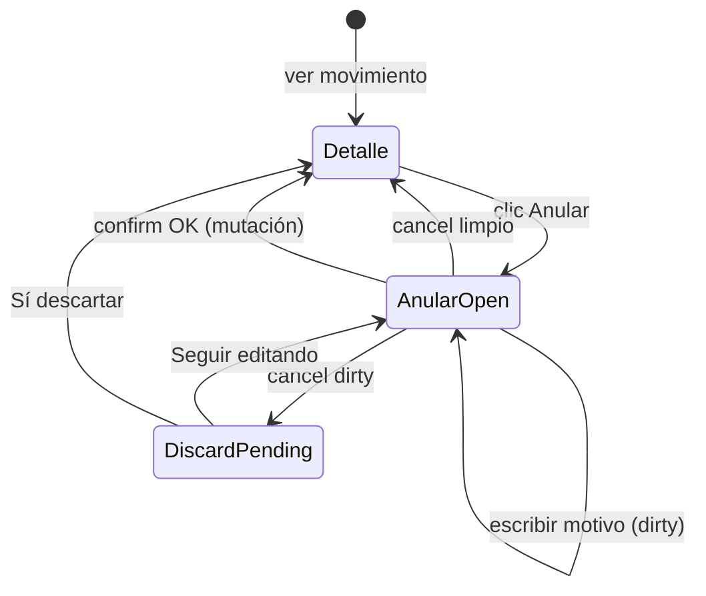

# UX-004 — Plan de implementación técnico

**Alternativa A (aprobada):** Dirty guard local en `ConfirmDialog` Anular de Movimientos.

**Estado:** Plan pre-implementación — **sin cambios de código**.

**Alcance:** `MovimientosPage.tsx`, estados locales de Anular, `ConfirmDialog` Anular, reutilización de `OrgDiscardConfirmDialog`.

**Referencias:** `UX_004_ANULAR_MOVIMIENTOS_AUDIT.md`, implementación real UX-003 en `InventarioFisicoPage.tsx`, `UX_003_IMPLEMENTATION_PLAN.md`, `UX_003_PRE_IMPLEMENTATION_REVIEW.md`, `ERP_FRONTEND_STANDARDS_V2.md` v2.1.

---

## 1. Resumen ejecutivo

Hoy, cancelar el `ConfirmDialog` Anular resetea `anularMotivo` sin aviso (D-INV-04 / SEC-LOSS-06). La solución replica el patrón **validado e implementado en UX-003**:

1. **Snapshot baseline** al abrir el confirm Anular (síncrono — sin `useEffect`).
2. **Detección dirty** comparando `anularMotivo` vs baseline (`trim()`).
3. **Confirmación de descarte** con `OrgDiscardConfirmDialog`, cerrando primero el confirm primario (B11-10) antes del discard (B11-11).

El flujo de confirmación exitosa (`ejecutarAnular` → mutación → `cerrarAnular(false)`) permanece intacto. **`variant="danger"`** del confirm Anular se preserva (UX-06).

**Complejidad relativa:** **inferior a UX-003** — un campo, sin prefill async, sin ref de captura.

---

## 2. Mapa de reutilización UX-003 → UX-004

Análisis contra la **implementación real** en `InventarioFisicoPage.tsx` (post UX-003).

| Pieza UX-003 (implementada) | UX-004 | Acción |
|-----------------------------|--------|--------|
| Imports: `OrgDiscardConfirmDialog`, `OrgDiscardPending`, `scheduleModalStackValidation` | Igual | **Copiar** |
| Interface baseline local (`AprobarConfirmBaseline`) | `AnularConfirmBaseline { motivo }` | **Adaptar** (1 campo) |
| Estado `discardPending` | Igual nombre | **Reutilizar** |
| Estado `aprobarBaseline` | `anularBaseline` | **Adaptar** nombre |
| `aprobarBaselineCapturedRef` + `useEffect` post-fetch | — | **Omitir** (no aplica) |
| `isAprobarConfirmDirty` (`useMemo`) | `isAnularConfirmDirty` | **Adaptar** (1 comparación) |
| `handleOpenAprobar` | `handleOpenAnular` | **Adaptar** (baseline sync) |
| `handleRequestCloseAprobar` | `handleRequestCloseAnular` | **Copiar** estructura |
| `handleAprobarDiscardCancel` / `Confirm` | `handleAnularDiscardCancel` / `Confirm` | **Copiar** estructura |
| `cerrarAprobar` extendido | `cerrarAnular` extendido | **Adaptar** |
| `detailDialogOpen && discardPending === null` | Igual | **Copiar** |
| `Dialog.onOpenChange` guard discard | Igual | **Copiar** |
| `<OrgDiscardConfirmDialog … />` | Igual patrón | **Copiar** (`entityLabel` distinto) |
| `ConfirmDialog.onClose` → request close | Idem Anular | **Wire** |
| Reset en `resetPageFilters` (no helper) | Idem | **Copiar** criterio UX-003 revisión |
| `disabled={discardPending !== null}` en botón workflow | Botón Anular | **Copiar** (opcional paridad ORG) |
| `useTiposMovimiento` / prefill async | — | **No tocar** |
| Toast validación pre-mutación | — | **No aplica** (motivo opcional) |
| Autorizar / Procesar / Finalizar | Sin cambios | **Fuera alcance** |

**No reutilizar:** `createOrgDiscardHandlers`, `useInvTransactionalFormGuard`, helper compartido nuevo (explícitamente fuera de alcance).

---

## 3. Diseño técnico detallado

### 3.1 Estados existentes (sin cambio semántico)

| Estado | Tipo | Rol |
|--------|------|-----|
| `anularOpen` | `boolean` | ConfirmDialog Anular visible |
| `anularMotivo` | `string` | Texto editado en textarea |
| `detailOpen` | `boolean` | Sesión detalle (puede estar true con dialog oculto) |
| `autorizarOpen` / `procesarOpen` | `boolean` | Otros workflow — **sin modificar** |

### 3.2 Estados nuevos requeridos

| Estado | Tipo | Propósito |
|--------|------|-----------|
| `anularBaseline` | `AnularConfirmBaseline \| null` | Snapshot al abrir confirm Anular |
| `discardPending` | `OrgDiscardPending` | `'edit' \| null` — discard secundario activo |

```typescript
/** Snapshot de valores iniciales del confirm Anular (local a la página). */
interface AnularConfirmBaseline {
  motivo: string;
}
```

**No se requiere:**
- `isAnularDirty` explícito — derivado con `useMemo`.
- `anularBaselineCapturedRef` — baseline capturable **sincrónicamente** al abrir (diferencia clave vs UX-003).
- `useEffect` de estabilización — no hay prefill async ni query lazy.

### 3.3 Baseline propuesto

**Cuándo:** en `handleOpenAnular`, mismo handler de clic, **antes** de `setAnularOpen(true)`.

**Valores iniciales:**

```typescript
const handleOpenAnular = () => {
  setAnularMotivo('');
  setAnularBaseline({ motivo: '' });
  setDiscardPending(null);
  setDetailOpen(false);
  setAnularOpen(true);
};
```

| Escenario | Baseline | Dirty tras abrir |
|-----------|----------|------------------|
| Abrir, no escribir | `{ motivo: '' }` | `false` |
| Abrir, escribir motivo | `{ motivo: '' }` fijo | `true` |
| Solo espacios en motivo | compare con `trim()` | `false` |
| Seguir editando (post-discard cancel) | Baseline **no** se recaptura — valores preservados en state | Sigue `true` si había cambios |
| Reabrir Anular tras descartar completo | Nueva sesión → baseline `{ motivo: '' }` | `false` |

**Falsos positivos:** no aplica prefill async (problema resuelto en UX-003 con `useEffect`). Único edge: espacios → mitigado con `trim()` en dirty compare.

### 3.4 Dirty detection

```typescript
const isAnularConfirmDirty = useMemo(() => {
  if (!anularBaseline) return false;
  return anularMotivo.trim() !== anularBaseline.motivo.trim();
}, [anularBaseline, anularMotivo]);
```

| Campo | Comparación | Normalización |
|-------|-------------|---------------|
| `anularMotivo` | `trim()` ambos lados | Espacios no cuentan como cambio |

**Motivo opcional:** dirty solo si hay texto significativo vs baseline vacío. Cancel limpio sin escribir → cierra directo (igual UX deseada).

### 3.5 RequestClose flow

Reemplazar `onClose={() => cerrarAnular()}` por **`handleRequestCloseAnular`**:

```typescript
const handleRequestCloseAnular = () => {
  if (anularMutation.isPending) return;
  if (isAnularConfirmDirty) {
    setAnularOpen(false);                    // B11-10: cerrar overlay primario
    setDiscardPending('edit');               // B11-11: abrir discard secundario
    scheduleModalStackValidation('inv-movimientos-anular-request-close-dirty');
    return;
  }
  cerrarAnular(true);
};
```

**Secuencia cancel dirty:**

```
Usuario Cancel/X en Anular
  → isAnularConfirmDirty === true
  → setAnularOpen(false)          // O4 off
  → setDiscardPending('edit')     // O5 on
  → un solo overlay visible
```

### 3.6 Discard flow

```typescript
const handleAnularDiscardCancel = () => {
  setDiscardPending(null);
  setAnularOpen(true);
  scheduleModalStackValidation('inv-movimientos-anular-discard-cancel-resume');
};

const handleAnularDiscardConfirm = () => {
  setDiscardPending(null);
  cerrarAnular(true);
  scheduleModalStackValidation('inv-movimientos-anular-discard-confirmed');
};
```

**`cerrarAnular` extendido** (reemplaza implementación actual):

```typescript
const cerrarAnular = (reopenDetail = true) => {
  setAnularOpen(false);
  setAnularMotivo('');
  setAnularBaseline(null);
  setDiscardPending(null);
  if (reopenDetail) reopenDetailIfSelected();
};
```

| Acción discard | Efecto |
|----------------|--------|
| Seguir editando | `anularOpen=true`, `anularMotivo` intacto, baseline intacto |
| Sí, descartar | reset motivo/baseline, reabre detalle |

**Confirmar Anular (mutación OK):** sin cambio — `cerrarAnular(false)`.

### 3.7 Reutilización de `OrgDiscardConfirmDialog`

Sin modificar el componente compartido:

```tsx
<OrgDiscardConfirmDialog
  discardPending={discardPending}
  entityLabel="la anulación"
  onClose={handleAnularDiscardCancel}
  onConfirm={handleAnularDiscardConfirm}
/>
```

| Aspecto | Valor |
|---------|-------|
| Modo | `'edit'` |
| Mensaje | *"Hay cambios sin guardar. ¿Desea cerrar sin guardar?"* |
| Botones | Seguir editando / Sí, descartar |
| Variant discard | `warning` (interno al componente — **no** afecta UX-06 del confirm Anular) |

**UX-06 preservado:** el `ConfirmDialog` Anular mantiene `variant="danger"`. Solo el discard secundario usa `warning` (patrón idéntico UX-003: Aprobar `warning` + discard `warning`; aquí Anular `danger` + discard `warning`).

### 3.8 Reglas de stacking

**Fórmulas (post UX-004):**

```typescript
const workflowConfirmOpen = autorizarOpen || procesarOpen || anularOpen;
const detailDialogOpen = detailOpen && !workflowConfirmOpen && discardPending === null;
```

**Invariante obligatoria:**

```typescript
!(anularOpen && discardPending !== null)
```

**`Dialog` detalle — extender `onOpenChange`:**

```typescript
onOpenChange={(open) => {
  if (!open && !workflowConfirmOpen && discardPending === null) {
    setDetailOpen(false);
  }
}}
```

#### Tabla de overlays

| ID | Componente | Control |
|----|------------|---------|
| O1 | Dialog detalle | `detailDialogOpen` |
| O2 | Confirm Autorizar | `autorizarOpen` |
| O3 | Confirm Procesar | `procesarOpen` |
| O4 | Confirm Anular | `anularOpen` |
| O5 | OrgDiscardConfirmDialog | `discardPending !== null` |

#### Estados válidos (máx. 1 overlay)

| # | Escenario | O1 | O2 | O3 | O4 | O5 |
|---|-----------|----|----|----|----|-----|
| S0 | Listado | — | — | — | — | — |
| S1 | Detalle | V | — | — | — | — |
| S2 | Anular editando | — | — | — | V | — |
| S3 | Discard pending | — | — | — | — | V |
| S4 | Seguir editando | — | — | — | V | — |
| S5 | Autorizar / Procesar | — | V* | — | — | — |

*V solo uno de O2/O3/O4 por workflow.

#### Combos prohibidos — demostración

| Combo | ¿Posible? | Mecanismo |
|-------|-----------|-----------|
| O4 + O5 (Anular + Discard) | **No** | Invariante + handlers |
| O1 + O4 (Detalle + Anular) | **No** | `setDetailOpen(false)` al abrir + `detailDialogOpen` |
| O1 + O5 (Detalle + Discard) | **No** | `detailDialogOpen` excluye `discardPending` |
| O4 + O2/O3 | **No** | UI no expone apertura paralela |

### 3.9 Impacto en reset empresa

**Criterio UX-003 revisión (aplicar igual):** limpiar en `resetPageFilters` de la página; **no modificar** `inv-list-empresa-reset.ts`.

```typescript
const resetPageFilters = useCallback(() => {
  // ... filtros existentes ...
  resetMovimientosListUiState({
    setDetailOpen,
    setSelectedMovimientoId,
    setAutorizarOpen,
    setProcesarOpen,
    setAnularOpen,
    setAnularMotivo,
  });
  setAnularBaseline(null);
  setDiscardPending(null);
}, []);
```

| Estado | Riesgo si no resetea | Helper actual resetea |
|--------|---------------------|----------------------|
| `anularOpen` | — | ✅ |
| `anularMotivo` | — | ✅ |
| `anularBaseline` | Bajo (huérfano en memoria) | ❌ → página |
| `discardPending` | **Alto** (O5 visible sin anular) | ❌ → página |

**Verificación caller:** `resetMovimientosListUiState` solo se consume desde `MovimientosPage.tsx` — reset inline es suficiente.

---

## 4. Flujo completo

### 4.1 Diagrama de estados



### 4.2 Secuencia paso a paso

| Paso | Acción | Comportamiento |
|------|--------|----------------|
| A | Abrir Anular | `handleOpenAnular` → baseline `{ motivo: '' }`, detalle cierra |
| B | Escribir motivo | `isAnularConfirmDirty = true` |
| C | Cancel dirty | O4 off → O5 on |
| D | Seguir editando | O5 off → O4 on, motivo preservado |
| E | Descartar | `cerrarAnular(true)` → reset, detalle reabre |
| F | Confirmar Anular | `ejecutarAnular` → éxito → `cerrarAnular(false)` |

---

## 5. Compatibilidad V2.1

| ID | Requisito | Cumplimiento post UX-004 |
|----|-----------|--------------------------|
| **B11-10** | Cerrar primario antes de discard | ✅ `setAnularOpen(false)` → `setDiscardPending('edit')` |
| **B11-11** | Discard secundario tras cerrar primario | ✅ Patrón idéntico UX-003 |
| **PB-13** | Un workflow confirm activo | ✅ Sin cambio en autorizar/procesar |
| **PB-14** | Defensa `detailDialogOpen` + `onOpenChange` | ✅ + guard `discardPending` |
| **UX-05** | Acciones positivas `warning` | ✅ Autorizar/Procesar sin cambio |
| **UX-06** | Anular `danger` | ✅ **Preservado** en ConfirmDialog Anular |
| **UX-08** | Discard antes de perder datos | ✅ `OrgDiscardConfirmDialog` |
| **MD-04** | Máx. 1 overlay | ✅ Invariante documentada |
| **SEC-09** | MUST NOT B.1.1 completo en one-shot | ✅ Guard ligero local, no Radix CRUD |
| **SEC-10** | MAY dirty en motivo anular | ✅ Implementación backlog R-06 |

**Restricciones verificadas:**

| Restricción | Estado |
|-------------|--------|
| No modificar `ConfirmDialog.tsx` | ✅ |
| No modificar `OrgDiscardConfirmDialog.tsx` | ✅ |
| No modificar helpers compartidos | ✅ (`inv-list-empresa-reset.ts` intacto) |
| No overlays simultáneos | ✅ Demostrado §3.8 |

---

## 6. Riesgos

### 6.1 Funcionales

| Riesgo | Prob. | Impacto | Mitigación |
|--------|-------|---------|------------|
| Mutación anular rota por interceptar onClose | Baja | Alto | No tocar `ejecutarAnular` |
| Motivo opcional — usuario pierde texto largo | Media | Bajo–Medio | Dirty guard (objetivo del ticket) |
| Baseline null durante render intermedio | Baja | Bajo | Set sync en `handleOpenAnular` |

### 6.2 UX

| Riesgo | Prob. | Impacto | Mitigación |
|--------|-------|---------|------------|
| Parpadeo O4→O5 al cancel dirty | Baja | Bajo | Patrón aceptado UX-003 |
| Confusión discard vs cancelar anulación | Baja | Medio | Textos estándar OrgDiscard |
| Inconsistencia temporal IF (Aprobar con guard) vs Mov sin guard | — | — | **Resuelto por UX-004** |

### 6.3 Técnicos / regresión

| Riesgo | Prob. | Impacto | Mitigación |
|--------|-------|---------|------------|
| Olvidar invariante O4+O5 | Media | Alto | QA Q12; `scheduleModalStackValidation` |
| `detailDialogOpen` durante discard | Media | Alto | Flag `discardPending` |
| Reset empresa deja discard colgado | Baja | Medio | Reset inline §3.9 |
| Autorizar/Procesar regresión | Baja | Alto | No modificar handlers |

### 6.4 Stacking

| Riesgo | Prob. | Impacto | Mitigación |
|--------|-------|---------|------------|
| Dos ConfirmDialog simultáneos | Media si mal impl. | Alto | Cerrar O4 antes de O5 |
| Escape en discard deja state huérfano | Baja | Medio | `onClose` → cancel handler |

---

## 7. Matriz QA

### 7.1 Flujo Anular — dirty guard

| # | Precondición | Acción | Resultado esperado |
|---|--------------|--------|-------------------|
| Q1 | Mov borrador/autorizado | Abrir Anular, no escribir, Cancelar | Cierra sin discard; detalle reabre; motivo reset |
| Q2 | Anular abierto | Escribir motivo, Cancelar | Discard visible; Anular cerrado |
| Q3 | Q2 + discard visible | Seguir editando | Anular reabre; motivo conservado; dirty true |
| Q4 | Q2 + discard visible | Sí, descartar | Cerrado; motivo reset; detalle reabre |
| Q5 | Anular abierto | Solo espacios en motivo, Cancelar | No dirty; cancel limpio |
| Q6 | Anular abierto, dirty | Confirmar Anular OK | Mutación OK; toast éxito; cierra sin discard |
| Q7 | Anular abierto, pending | Cancelar / X | No cierra (guard `isPending`) |
| Q8 | Anular abierto | Confirmar sin motivo | Anula con `motivo: null` — válido |

### 7.2 Stacking / visibilidad

| # | Acción | Resultado esperado |
|---|--------|-------------------|
| Q9 | Abrir Anular desde detalle | Solo ConfirmDialog Anular (O4) |
| Q10 | Cancel dirty | Nunca 2 dialogs visibles |
| Q11 | Seguir editando | Solo ConfirmDialog Anular |
| Q12 | Abrir Autorizar/Procesar | Sin discard; sin cambio UX-004 |

### 7.3 Regresión workflow

| # | Acción | Resultado esperado |
|---|--------|-------------------|
| Q13 | Autorizar / Procesar cancel | Sin discard (sin campos editables) |
| Q14 | Cambiar empresa con Anular abierto | Reset cierra todo; sin discard colgado |
| Q15 | Anular → éxito | Lista refresca; sin detalle obsoleto |

### 7.4 UX-06 / variantes

| # | Acción | Resultado esperado |
|---|--------|-------------------|
| Q16 | Inspeccionar ConfirmDialog Anular | `variant="danger"` |
| Q17 | Inspeccionar OrgDiscardConfirmDialog | `variant="warning"` |

### 7.5 RBAC / edge

| # | Precondición | Resultado esperado |
|---|--------------|-------------------|
| Q18 | Sin permiso editar | Botón Anular disabled |
| Q19 | Mov procesado/anulado | Botón Anular disabled |
| Q20 | Escape Anular limpio | Igual Cancelar |
| Q21 | Escape discard | Seguir editando |

---

## 8. Estimación real

Basada en implementación UX-003 real (+135 LOC, 1 archivo, sin helper) y simplificación UX-004.

| Métrica | UX-003 (real) | UX-004 (estimado) |
|---------|---------------|-------------------|
| Archivos afectados | 1 | **1** (`MovimientosPage.tsx`) |
| Helpers compartidos | 0 (revisión: reset en página) | **0** |
| Líneas netas aprox. | +135 | **+55–75** |
| `useEffect` baseline | Sí | **No** |
| Ref captura | Sí | **No** |
| Complejidad | Baja–media | **Baja** |
| Implementación | ~2–3 h | **~1.5–2 h** |
| QA manual | ~1 h | **~45 min–1 h** |
| **Total** | ~3–4 h | **~2.5–3 h** |

### 8.1 Orden de implementación sugerido

1. Imports + interface `AnularConfirmBaseline`.
2. Estados `anularBaseline`, `discardPending`.
3. `handleOpenAnular` + wire botón Anular.
4. `isAnularConfirmDirty` + extender `cerrarAnular`.
5. `handleRequestCloseAnular` + discard handlers + `scheduleModalStackValidation`.
6. Wire `ConfirmDialog` Anular `onClose`.
7. Render `OrgDiscardConfirmDialog`.
8. Ajustar `detailDialogOpen` + `Dialog.onOpenChange`.
9. Extender `resetPageFilters`.
10. QA matriz §7.

### 8.2 Fuera de alcance (explícito)

- Dirty guard en Autorizar / Procesar (sin campos editables).
- Helper compartido `createInvWorkflowConfirmDiscardHandlers` (evaluar post UX-004 si se desea).
- Cambios en `useAnularMovimiento` o contrato API.
- Modificación `ConfirmDialog.tsx`, `OrgDiscardConfirmDialog.tsx`, `inv-list-empresa-reset.ts`.
- Documentación normativa V2.1.
- InventarioFisicoPage Anular (sin campos en confirm).

---

## 9. Checklist pre-merge

- [ ] Invariante `!(anularOpen && discardPending !== null)` verificada
- [ ] `onClose` Anular usa `handleRequestCloseAnular`, no `cerrarAnular` directo
- [ ] Baseline capturado sync en `handleOpenAnular` (`{ motivo: '' }`)
- [ ] `resetPageFilters` limpia `anularBaseline` y `discardPending`
- [ ] `variant="danger"` preservado en ConfirmDialog Anular (UX-06)
- [ ] Matriz QA §7 ejecutada
- [ ] Sin overlays simultáneos (Q10)
- [ ] `ejecutarAnular` / mutación sin cambios funcionales

---

## 10. Diff previsto (referencia)

```
src/features/inv/pages/MovimientosPage.tsx  | +55–75 −8–12
```

**Imports nuevos:** `OrgDiscardConfirmDialog`, `OrgDiscardPending`, `scheduleModalStackValidation`

**Sin cambios en:** hooks, services, primitivas UI, helpers compartidos, otros archivos INV.

---

## 11. Veredicto del plan

| Pregunta | Respuesta |
|----------|-----------|
| ¿Reutiliza patrón UX-003? | **Sí** — copia estructural con omisiones justificadas |
| ¿Más simple que UX-003? | **Sí** — sin `useEffect`/ref/prefill |
| ¿Riesgo stacking? | **Bajo** — misma invariante probada |
| ¿UX-06 preservado? | **Sí** — `danger` en confirm Anular |
| ¿Helpers compartidos? | **No requeridos** |
| ¿Listo para implementación? | **Sí** — tras aprobación explícita de este plan |

---

## 12. Aprobaciones

| Artefacto | Estado |
|-----------|--------|
| Auditoría UX-004 | ✅ Aprobada |
| Plan técnico UX-004 (este doc) | 📄 Pendiente revisión |
| Implementación código | ⛔ No iniciar hasta aprobación del plan |

---

*Generado: 2026-06-10 — Alternativa A, paridad UX-003, sin cambios de código.*
