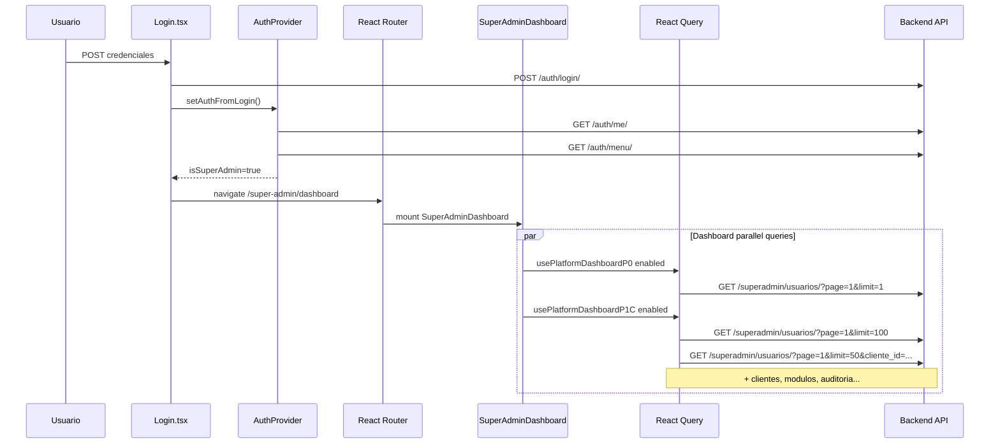

# F13-M3A — Auditoría del bootstrap Frontend Platform Admin

**Documento:** `app/docs/arquitectura/F13_M3A_FRONTEND_BOOTSTRAP_AUDIT.md`  
**Fecha:** 2026-06-29  
**Modo:** READ ONLY — sin modificación de código, sin commits, sin nuevos endpoints  
**Alcance:** Flujo de carga inicial del Frontend Platform Admin (`platform_admin`) y origen de  
`GET /api/v1/superadmin/usuarios/?page=1&limit=100` y  
`GET /api/v1/superadmin/usuarios/?page=1&limit=1`

---

## 1. Resumen ejecutivo

Las dos peticiones a `/superadmin/usuarios/` **no forman parte del bootstrap de sesión** (`/auth/login`, `/auth/me`, `/auth/menu`). Se disparan **después** del login (o tras restaurar sesión al salir de impersonación) porque el destino por defecto del operador Platform es **`/super-admin/dashboard`**, y esa pantalla monta hooks de dashboard que consumen el listado paginado de usuarios globales con distintos `limit`.

| Request | Origen FE | Propósito |
|---------|-----------|-----------|
| `limit=1` | `usePlatformDashboardP0` → query `usuarios-total` | KPI **W12 — Total Usuarios** (lee `total_usuarios` del envelope paginado) |
| `limit=100` | `usePlatformDashboardP1C` → query `blocked-users-scan` | Alerta dashboard **`USER_BLOCKED`** (escaneo client-side de `fecha_bloqueo` en hasta 100 registros) |

**No existe** una ruta `/super-admin/usuarios` ni una tabla global de usuarios en el shell Platform Admin. El listado global solo se usa en widgets del **Centro de Operaciones** (dashboard). La gestión de usuarios por tenant vive en `ClientUsersTab` con endpoint distinto (`/superadmin/usuarios/clientes/{id}/usuarios/`).

---

## 2. Respuestas directas (entregable obligatorio)

### 2.1 ¿Quién dispara `limit=100`?

| Capa | Artefacto |
|------|-----------|
| **Componente** | `SuperAdminDashboard` (`src/features/super-admin/dashboard/pages/SuperAdminDashboard.tsx`) |
| **Hook** | `usePlatformDashboardP1C` (`src/features/super-admin/dashboard/hooks/usePlatformDashboardP1C.ts`) |
| **Query React Query** | `blockedUsersQuery` — queryKey `['platform-dashboard', 'blocked-users-scan', 100]` |
| **Constante** | `BLOCKED_USERS_SCAN_LIMIT = 100` (L18) |
| **Servicio** | `superadminUsuarioService.getUsuariosGlobales({ page: 1, limit: 100 })` |
| **Consumidor UI** | `buildOperatorAlertsFromUsuarios` → alerta `USER_BLOCKED` en `PlatformAlertBanner` (`dashboard-alert.rules.ts`) |
| **useEffect** | **Ninguno** en el hook; el fetch lo dispara **React Query** al montar el hook con `enabled: true` |

### 2.2 ¿Por qué se dispara inmediatamente después del login?

Cadena causal:

1. Login exitoso → `setAuthFromLogin` → `initializeAuth()` → `GET /auth/me` + `GET /auth/menu` (bootstrap de sesión).
2. `updateAccessLevels` marca `isSuperAdmin = true` cuando `user_type === 'platform_admin'`.
3. `Login.tsx` calcula destino con `resolvePostLoginPath` → **`/super-admin/dashboard`** (fallback explícito para platform admin en `post-login-path.ts` L116–123).
4. Router monta `ProtectedRoute requireSuperAdmin` → `SuperAdminLayout` → ruta `dashboard` → lazy `SuperAdminDashboard`.
5. Al montar, el componente invoca cuatro hooks con `enabled: isSuperAdmin` (L39–42). Cuando `isSuperAdmin` ya es `true`, React Query ejecuta todas las queries en paralelo, incluidas `limit=1` (P0) y `limit=100` (P1C).

**Tras finalizar impersonación** ocurre el mismo efecto:

- `restorePlatformSession` / `exitSupportMode` hace `queryClient.clear()`, restaura token platform, `initializeAuth()` de nuevo, y navega a `/super-admin/dashboard` (`useImpersonation.ts` L45, `auth-provider-impersonation.compositor.ts` L174–175).
- El dashboard se monta de cero → mismas queries sin cache.

### 2.3 ¿Es realmente necesario?

| Request | Necesidad funcional actual | Necesidad técnica |
|---------|---------------------------|-------------------|
| `limit=1` | **Sí**, para mostrar el KPI «Total Usuarios» en la sección Plataforma del dashboard (widget **W12**). | **No** requiere traer filas: solo `total_usuarios` del metadata paginado. `limit=1` es un patrón de mínimo payload, no un requisito de negocio. |
| `limit=100` | **Parcialmente**: alimenta la alerta `USER_BLOCKED` en el banner superior. | **No es la solución ideal**: cuenta bloqueados filtrando en cliente sobre la primera página de 100 usuarios sin orden garantizado por bloqueo → **resultado parcial** si hay >100 usuarios o bloqueados fuera del top 100. Documentado en `PLATFORM_DASHBOARD_P1C_IMPLEMENTATION_REPORT.md` §3 Alertas. |

Ninguna de las dos es necesaria para **autenticación, menú, layout ni RBAC**. Son necesarias **solo** porque el landing post-login es el dashboard y el dashboard incluye W12 + alertas operador.

### 2.4 ¿Puede diferirse hasta abrir la pantalla Usuarios?

**Contexto importante:** hoy **no hay** pantalla «Usuarios» en `/super-admin/*`. Rutas super-admin registradas (`routes.tsx`): dashboard, clientes, módulos, auditoría, catálogos, etc. — sin listado global de usuarios.

| Escenario | Viabilidad |
|-----------|------------|
| Diferir hasta abrir **dashboard** | Ya ocurre implícitamente: otras rutas (`/super-admin/clientes`, etc.) **no** llaman `getUsuariosGlobales`. El costo aparece porque dashboard es la **landing**. |
| Diferir hasta una futura **`/super-admin/usuarios`** | **Sí, técnicamente viable**: mover queries fuera del mount del dashboard o lazy-load por sección del dashboard. |
| Diferir `limit=1` (W12) sin perder KPI | **Sí**, con endpoint agregado (`/usuarios/stats`) o cargando W12 solo al scroll/visibilidad del bloque Plataforma. |
| Diferir `limit=100` sin perder alerta | **Sí**, idealmente reemplazando el scan por un contador server-side (`blocked_count` en stats). |

Cambiar el post-login a otra ruta (p. ej. clientes) eliminaría estas llamadas del «primer paint» pero **no** del producto si el operador entra al dashboard después.

### 2.5 ¿La futura separación `/usuarios/stats` eliminaría realmente estas llamadas?

**Depende del contrato del endpoint stats**, no de crear la ruta FE sola.

| Escenario stats | ¿Elimina `limit=1`? | ¿Elimina `limit=100`? | ¿Otras llamadas `/usuarios/`? |
|-----------------|---------------------|----------------------|-------------------------------|
| Stats expone `total_usuarios` + `blocked_count` y el FE migra W12 + `USER_BLOCKED` | **Sí** | **Sí** | **No** — seguiría `limit=50` con filtros para panel **Operadores Platform** (`operatorsQuery` en P1C) |
| Stats solo expone `total_usuarios` | **Sí** | **No** — scan 100 seguiría o habría que otro campo | Operadores `limit=50` sigue |
| Stats no se usa en dashboard; solo en futura pantalla Usuarios | **No automático** — hay que **retirar** queries del dashboard | **No automático** | Idem |

Hoy el FE tiene **exactamente 3** consumos de `getUsuariosGlobales`, todos en dashboard:

```
usePlatformDashboardP0  → limit=1   (W12)
usePlatformDashboardP1C → limit=50  (operadores, cliente_id=PLATFORM_SUPERADMIN_CLIENTE_ID)
usePlatformDashboardP1C → limit=100 (blocked scan)
```

Un endpoint stats bien diseñado **puede eliminar 2 de 3** llamadas al mount; la de operadores requiere listado enriquecido o un endpoint distinto (operadores platform).

---

## 3. Mapa de responsabilidades

### 3.1 `limit=1` — KPI Total Usuarios (W12)

```
SuperAdminDashboard
  └── usePlatformDashboardP0(isSuperAdmin)
        └── useQueries[2] queryKey: ['platform-dashboard', 'usuarios-total']
              └── superadminUsuarioService.getUsuariosGlobales({ page: 1, limit: 1 })
                    └── GET /api/v1/superadmin/usuarios/?page=1&limit=1
              └── return data.total_usuarios
        └── DashboardKpiCard label="Total Usuarios"
```

### 3.2 `limit=100` — Alerta usuarios bloqueados

```
SuperAdminDashboard
  └── usePlatformDashboardP1C(isSuperAdmin)
        └── useQuery queryKey: ['platform-dashboard', 'blocked-users-scan', 100]
              └── getUsuariosGlobales({ page: 1, limit: BLOCKED_USERS_SCAN_LIMIT })
                    └── GET /api/v1/superadmin/usuarios/?page=1&limit=100
              └── countBlockedUsers(usuarios) // fecha_bloqueo != null
        └── buildOperatorAlertsFromUsuarios(..., blockedCount, ...)
              └── alerta codigo: 'USER_BLOCKED'
        └── mergeDashboardAlerts → PlatformAlertBanner
```

### 3.3 ¿La «tabla de usuarios» forma parte del bootstrap global?

**No.**

| Elemento UI | Fuente de datos | ¿Usa `/superadmin/usuarios/`? |
|-------------|-----------------|-------------------------------|
| KPI «Total Usuarios» | W12 — `limit=1` | **Sí** (solo metadata) |
| Panel «Top usuarios» (Seguridad 24h) | `estadisticas.top_usuarios` vía `GET /superadmin/auditoria/estadisticas/` | **No** |
| Panel «Operadores Platform» | `limit=50` + filtros `cliente_id` SYSTEM | **Sí** (tercer call, no preguntado) |
| Tab usuarios en detalle cliente | `getUsuariosByCliente` | **No** — ruta `/clientes/{id}/usuarios/` |
| Pantalla `/admin/usuarios` (tenant admin) | `useUsersList` → `/usuarios/` tenant-scoped | **No** — otro shell |

---

## 4. Timeline completo del bootstrap Frontend (Platform Admin)

### Fase A — Bootstrap de sesión (global, sin `/superadmin/usuarios/`)

| # | Trigger | HTTP / acción | Archivo clave |
|---|---------|---------------|---------------|
| A1 | Submit login | `POST /auth/login/` | `auth.service.ts`, `Login.tsx` |
| A2 | `applyFullSessionToken` / `setAuthFromLogin` | `queryClient.clear()` | `auth-provider-public-actions.ts` |
| A3 | `initializeAuth()` | `GET /auth/me/` | `auth-provider-bootstrap.compositor.ts`, `session-refresh-hydrate.ts` |
| A4 | `loadMenuAndPermissionsFromAuthMenu` | `GET /auth/menu/` | `auth-provider-permissions.compositor.ts` |
| A5 | `updateAccessLevels` | Estado: `isSuperAdmin=true`, `user_type=platform_admin` | `auth-provider-permissions.compositor.ts` L248 |
| A6 | platform_admin | **Skip** `loadEmpresasElegiblesForSession` | `session-refresh-hydrate.ts` L184–185 |
| A7 | Flags bootstrap | `authInitialized=true`, `isBootstrapped=true` | `session-refresh-hydrate.ts` L197–199 |
| A8 | Navegación | `navigate('/super-admin/dashboard')` | `Login.tsx`, `post-login-path.ts` |

### Fase B — Bootstrap de shell super-admin (layout, sin usuarios globales)

| # | Trigger | HTTP / acción | Archivo clave |
|---|---------|---------------|---------------|
| B1 | Router match | `ProtectedRoute requireSuperAdmin` | `router.tsx` L55–64 |
| B2 | Layout | `SuperAdminLayout` → `NewLayout variant="super-admin"` | `SuperAdminLayout.tsx` |
| B3 | Sidebar/menú | Render desde `menuModulos` (ya cargado en A4) | `NewSidebar` — **sin prefetch usuarios** |
| B4 | Lazy route | `Suspense` → chunk `SuperAdminDashboard` | `routes.tsx` L26–31 |

### Fase C — Bootstrap del dashboard (aquí aparecen `limit=1` y `limit=100`)

Montaje de `SuperAdminDashboard` con `isSuperAdmin === true` → React Query dispara en paralelo:

| # | Hook | Query key | Endpoint principal |
|---|------|-----------|-------------------|
| C1 | P0 | `clientes-activos` | `GET /clientes/?skip=0&limit=1&solo_activos=true` |
| C2 | P0 | `clientes-total` | `GET /clientes/?skip=0&limit=1&solo_activos=false` |
| C3 | P0 | **`usuarios-total`** | **`GET /superadmin/usuarios/?page=1&limit=1`** |
| C4 | P0 | `modulos-total` | `GET /modulos/?skip=0&limit=1` |
| C5 | P0 | `auth-activity` | `GET /superadmin/auditoria/autenticacion/?page=1&limit=15` |
| C6 | P1A | `auditoria-estadisticas` | `GET /superadmin/auditoria/estadisticas/?fecha_desde&fecha_hasta` |
| C7 | P1B/P1C | `clientes-snapshot` | `GET /clientes/?skip=0&limit=1000&solo_activos=false` (deduplicada) |
| C8 | P1C | `sync-logs` | `GET /superadmin/auditoria/sincronizacion/?page=1&limit=10` |
| C9 | P1C | `platform-operators` | `GET /superadmin/usuarios/?page=1&limit=50&cliente_id={SYSTEM}&es_activo=true&...` |
| C10 | P1C | **`blocked-users-scan`** | **`GET /superadmin/usuarios/?page=1&limit=100`** |

**Orden temporal:** C1–C10 ocurren tras A8+B4, en el mismo tick de montaje del dashboard (paralelo vía React Query). No hay `useEffect` intermedio en los hooks de dashboard.

### Fase D — Salida de impersonación (misma Fase C)

| # | Trigger | Efecto |
|---|---------|--------|
| D1 | `endImpersonation` / `restorePlatformSession` | `queryClient.clear()` — invalida cache dashboard |
| D2 | Restauración token platform | `initializeAuth()` repite Fase A3–A7 |
| D3 | Redirect | `/super-admin/dashboard` |
| D4 | Remount dashboard | Repite Fase C completa (incl. `limit=1` y `limit=100`) |

---

## 5. Árbol de componentes (post-login Platform Admin)

```
Router (createBrowserRouter)
└── ProtectedRoute [requireSuperAdmin]
    └── SuperAdminLayout
        └── NewLayout [variant="super-admin"]
            ├── NewSidebar          ← menú /auth/menu (sin usuarios API)
            ├── Header
            └── Outlet
                └── Suspense
                    └── SuperAdminDashboard          ← DISPARADOR
                        ├── usePlatformDashboardP0   ← limit=1 (W12)
                        ├── usePlatformDashboardP1A
                        ├── usePlatformDashboardP1B
                        ├── usePlatformDashboardP1C  ← limit=100 (USER_BLOCKED)
                        ├── PlatformAlertBanner      ← consume blockedCount
                        ├── DashboardKpiCard ×4      ← Total Usuarios usa W12
                        ├── AuthEventsBarChart / TopIpsTable / TopUsuariosTable
                        ├── ClientesPlanDonutChart
                        └── PlatformOperatorsPanel   ← limit=50 (related)
```

**Providers globales (envuelven todo, no llaman usuarios):** `AuthProvider`, `QueryClientProvider`, `PermissionProvider`, etc. en `src/app/main.tsx` → árbol de app.

---

## 6. Secuencia exacta de llamadas HTTP (diagrama)



---

## 7. Análisis W12 y `limit=100`

### 7.1 ¿W12 realmente necesita `limit=100`?

**No.** W12 usa **`limit=1`**, no 100.

- **W12** = widget KPI «Total Usuarios» → `usePlatformDashboardP0` → `limit=1` → campo `total_usuarios`.
- **`limit=100`** pertenece a **P1C / alerta `USER_BLOCKED`**, no a W12.

Referencia contrato interno: `PLATFORM_DASHBOARD_FRONTEND_CONTRACT.md` widget W12; implementación P1C en `PLATFORM_DASHBOARD_P1C_IMPLEMENTATION_REPORT.md` L133–138.

### 7.2 ¿El `limit=100` pertenece al Dashboard u otra vista?

**Pertenece exclusivamente al Dashboard Platform** (sección alertas operador + banner). No hay otro consumidor de `getUsuariosGlobales({ limit: 100 })` en el repositorio (grep confirma único sitio: `usePlatformDashboardP1C.ts`).

### 7.3 Dependencia que dispara la carga (precisión técnica)

| Dependencia | Rol |
|-------------|-----|
| `isSuperAdmin === true` | Prop `enabled` de todas las queries dashboard |
| Montaje de `SuperAdminDashboard` | Suscripción React Query |
| `queryKey` estable | Identidad de cache (`usuarios-total`, `blocked-users-scan`) |
| Post-login path `/super-admin/dashboard` | Garantiza montaje inmediato |
| `queryClient.clear()` post-impersonación | Fuerza refetch sin stale cache |

**No hay** `useEffect(() => fetch..., [])` en los hooks de dashboard. El mecanismo es el ciclo de vida de React Query (`enabled` + mount).

---

## 8. ¿Debería cargarse bajo demanda?

| Dato | Carga actual | Recomendación auditoría (sin implementar) |
|------|--------------|-------------------------------------------|
| `total_usuarios` (W12) | Eager en landing dashboard | Diferible si landing deja de ser dashboard; idealmente vía **`/usuarios/stats`** |
| Scan bloqueados (100) | Eager en landing dashboard | **Candidato prioritario a eliminar/reemplazar** — costo alto, precisión parcial |
| Operadores (50) | Eager en landing dashboard | Diferible a expandir panel «Operación» o pantalla dedicada |
| Listado usuarios tenant | On-demand en `ClientUsersTab` | **Ya bajo demanda** (tab en detalle cliente) |

---

## 9. Hallazgos

| ID | Hallazgo | Severidad |
|----|----------|-----------|
| H1 | Las llamadas `/superadmin/usuarios/` post-login son **efecto colateral del landing dashboard**, no del bootstrap auth | Info |
| H2 | `limit=100` es un **workaround client-side** para alerta `USER_BLOCKED`; no es requisito de W12 | Medio |
| H3 | No existe pantalla global Usuarios en super-admin; la pregunta «diferir hasta Usuarios» implica **feature futura** o confusión con `/admin/usuarios` tenant | Info |
| H4 | Tras impersonación, `queryClient.clear()` + remount dashboard **repite** el paquete completo de queries | Info |
| H5 | Un tercer call `limit=50` coexiste en el mismo mount (operadores); audit F13 se centró en 100 y 1 según observación | Info |
| H6 | `/usuarios/stats` solo elimina las llamadas si el **FE deja de invocar** `getUsuariosGlobales` en P0/P1C para esos casos | Info |

---

## 10. Referencias de código

| Tema | Ruta |
|------|------|
| KPI W12 `limit=1` | `src/features/super-admin/dashboard/hooks/usePlatformDashboardP0.ts` L63–70 |
| Scan bloqueados `limit=100` | `src/features/super-admin/dashboard/hooks/usePlatformDashboardP1C.ts` L18, L72–81 |
| Montaje hooks dashboard | `src/features/super-admin/dashboard/pages/SuperAdminDashboard.tsx` L37–42 |
| Servicio HTTP | `src/services/superadmin-usuario.service.ts` L31–52 |
| Alerta USER_BLOCKED | `src/features/super-admin/dashboard/utils/dashboard-alert.rules.ts` L126–146 |
| Post-login → dashboard | `src/core/routing/post-login-path.ts` L116–123 |
| Login navigate | `src/features/auth/pages/Login.tsx` L141–162 |
| Salida impersonación | `src/features/auth/hooks/useImpersonation.ts` L41–46 |
| Restore platform + clear RQ | `src/core/auth/provider/auth-provider-impersonation.compositor.ts` L156–175 |
| Rutas super-admin | `src/features/super-admin/routes.tsx` |
| Reporte P1C (limit=100 documentado) | `PLATFORM_DASHBOARD_P1C_IMPLEMENTATION_REPORT.md` |

---

## 11. Conclusión

Inmediatamente después del login (y al terminar impersonación), el Frontend ejecuta `GET /superadmin/usuarios/?page=1&limit=1` y `GET /superadmin/usuarios/?page=1&limit=100` porque **`SuperAdminDashboard` es la pantalla de aterrizaje** y sus hooks **P0 (W12)** y **P1C (alerta USER_BLOCKED)** usan el listado paginado global como proxy de contadores. No forman parte del bootstrap de autenticación ni de una tabla global de usuarios inexistente en Platform Admin.

**W12 no necesita `limit=100`** — usa `limit=1`. El **`limit=100` es del dashboard P1C** y es el candidato más claro a sustitución por agregación server-side. Un futuro **`/usuarios/stats`** puede eliminar ambas llamadas **solo si** el contrato expone `total_usuarios` y métricas de bloqueo y el dashboard deja de usar `getUsuariosGlobales` para esos fines; la query de operadores (`limit=50`) persistiría salvo endpoint alternativo.

---

*Fin de auditoría F13-M3A — sin cambios de código.*
