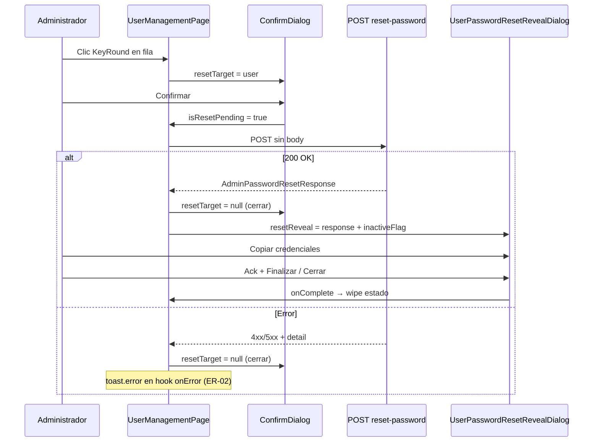

# ADMIN_PASSWORD_RESET — Especificación Funcional + UX (Frontend)

**Documento:** `docs/arquitectura/ADMIN_PASSWORD_RESET_FRONTEND_SPEC.md`  
**Fecha:** 2026-06-24  
**Modo:** READ ONLY — sin cambios de código  
**Fuentes de verdad (exclusivas):**
- [`ADMIN_PASSWORD_RESET_FRONTEND_CONTRACT_CERTIFICATION.md`](../../ADMIN_PASSWORD_RESET_FRONTEND_CONTRACT_CERTIFICATION.md)
- [`ADMIN_PASSWORD_RESET_FRONTEND_AUDIT_V2.md`](./ADMIN_PASSWORD_RESET_FRONTEND_AUDIT_V2.md)

**Pantalla:** `UserManagementPage` — ruta `/admin/usuarios`  
**Alcance v1:** Reset administrativo desde listado de usuarios. Sin ruta nueva, sin acciones masivas, sin campo de contraseña manual.

---

## 0. Resumen

El administrador con permiso `admin.usuario.reset_password` restablece la contraseña de un **usuario local** distinto de sí mismo. El Backend genera la temporal, cierra sesiones del afectado y devuelve credenciales **una sola vez**. El Frontend confirma, ejecuta `POST`, muestra modal de revelación con copia al portapapeles y borra la contraseña de memoria al cerrar.

El flujo post-login del usuario afectado (force password change) **no** forma parte de esta épica — ya está implementado en Auth.

---

## 1. Ubicación

### 1.1 Pantalla y columna

| Atributo | Valor |
|----------|-------|
| Página | `src/features/admin/pages/UserManagementPage.tsx` |
| Ruta | `/admin/usuarios` |
| Tabla | Columna **Acciones** (última columna, alineación `text-center`) |
| Contenedor acciones | `div.inline-flex.items-center.gap-1` (existente) |

### 1.2 Orden de botones

**Fila activa (`es_activo === true`):**

```
[ Editar ] → [ Restablecer contraseña ] → [ Desactivar ]
   Edit3         KeyRound                      Trash2
```

**Fila inactiva (`es_activo === false`):**

```
[ Reactivar ] → [ Restablecer contraseña ]
   RotateCcw           KeyRound
```

El botón de reset **siempre** va **después** de la acción primaria de la fila (Editar o Reactivar) y **antes** de Desactivar en filas activas.

### 1.3 Botón — especificación visual

| Atributo | Valor |
|----------|-------|
| Tipo | `<button type="button">` |
| Icono | `KeyRound` de `lucide-react`, `className="h-4 w-4"` |
| Color | `text-warning hover:text-warning/80` (diferencia de Editar `brand-primary` y Desactivar `error`) |
| Padding / hover | `p-1 rounded hover:bg-overlay` (igual que acciones existentes) |
| `title` (tooltip nativo) | `Restablecer contraseña` |
| `sr-only` | `Restablecer contraseña` |
| `disabled` cuando | `authLoading \|\| !isAuthenticated \|\| pageActionsLocked \|\| isResetPending` |

**No** usar menú contextual, dropdown ni texto visible en la celda — solo icono + tooltip, coherente con Editar/Desactivar/Reactivar.

### 1.4 Lo que NO se añade en v1

- Toolbar superior (sin botón global «Reset»).
- Modal de edición de usuario.
- Acción masiva sobre selección.
- Nueva ruta o entrada de menú lateral.

---

## 2. Visibilidad

La acción se **renderiza** solo si **todas** las condiciones siguientes son verdaderas. Si alguna falla, el botón **no existe en el DOM** (no usar `disabled` como sustituto de ocultar por permiso/SSO/self).

### 2.1 Función de decisión (normativa)

Implementar util central `canShowAdminPasswordReset(user, ctx)`:

```typescript
interface AdminPasswordResetVisibilityContext {
  currentUsuarioId: string | null;
  hasResetPermission: boolean;
  pageActionsLocked: boolean;
}

function canShowAdminPasswordReset(
  user: UserWithRoles,
  ctx: AdminPasswordResetVisibilityContext,
): boolean {
  if (!ctx.hasResetPermission) return false;
  if (!ctx.currentUsuarioId) return false;
  if (user.usuario_id === ctx.currentUsuarioId) return false;
  if (ctx.pageActionsLocked) return false;
  if (!isLocalAuthUser(user)) return false;
  return true;
}
```

### 2.2 Tabla de condiciones

| Condición | Mostrar acción | Comportamiento si no se cumple |
|-----------|----------------|--------------------------------|
| **Permiso** `admin.usuario.reset_password` | Sí | Botón **no renderizado**. `hasPermission` vía `usePermission()`. |
| **SSO** `proveedor_autenticacion !== 'local'` | No | Botón **no renderizado**. Ver §7. |
| **Auto-reset** `usuario_id === auth.user.usuario_id` | No | Botón **no renderizado**. Ver §8. |
| **Usuario eliminado** | No | No aparece en listado; si `404` en POST → toast + refrescar listado. |
| **Usuario inactivo** | **Sí** | Botón visible si resto de gates OK. Advertencias en confirm y reveal (§6). |
| **Usuario activo** | Sí | Flujo estándar. |
| **`pageActionsLocked`** | No | Botón deshabilitado (discard modal abierto). |
| **Mutación en curso** | No interactivo | Botón `disabled` mientras `isResetPending`. |

### 2.3 SSO — criterio `isLocalAuthUser`

```typescript
function isLocalAuthUser(user: UserWithRoles): boolean {
  const provider = user.proveedor_autenticacion?.trim().toLowerCase();
  if (!provider) return true; // ausente → tratar como local (O3 auditoría)
  return provider === 'local';
}
```

Valores distintos de `'local'` (`azure`, `google`, `saml`, etc.) → **ocultar** acción.

### 2.4 Campo `proveedor_autenticacion` en tipos

Ampliar `UserWithRoles` con `proveedor_autenticacion?: string | null` (OpenAPI `UsuarioReadWithRoles`). El listado debe propagar el campo sin normalización que lo elimine.

### 2.5 Constante de permiso

```typescript
export const ADMIN_USUARIO_PERMISSIONS = {
  RESET_PASSWORD: 'admin.usuario.reset_password',
} as const;
```

Ubicación sugerida: `src/features/admin/constants/admin-usuario.permissions.ts` o junto a tipos IAM admin.

---

## 3. Flujo UX (paso a paso)

### 3.1 Diagrama



### 3.2 Pasos numerados

| Paso | Actor | Acción | Estado FE |
|------|-------|--------|-----------|
| 1 | Admin | Clic icono `KeyRound` | `setResetTarget(user)`; `inactiveUserFlag = !user.es_activo` |
| 2 | Sistema | Abre `ConfirmDialog` | `resetTarget !== null && discardPending === null` |
| 3 | Admin | «Restablecer contraseña» o Cancelar | Cancelar → `resetTarget = null` |
| 4 | Sistema | POST `resetUserPassword(resetTarget.usuario_id)` | `isResetPending = true`; `pageActionsLocked` efectivo vía flags |
| 5a | Sistema (éxito) | Cierra confirm **antes** de reveal | `resetTarget = null`; `setResetReveal(response)` |
| 5b | Sistema (error) | Cierra confirm; toast error | `resetTarget = null`; mensaje vía `getErrorMessage` en `onError` del hook |
| 6 | Sistema | Abre `UserPasswordResetRevealDialog` | `resetReveal !== null` |
| 7 | Admin | Copia usuario / contraseña / bloque | `copyTextToClipboard` + `toast.success` |
| 8 | Admin | Marca checkbox ack | `acknowledged = true` |
| 9 | Admin | «Finalizar» o «Cerrar» | Ver §5 |
| 10 | Sistema | Wipe memoria | `resetReveal = null`; reset estado interno del modal |

### 3.3 Reglas de stack de modales

| Regla | Detalle |
|-------|---------|
| AP-13 / B11-10 | **Nunca** `ConfirmDialog` y `RevealDialog` abiertos a la vez |
| Secuencia éxito | Cerrar confirm → luego montar reveal en el mismo tick / `requestAnimationFrame` |
| `discardPending` | Si hay discard de create/edit abierto, no abrir confirm reset |
| z-index | Confirm `z-50`; Reveal `z-[60]` (paridad `ClientCredentialsRevealModal`) |

### 3.4 Estado en `UserManagementPage`

```typescript
const [resetTarget, setResetTarget] = useState<UserWithRoles | null>(null);
const [resetInactiveFlag, setResetInactiveFlag] = useState(false);
const [resetReveal, setResetReveal] = useState<AdminPasswordResetResponse | null>(null);

// isResetPending proviene del hook useResetUserPassword
const pageActionsLocked =
  discardPending !== null || isResetPending;
```

Al abrir confirm: `setResetInactiveFlag(!user.es_activo)`.

Al `onComplete` del reveal: `setResetReveal(null)`; `setResetInactiveFlag(false)`.

---

## 4. ConfirmDialog (pre-POST)

Usar `ConfirmDialog` de `@/shared/components/ui/ConfirmDialog` — **no** wrapper Radix adicional.

### 4.1 Props normativas

| Prop | Valor |
|------|-------|
| `isOpen` | `!!resetTarget && discardPending === null` |
| `onClose` | `() => !isResetPending && setResetTarget(null)` |
| `onConfirm` | `() => void ejecutarReset()` |
| `title` | `Restablecer contraseña` |
| `variant` | `warning` |
| `confirmText` | `Restablecer contraseña` |
| `cancelText` | `Cancelar` |
| `loading` | `isResetPending` |
| `panelClassName` | `max-w-lg` |

### 4.2 Mensaje principal

Usar `formatUserDisplayName(resetTarget)` (función local de la página).

**Usuario activo:**

```
¿Restablecer la contraseña de '{nombre}'?

El sistema generará una contraseña temporal nueva. Todas las sesiones activas de este usuario se cerrarán.

La contraseña temporal solo se mostrará una vez después de confirmar. No podrá recuperarla desde el sistema.

El usuario deberá cambiar la contraseña en su próximo acceso.
```

**Usuario inactivo** — mismo bloque + párrafo adicional al final:

```
Este usuario está inactivo. Tras el restablecimiento deberá reactivarlo antes de que pueda iniciar sesión.
```

(`{nombre}` = `formatUserDisplayName(resetTarget)`.)

### 4.3 Iconografía

`ConfirmDialog` renderiza `AlertTriangle` con estilo `warning` automáticamente — **no** añadir icono extra en el mensaje.

### 4.4 Comportamiento botones

| Botón | Acción |
|-------|--------|
| Cancelar / X | Cierra sin POST; `resetTarget = null` |
| Restablecer contraseña | Dispara mutación; botones deshabilitados mientras `loading` |
| Overlay click | Igual que Cancelar (solo si `!loading`) |

### 4.5 Sin campo de contraseña

**Prohibido** `children` con input, `PasswordFieldWithGenerate` o texto libre para definir contraseña.

---

## 5. Reveal Dialog (post-200)

Componente nuevo: **`UserPasswordResetRevealDialog`**  
Ubicación: `src/features/admin/components/iam/UserPasswordResetRevealDialog.tsx`  
Patrón: **copiar estructura** de `ClientCredentialsRevealModal` (overlay custom, **no** import desde `super-admin`).

### 5.1 Props

```typescript
interface UserPasswordResetRevealDialogProps {
  isOpen: boolean;
  result: AdminPasswordResetResponse;
  targetDisplayName: string; // formatUserDisplayName del usuario afectado
  isInactiveUser: boolean;
  onComplete: () => void;
}
```

### 5.2 Layout (de arriba a abajo)

| Sección | Contenido |
|---------|-----------|
| **Header** | Icono `KeyRound` (`text-brand-primary`) + título + subtítulo + botón X |
| **Cuerpo scroll** | Banner éxito → banner warning persistente → banner inactivo (condicional) → tarjeta credenciales → botón copiar bloque → checkbox ack |
| **Footer** | «Cerrar» (secundario) + «Finalizar» (primario `bg-brand-primary`) |

Clases Capa 1: `bg-surface`, `border-border-base`, `text-text-base`, `text-text-soft`, `bg-warning/10`, `bg-subtle`, etc.

### 5.3 Header — copy exacto

| Elemento | Texto |
|----------|-------|
| `title` (`h2`) | `Contraseña restablecida` |
| Subtítulo | `Guarde esta información ahora. No podrá recuperarla después.` |

### 5.4 Banner éxito (mensaje Backend)

Caja `border-info/30 bg-info/10` con icono `CheckCircle` (`text-info`):

- Texto: **`result.message`** tal cual viene del Backend (sin reescribir).

### 5.5 Banner warning persistente

Caja `border-warning/30 bg-warning/10` con `ShieldAlert`:

```
La contraseña solo se muestra en esta pantalla. Compártala con el usuario por un canal seguro.
```

### 5.6 Banner usuario inactivo (condicional)

Visible solo si `isInactiveUser === true`.  
Caja `border-warning/30 bg-warning/10` con `AlertTriangle`:

```
Este usuario está inactivo. Debe reactivarlo antes de que pueda iniciar sesión con la contraseña temporal.
```

### 5.7 Tarjeta credenciales (`bg-subtle border-border-base`)

**Bloque identidad del usuario afectado:**

| Label | Valor mostrado |
|-------|----------------|
| `USUARIO AFECTADO` (uppercase xs) | `targetDisplayName` (nombre legible, no UUID) |
| Subtexto opcional | `result.credenciales_temporales.nombre_usuario` en `font-mono` si difiere del display name |

**Fila «Usuario» (login):**

| Label | Valor |
|-------|-------|
| `USUARIO` | `credenciales_temporales.nombre_usuario` (`font-mono`) |
| Acción | Botón «Copiar» → portapapeles solo login; toast `Usuario copiado.` |

**Fila «Contraseña temporal»:**

| Elemento | Comportamiento |
|----------|----------------|
| Label | `CONTRASEÑA TEMPORAL` |
| Valor | Oculto por defecto: `••••••••••••` |
| Toggle | Botón `Eye` / `EyeOff` — `aria-label` Mostrar/Ocultar contraseña |
| Copiar | Botón «Copiar» → solo `contrasena`; toast `Contraseña copiada.` |
| Nota | `AlertTriangle` + `Cambio de contraseña obligatorio en el primer acceso.` (siempre; `requiere_cambio` es siempre `true`) |

**Sesiones revocadas (informativo):**

Si `result.sesiones_revocadas > 0`:

```
Se cerraron {n} sesión(es) activa(s) de este usuario.
```

Texto `text-xs text-text-soft` bajo la tarjeta de contraseña.

### 5.8 Copiar bloque completo

Botón ancho completo «Copiar bloque completo» — formato:

```
Usuario afectado: {targetDisplayName}
Usuario: {nombre_usuario}
Contraseña temporal: {contrasena}
Nota: El usuario deberá cambiar la contraseña en su primer acceso.
```

Si `isInactiveUser`: añadir línea:

```
Nota: El usuario está inactivo; debe reactivarse antes de iniciar sesión.
```

Toast éxito: `Bloque de credenciales copiado.`  
Error portapapeles: `No se pudo copiar al portapapeles.`

### 5.9 Acknowledgement (checkbox)

```html
<label>
  <input type="checkbox" />
  Confirmo que he guardado las credenciales en un lugar seguro y entiendo que no podré
  recuperarlas desde el sistema.
</label>
```

- Estado inicial: `acknowledged = false` al abrir.
- Reset de `acknowledged`, `showPassword`, `closeConfirmOpen`, `copying` cuando `isOpen` pasa a `true` o cambia `result.usuario_id`.

### 5.10 Footer — botones

| Botón | Estilo | Comportamiento |
|-------|--------|----------------|
| **Cerrar** | Secundario borde | Llama `handleRequestClose` |
| **Finalizar** | Primario `bg-brand-primary` + `CheckCircle` | Requiere `acknowledged`; si no, `toast.error('Debe confirmar que guardó las credenciales antes de cerrar.')` |

**No** mostrar toast de éxito al Finalizar (el mensaje principal ya está en el modal). Opcional: ningún toast adicional en v1.

### 5.11 Cierre sin haber copiado / sin ack

| Acción admin | Respuesta |
|--------------|-----------|
| Clic X, overlay, Escape, o «Cerrar» con `acknowledged === false` | Abre **segundo** `ConfirmDialog` anidado (`closeConfirmOpen`) |
| Segundo confirm — título | `¿Cerrar sin confirmar?` |
| Segundo confirm — mensaje | `Si cierra ahora, no podrá volver a ver la contraseña temporal. Solo estará disponible en esta pantalla.` |
| Segundo confirm — variant | `warning` |
| Segundo confirm — confirmText | `Cerrar de todos modos` |
| Segundo confirm — cancelText | `Volver` |
| «Cerrar de todos modos» | `onComplete()` → wipe |
| «Volver» | Cierra solo el segundo confirm; reveal sigue abierto |

| Acción admin | Respuesta |
|--------------|-----------|
| Clic X / Cerrar / Escape con `acknowledged === true` | `onComplete()` directo (sin segundo confirm) |
| «Finalizar» con ack | `onComplete()` directo |

**Copiar no es obligatorio** — solo el checkbox ack es prerequisito para «Finalizar». El segundo confirm protege cierre accidental sin ack.

### 5.12 Al cerrar (`onComplete`)

1. `setResetReveal(null)` en página padre.
2. `useEffect` en dialog: si `!isOpen`, no retener `contrasena` en estado hijo.
3. **No** toast post-cierre en v1.
4. **No** invalidar listado salvo que se desee consistencia — reset no cambia columnas visibles; **no obligatorio** invalidar en 200.

### 5.13 Seguridad en campos display

- Inputs read-only de contraseña: `autoComplete="off"`, `readOnly`, `spellCheck={false}`.
- Contraseña solo en estado React del modal; nunca en URL, query string ni props persistidas fuera del árbol.

### 5.14 Teclado

`Escape` → `handleRequestClose` (misma lógica que X). `preventDefault` en Escape mientras reveal abierto.

---

## 6. Usuario inactivo

| Momento | Mensaje exacto |
|---------|----------------|
| **ConfirmDialog** (si `!user.es_activo`) | Párrafo final: `Este usuario está inactivo. Tras el restablecimiento deberá reactivarlo antes de que pueda iniciar sesión.` |
| **RevealDialog** banner | `Este usuario está inactivo. Debe reactivarlo antes de que pueda iniciar sesión con la contraseña temporal.` |
| **Bloque copiar** | Línea extra: `Nota: El usuario está inactivo; debe reactivarse antes de iniciar sesión.` |
| **POST** | Permitido — Backend devuelve `200` (contrato §5.3) |
| **Tras cerrar reveal** | Sin mensaje adicional; admin puede usar botón Reactivar existente en la misma fila |

**No** bloquear el reset en inactivos. **No** auto-reactivar.

---

## 7. SSO — UX

### 7.1 Prevención (estado nominal)

| Aspecto | UX |
|---------|-----|
| Listado | **Sin botón** `KeyRound` en filas con `proveedor_autenticacion` distinto de `local` |
| Percepción admin | El administrador no ve la acción — no hay tooltip ni ícono deshabilitado |
| Edición usuario | Sin indicador SSO en v1 salvo que ya exista en tabla — fuera de alcance |

### 7.2 Condición de carrera (400 SSO)

Si el listado mostró la acción pero el POST devuelve `400` con `detail` sobre SSO:

| Paso | UX |
|------|-----|
| 1 | Cerrar `ConfirmDialog` |
| 2 | `toast.error(detail)` — texto del Backend, p. ej. `El restablecimiento de contraseña no está disponible para usuarios SSO externos` |
| 3 | `invalidateUsersListQueries` para refrescar `proveedor_autenticacion` |
| 4 | **No** modal reveal |

**No** mostrar enlace a IdP — solo mensaje del Backend.

---

## 8. Auto-reset — UX

### 8.1 Prevención

| Aspecto | UX |
|---------|-----|
| Fila del admin autenticado | **Sin botón** reset (comparar `user.usuario_id === auth.user.usuario_id`) |
| Percepción | El administrador gestiona su propia contraseña desde Mi cuenta |

### 8.2 Si ocurre 400 auto-reset (race / manipulación)

`detail` esperado:

```
No puede restablecer su propia contraseña por esta vía. Use el cambio de contraseña o solicítelo a otro administrador
```

| Paso | UX |
|------|-----|
| 1 | Cerrar confirm |
| 2 | `toast.error(detail)` |
| 3 | Mostrar **debajo del listado** (o en zona de toolbar) un aviso inline **no modal**, texto: `Para cambiar su propia contraseña, vaya a Mi cuenta → Seguridad.` con enlace `<Link to="/app/cuenta/seguridad">` — visible 8 segundos o hasta navegación |

Alternativa aceptable si se prefiere menos UI: incluir en el toast la frase `Vaya a Mi cuenta → Seguridad para cambiar su propia contraseña.` **sin** enlace clickeable. **Decisión cerrada v1:** toast con texto completo del `detail` + enlace inline bajo toolbar (una sola línea `text-sm text-info`).

---

## 9. Seguridad (confirmación normativa)

| Requisito | Implementación obligatoria |
|-----------|----------------------------|
| Nunca persistir contraseña | Solo `useState` en `UserPasswordResetRevealDialog` y `resetReveal` en página; `null` en `onComplete` |
| Nunca `localStorage` / `sessionStorage` / IndexedDB | Prohibido |
| Nunca logs de contraseña | No `console.log/error` del response 200; `logIamUserOperation` si se usa → `responseBody: { redacted: true, usuario_id, sesiones_revocadas }` |
| Limpieza inmediata | `onComplete` + `useEffect` cleanup al desmontar reveal |
| React Query cache | **No** cachear response de reset — `gcTime: 0` en mutación o no almacenar en query cache |
| Analytics / Sentry | No capturar body de respuesta |
| Ocultar sin permiso | No renderizar botón |
| Ocultar SSO / self | No renderizar botón |
| Autocompletado | `autoComplete="off"` en displays |

---

## 10. Manejo de errores (resumen UX)

Toast **único** en `onError` del hook `useResetUserPassword` (ER-02). El `catch` de la página solo resetea estado local.

| HTTP | UX tras error |
|------|---------------|
| **401** | Toast + flujo auth global (redirect login) |
| **403** permiso | Toast `detail`; acción ya oculta en UI nominal |
| **403** sesión admin inactiva | Toast; considerar logout |
| **404** | Toast `detail`; `invalidateUsersListQueries` |
| **400** SSO / auto-reset | Ver §7.2 / §8.2 |
| **422** | Toast `detail` |
| **500** | Toast `detail`; admin puede reintentar desde fila |

Clasificar por **status + `detail`** (`getErrorMessage`). No depender de `error_code` salvo 422.

---

## 11. Componentes

### 11.1 Nuevos

| Componente / módulo | Responsabilidad |
|---------------------|-----------------|
| `UserPasswordResetRevealDialog` | Modal entrega única post-200 |
| `useResetUserPassword` | Mutación React Query |
| `iam-user-password-reset.utils.ts` | `canShowAdminPasswordReset`, `isLocalAuthUser`, `formatPasswordResetCredentialsBlock` |
| `admin-usuario.permissions.ts` | Constante permiso |
| Tipos en `usuario.types.ts` o `admin-password-reset.types.ts` | `AdminPasswordResetResponse`, `CredencialesTemporalesRead` |

`UserPasswordResetConfirmDialog` como wrapper **opcional** — v1 puede usar `ConfirmDialog` inline en la página (recomendado: inline para menos archivos).

### 11.2 Reutilizados

| Pieza | Uso |
|-------|-----|
| `ConfirmDialog` | Pre-POST + cierre sin ack en reveal |
| `copyTextToClipboard` | Copias |
| `getErrorMessage` | Errores |
| `toast` | Copia OK + errores mutación |
| `usePermission` | Gate permiso |
| `useAuth` | Gate self |
| `invalidateUsersListQueries` | 404 / SSO race |
| Iconos Lucide | `KeyRound`, `Edit3`, `Trash2`, `RotateCcw`, etc. |
| Patrón UX `ClientCredentialsRevealModal` | Estructura del reveal (código nuevo, no import) |

### 11.3 NO reutilizados

| Pieza | Motivo |
|-------|--------|
| `PasswordFieldWithGenerate` | Sin body |
| `generateSecurePassword` | BE genera |
| `ClientCredentialsRevealModal` (import) | Cross-módulo + tipos distintos |
| `ChangePasswordPage` / `AccountChangePasswordForm` | Self-service |
| `PermissionGuard` | Permiso es acción fila |
| `UserActions` / `DataTable` | No existen |

---

## 12. Implementación — un único PR

**Sí.** Toda la funcionalidad v1 cabe en **un solo PR** acotado.

### 12.1 Checklist de archivos

**Nuevos**

- [ ] `src/features/admin/components/iam/UserPasswordResetRevealDialog.tsx`
- [ ] `src/features/admin/hooks/useResetUserPassword.ts`
- [ ] `src/features/admin/utils/iam-user-password-reset.utils.ts`
- [ ] `src/features/admin/constants/admin-usuario.permissions.ts`
- [ ] `src/features/admin/utils/__tests__/iam-user-password-reset.utils.test.ts`
- [ ] `src/features/admin/components/iam/__tests__/UserPasswordResetRevealDialog.test.tsx`
- [ ] `src/features/admin/hooks/__tests__/useResetUserPassword.test.ts`

**Modificados**

- [ ] `src/features/admin/services/usuario.service.ts` — `resetUserPassword`
- [ ] `src/features/admin/types/usuario.types.ts` — tipos response + `proveedor_autenticacion`
- [ ] `src/features/admin/pages/UserManagementPage.tsx` — botón, estado, dialogs, handler
- [ ] `src/features/admin/components/iam/index.ts` — export reveal dialog
- [ ] `src/features/admin/utils/iam-user-operation-log.ts` — operación `RESET_PASSWORD` redactada (si se registra)

**Sin tocar**

- Auth, Account Center (salvo enlace lectura), super-admin, OpenAPI repo.

### 12.2 Orden de implementación

1. Tipos + constante permiso  
2. Util visibilidad + tests  
3. Service `resetUserPassword`  
4. Hook mutación + tests  
5. `UserPasswordResetRevealDialog` + tests  
6. Wire `UserManagementPage`  
7. QA manual: permiso, SSO, self, inactivo, ack, cierre sin ack, 404  

### 12.3 Criterios de aceptación PR

- [ ] POST sin body a URL con trailing slash  
- [ ] Botón orden y estilo según §1  
- [ ] Gates §2 — botón ausente cuando corresponde  
- [ ] Flujo §3 sin doble overlay  
- [ ] Copy exacto §4 y §5  
- [ ] Inactivo §6  
- [ ] SSO §7 y auto-reset §8  
- [ ] Seguridad §9 verificada en code review  
- [ ] Tests unitarios utils + reveal ack + hook URL  

---

## 13. Fuera de alcance v1

- Reset desde modal Editar usuario  
- Acciones masivas  
- Regenerar sin nuevo POST  
- «Ver contraseña de nuevo»  
- Cambios en flujo Auth del usuario afectado  
- Indicador visual SSO en columna tabla  
- Campo contraseña manual  

---

## 14. Dictamen

| Criterio | Estado |
|----------|--------|
| Contrato HTTP cerrado | ✅ |
| UX sin decisiones abiertas | ✅ |
| Arquitectura acotada a `features/admin` | ✅ |
| Un PR suficiente | ✅ |
| Cambios Backend requeridos | ❌ No |

# **A) Listo para implementación**

La especificación es suficiente para implementar el reset administrativo de contraseña en un único PR sin ambigüedades funcionales ni de UX pendientes.

---

*Especificación READ ONLY — ADMIN_PASSWORD_RESET — 2026-06-24.*
