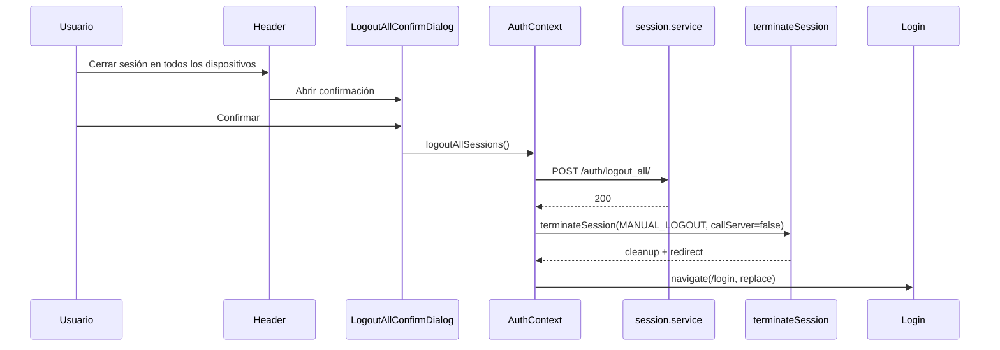
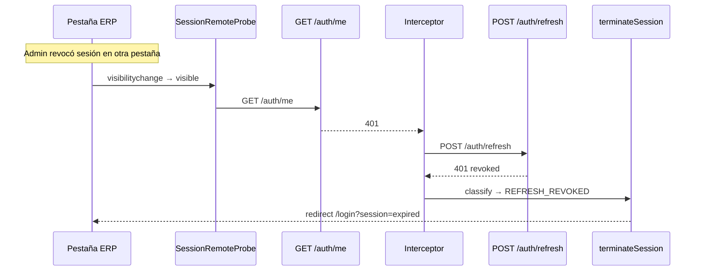
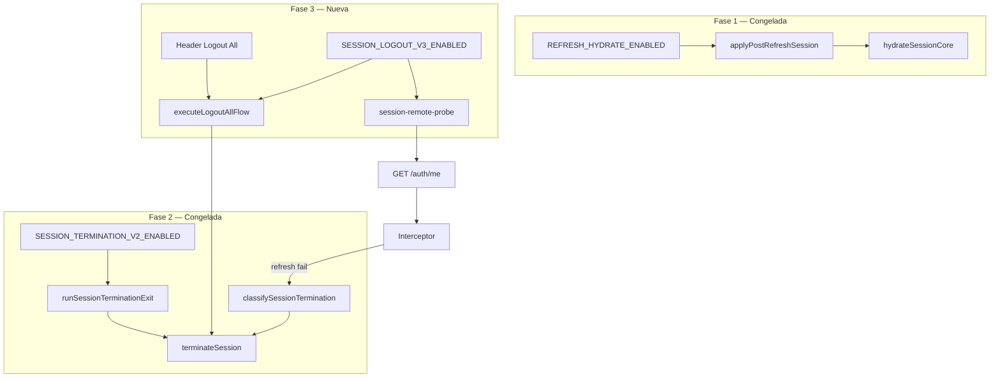

# IAM-FE-PHASE-03 — Diseño Técnico: Logout & Remote Revocation

**Ticket diseño:** IAM-FE-PHASE-03-DESIGN  
**Ticket implementación:** IAM-FE-PHASE-03-LOGOUT-IMPROVEMENTS  
**Versión:** 1.1  
**Estado:** IMPLEMENTADO — IMPL-01–10 completos (post-VALIDATION)  
**Fecha:** 2026-06-19  
**Actualización doc:** 2026-06-19 — IAM-FE-PHASE-03-DOCUMENTATION-PATCH-02  
**Referencias normativas:**
- `docs/arquitectura/IAM_SESSION_ALIGNMENT_PLAN_V1.md` — Fase 3, §8 V3.x
- `docs/arquitectura/IAM_SESSION_FRONTEND_ARCHITECTURE_V1.md` — §7 Logout All, §16–§17
- `docs/arquitectura/IAM_FE_PHASE_01_TECHNICAL_DESIGN.md` — Fase 1 cerrada (base hydrate)
- `docs/arquitectura/IAM_FE_PHASE_02_TECHNICAL_DESIGN.md` — Fase 2 cerrada (terminación)
- `IAM_SESSION_MANAGEMENT_V2.md` — contrato backend §7, §19, L-07, L-08
- `BACKEND_PLATFORM_API_CONTRACT_V2.md` — sesiones admin (sin cambio contrato)

> Este documento define el diseño y el **estado implementado** de la Fase 3.  
> Las secciones marcadas como **Snapshot pre-Phase-03** conservan el contexto histórico pre-implementación.  
> Los contratos Fase 1 y Fase 2 listados en §1.6 quedan **intactos** salvo wiring mínimo en `AuthContext` como composition root.

---

## Índice

1. [Objetivos de la Fase](#1-objetivos-de-la-fase)
2. [Problemas actuales](#2-problemas-actuales)
3. [Arquitectura propuesta](#3-arquitectura-propuesta)
4. [Nuevos módulos](#4-nuevos-módulos)
5. [Responsabilidades](#5-responsabilidades)
6. [Flujo completo](#6-flujo-completo)
7. [Diagramas](#7-diagramas)
8. [Contratos públicos](#8-contratos-públicos)
9. [Contratos internos](#9-contratos-internos)
10. [Integración con AuthContext](#10-integración-con-authcontext)
11. [Integración con Fase 1](#11-integración-con-fase-1)
12. [Integración con Fase 2](#12-integración-con-fase-2)
13. [Logout All — flujo contractual](#13-logout-all--flujo-contractual)
14. [Detección proactiva de revocación remota](#14-detección-proactiva-de-revocación-remota)
15. [Integración ActiveSessionsPage](#15-integración-activesessionspage)
16. [Integración con interceptor y processQueue](#16-integración-con-interceptor-y-processqueue)
17. [Integración con React Query](#17-integración-con-react-query)
18. [Integración con ProtectedRoute y Login](#18-integración-con-protectedroute-y-login)
19. [UX](#19-ux)
20. [Feature flags](#20-feature-flags)
21. [Rollback](#21-rollback)
22. [Riesgos](#22-riesgos)
23. [Dependencias](#23-dependencias)
24. [Plan de implementación](#24-plan-de-implementación)
25. [División por pasos](#25-división-por-pasos)
26. [Criterios de aceptación](#26-criterios-de-aceptación)
27. [Estrategia de pruebas](#27-estrategia-de-pruebas)
28. [Estrategia de auditoría](#28-estrategia-de-auditoría)
29. [Validación](#29-validación)
30. [Criterios de cierre](#30-criterios-de-cierre)

---

## 1. Objetivos de la Fase

### 1.1 Problema que resuelve

> **Snapshot pre-Phase-03** — estado tras Fase 2, antes de IMPL-01–10. Los GAPs listados se cierran en §1.2 / §26.5.

Tras el cierre de la Fase 2, **toda salida de sesión** transita por `terminateSession` vía `runSessionTerminationExit`. Sin embargo, persisten dos desalineaciones contractuales con `IAM_SESSION_MANAGEMENT_V2.md` §19 y el plan de alineación:

| Contexto | Comportamiento post-Fase 2 | Alineación §19 BE |
|----------|--------------------------|-------------------|
| **Logout All** `POST /auth/logout_all/` | Servicio HTTP existe; **sin UI** ni flujo post-200 | **Desalineado** — §19 exige redirect inmediato tras 200 |
| **Access residual post logout_all** (L-08) | Sin flujo que deje de confiar en access | **Desalineado** — usuario podría seguir operando hasta expiración JWT |
| **Revocación remota** (admin revoke) | Terminación **diferida** hasta próximo 401/refresh | **Parcial** — UI activa con sesión ya revocada en BD |
| **Logout manual header** | `logout()` → `terminateSession(MANUAL_LOGOUT)` | **Alineado** Fase 2 — Fase 3 valida regresión V3.1/V3.4 |
| **Admin revoke sesión propia (otra pestaña)** | Sin detección hasta request fallido | **Desalineado** — GAP-P1-04 |

**Consecuencia verificable:** un usuario no puede cerrar todas sus sesiones desde la UI (GAP-P0-03); tras `logout_all` el access Bearer sigue aceptándose en el cliente hasta TTL natural (L-08); un administrador que revoca su propia sesión desde otro dispositivo/pestaña mantiene la UI ERP operativa hasta el siguiente 401 pasivo.

### 1.2 GAPs que cierra

| ID | Descripción | Cierre Fase 3 |
|----|-------------|---------------|
| **GAP-P0-03** | Logout All sin UI ni redirect post-200 | **Cierre completo** — UI self-service + terminación inmediata |
| **GAP-P1-04** | Sin detección proactiva logout remoto | **Cierre completo** — probe focus/visibility (+ post-revoke admin) |
| **GAP-P0-04** (parcial logout_all) | Redirect post-terminación para logout all | **Cierre parcial** — vía `terminateSession` existente, no nuevo redirect |

### 1.3 GAPs explícitamente fuera de alcance Fase 3

| ID | Fase responsable | Notas |
|----|------------------|-------|
| GAP-P0-02 | Fase 4 | Sync access token entre pestañas (BroadcastChannel) |
| GAP-P1-01 | Fase 5 | Retry refresh 500 |
| GAP-P1-02 | Fase 6 | Impersonación 403 refresh |
| GAP-P3-02 | Fase 7 | Session limit awareness en login |
| GAP-P3-01 | Fase 8 | Observabilidad estructurada |
| Modal full-page sesión expirada | Fase 7 | Fase 3 reutiliza toast/banner Fase 2 |

Fase 3 **consume** contratos Fase 2 (`terminateSession`, taxonomía `REFRESH_REVOKED`) sin modificar el parser HTTP de Fase 2.

### 1.4 Objetivo técnico formal

La capa **Logout & Remote Revocation** implementada:

1. **Expone** UI self-service para `POST /auth/logout_all/` con confirmación destructiva.
2. **Ejecuta** terminación local **inmediata** tras `logout_all` 200, sin confiar en access residual (L-08).
3. **Detecta** revocación remota de forma proactiva (focus/visibility) reutilizando el camino 401→refresh→terminación de Fase 2.
4. **Integra** post-revoke en `ActiveSessionsPage` cuando el admin revoca sesiones propias.
5. **Preserva** íntegramente los contratos congelados Fase 1 y Fase 2 (§1.6).
6. **No introduce** endpoints nuevos ni modifica contratos API existentes.

### 1.5 Criterios de aceptación (enlace plan)

Escenarios obligatorios: **V3.1–V3.4** (`IAM_SESSION_ALIGNMENT_PLAN_V1.md` §8).

Regresión obligatoria: **V1.1–V1.4** (Fase 1) + **V2.1–V2.6** (Fase 2).

### 1.6 Contratos congelados — inmutabilidad estricta

Los siguientes artefactos **no se modifican en cuerpo, firma pública ni semántica** durante Fase 3. Solo se **invocan** desde wiring nuevo en `AuthContext` o componentes UI.

| Contrato | Ubicación | Regla Fase 3 |
|----------|-----------|--------------|
| `applyPostRefreshSession` | `src/core/auth/session/session-post-refresh.ts` | **Congelado** — sin edits |
| `hydrateSessionCore` | `src/core/auth/session/session-refresh-hydrate.ts` | **Congelado** — sin edits |
| `terminateSession` | `src/core/auth/session/session-terminate.ts` | **Congelado** — solo invocación con inputs válidos |
| `runSessionTerminationExit` | `src/shared/context/AuthContext.tsx` | **Congelado** — firma y dispatcher intactos |
| `REFRESH_HYDRATE_ENABLED` | `src/core/auth/session/refresh-hydrate.flags.ts` | **Congelado** |
| `SESSION_TERMINATION_V2_ENABLED` | `src/core/auth/session/session-termination.flags.ts` | **Congelado** |

**Wiring permitido en `AuthContext`:** nuevos métodos (`logoutAll`), nuevos efectos (probe binder), nuevas exportaciones de test — sin alterar firmas congeladas ni lógica interna de módulos `session/` Fase 1–2.

---

## 2. Problemas actuales

> **Snapshot pre-Phase-03** — describe el baseline que motivó la fase. El estado implementado está en §3, §6 y §26.5.

### 2.1 Logout All — estado post-Fase 2

Archivo: `src/features/admin/services/session.service.ts` — `logoutAllSessions()`.

| Aspecto | Estado actual | Problema |
|---------|---------------|----------|
| `POST /auth/logout_all/` | Implementado con Bearer | OK servicio |
| UI consumidora | **Ausente** | GAP-P0-03 |
| Post-200 terminación | **No ejecuta** | Usuario permanece autenticado en UI |
| L-08 access residual | Sin mitigación FE | Requests ERP podrían continuar con access válido |
| `callServer` en terminate | N/A — flujo no existe | Riesgo doble logout si se usa `callServer: true` tras logout_all |

### 2.2 Logout manual — estado post-Fase 2

Archivo: `src/shared/components/layout/Header.tsx` — `onClick={logout}`.

| Aspecto | Estado Fase 2 | Acción Fase 3 |
|---------|---------------|---------------|
| `logout()` → `terminateSession` | Implementado (flag V2) | **Validar** V3.1 regresión |
| POST `/auth/logout/` | `callServer: true` | Sin cambio |
| Idempotencia doble click | `isTerminatingRef` guard | **Validar** V3.4 |
| Impersonación activa | `endImpersonation` path | Sin cambio Fase 3 |

### 2.3 Revocación remota — estado post-Fase 2

| Escenario | Detección actual | Latencia UX |
|-----------|------------------|-------------|
| Admin revoke sesión ajena | N/A para cliente revocado | Revocado ve 401 en próximo request |
| Admin revoke **sesión propia** (otra pestaña) | Pasiva | UI operativa hasta 401 |
| Idle timeout | Refresh 401 → Fase 2 | Aceptado — transparente BE |
| Password change revoke all | `applyFullSessionToken` nueva sesión | Fuera alcance |
| TOKEN_REUSE | Fase 2 classify | Sin cambio |

Archivo: `src/features/admin/pages/ActiveSessionsPage.tsx` — `confirmRevoke`.

| Aspecto | Estado actual | Problema |
|---------|---------------|----------|
| `revokeSessionById` 200 | Toast éxito + invalidate list | OK admin |
| Revoca sesión propia actual | **No termina** sesión local | Usuario sigue en ERP si era sesión activa |
| Revoca sesión propia otra pestaña | Sin sync (Fase 4) | Probe Fase 3 mitiga latencia |

### 2.4 Backend §19 y §7 — contrato relevante

| Evento BE | Respuesta / efecto | Acción FE Fase 3 |
|-----------|-------------------|------------------|
| `POST /auth/logout_all/` 200 | Revoca todos refresh; blacklist access mapping | Terminar sesión local **inmediatamente** |
| L-08 | Access usado en logout_all válido hasta exp natural | **No** continuar operaciones; `terminateSession` sin delay |
| Admin `revoke_admin` | Revoca refresh + blacklist access vía mapping (fail-soft L-07) | Probe `GET /auth/me` detecta 401 si blacklist OK |
| Refresh revocado | 401 en `POST /auth/refresh/` | Fase 2 → `REFRESH_REVOKED` / `SESSION_EXPIRED` |
| Logout idempotente | Siempre 200 | Sin error visible en doble acción |

Mensaje canónico refresh 401 (sin cambio):
> "Sesión expirada o cerrada remotamente. Por favor, vuelva a iniciar sesión."

### 2.5 Limitación arquitectónica conocida — identificación sesión actual

> **Snapshot pre-Phase-03** — contexto de diseño original. Estado implementado: ver nota al final de esta sección.

El JWT access **no expone** `token_id` de `refresh_tokens` como claim. `AdminSessionRead.token_id` existe en listados admin.

**Estado implementado (post-VALIDATION):**
- `GET /auth/me` expone `current_token_id` (UUID fila `refresh_tokens` de la sesión autenticada).
- `isCurrentSession(session, currentTokenId)` en `src/features/admin/utils/iam-current-session.ts` compara `session.token_id === current_token_id`.
- Post-revoke admin invoca probe solo si `isCurrentSession(revokeTarget)` (no `isOwnSession` por `usuario_id`).

**Estrategia de diseño (vigente):**
- **Cross-tab (V3.3):** probe focus/visibility — no requiere correlación manual de dispositivo.
- **Same-tab admin revoke:** post-revoke **probe inmediato** (no terminación ciega) — si probe falla → terminación vía Fase 2.
- **Heurística opcional P2:** fingerprint `user_agent` + `client_type` — solo como hint UX en confirm dialog, no como gate duro.

---

## 3. Arquitectura propuesta

### 3.1 Principio de diseño: orquestación sobre terminación existente

| Capa | Nombre | Responsabilidad Fase 3 |
|------|--------|------------------------|
| **L3-A** | Logout All orchestration | POST logout_all → invocar `terminateSession` con semántica correcta |
| **L3-B** | Remote session probe | Detectar sesión inválida sin modificar parser Fase 2 |
| **L3-C** | Probe lifecycle | Focus/visibility debounce; guards de autenticación |
| **L3-D** | UI self-service | Header / cuenta — confirmación + acción |
| **L3-E** | Admin post-revoke hook | Tras revoke propio → probe inmediato |

**Regla central:** Fase 3 **no crea** un segundo orquestador de terminación. Todo fin de sesión sigue siendo `terminateSession` (Fase 2).

### 3.2 Qué cambia vs Fase 2

| Elemento | Cambio Fase 3 |
|----------|---------------|
| `useAuth` / `AuthContext` | Nuevo método `logoutAllSessions()` (aditivo) |
| `Header` | Entrada UI «Cerrar sesión en todos los dispositivos» |
| `AuthProvider` | Binder probe (efecto visibility/focus) |
| `ActiveSessionsPage` | Post-revoke probe para sesiones propias |
| Módulos Fase 2 terminate/reason/ux | **Sin cambio** |

### 3.3 Qué permanece sin cambio

| Elemento | Notas |
|----------|-------|
| `applyPostRefreshSession` (éxito) | Flujo L0→L1→diff→L2 intacto |
| `hydrateSessionCore` (cuerpo) | Sin cambio |
| `terminateSession` (cuerpo) | Sin cambio; nuevos callers |
| `classifySessionTermination` / parser | Sin cambio — Fase 3 no amplía patrones |
| `runSessionTerminationExit` | Sin cambio de firma |
| `REFRESH_HYDRATE_ENABLED` | Sin cambio |
| `SESSION_TERMINATION_V2_ENABLED` | Sin cambio |
| Interceptor 401 éxito | Fase 1 sin cambio |
| API pública `useAuth` campos existentes | Sin breaking changes |

### 3.4 Componentes nuevos (diseño)

| Artefacto | Ubicación propuesta | Responsabilidad |
|-----------|-------------------|-----------------|
| `session-logout-all.ts` | `src/core/auth/session/` | Orquestación pura logout_all → terminate |
| `session-remote-probe.ts` | `src/core/auth/session/` | Política probe: cuándo, debounce, guards |
| `session-logout-v3.flags.ts` | `src/core/auth/session/` | Feature flag Fase 3 |
| `useSessionRemoteProbe.ts` | `src/core/auth/session/` | Hook lifecycle visibility/focus |
| `LogoutAllConfirmDialog.tsx` | `src/features/auth/components/` | Confirmación destructiva |
| `Header` (extensión) | `src/shared/components/layout/` | Menú usuario — acción logout all |
| Tests | `src/core/auth/session/__tests__/`, `src/shared/context/__tests__/` | Unit + wiring |

**Nota:** Convive con módulos Fase 1–2 en `session/` sin fusionar responsabilidades hydrate/terminate.

### 3.5 Diagrama arquitectura objetivo

```
┌──────────────────────────────────────────────────────────────────────────┐
│ AuthProvider (AuthContext.tsx) — composition root                        │
│  ├─ [Fase 1] interceptor 401 éxito → applyPostRefreshSession           │
│  ├─ [Fase 2] interceptor 401 fallo → terminateSession                    │
│  ├─ [Fase 3] logoutAllSessions() → executeLogoutAllFlow                  │
│  ├─ [Fase 3] SessionRemoteProbeBinder (focus/visibility)                 │
│  └─ [Fase 2] logout() → terminateSession(MANUAL_LOGOUT)                   │
└────────────────────────────┬─────────────────────────────────────────────┘
                             │
         ┌───────────────────┼───────────────────┐
         ▼                   ▼                   ▼
┌─────────────────┐ ┌─────────────────┐ ┌─────────────────────────┐
│ session-logout- │ │ session-remote- │ │ UI: Header + Confirm    │
│ all.ts          │ │ probe.ts        │ │ Dialog + ActiveSessions │
│ L3-A orchestrate│ │ L3-B policy     │ │ L3-D / L3-E             │
└────────┬────────┘ └────────┬────────┘ └─────────────────────────┘
         │                   │
         │ POST logout_all   │ GET /auth/me (probe)
         │                   │ (401 → interceptor → refresh fail)
         └─────────┬─────────┘
                   ▼
         ┌─────────────────────────────┐
         │ terminateSession (Fase 2)    │  ← CONGELADO
         │  reason: MANUAL_LOGOUT |     │
         │         REFRESH_REVOKED*     │
         │  callServer: false (logout_all)│
         └─────────────────────────────┘
                   │
                   ▼
         runSessionTerminationExit (Fase 2) — CONGELADO
```

---

## 4. Nuevos módulos

### 4.1 `session-logout-all.ts`

| Export | Tipo | Descripción |
|--------|------|-------------|
| `LogoutAllFlowInput` | interface | Opciones de flujo (preserve branding, etc.) |
| `LogoutAllFlowDeps` | interface | DI: callLogoutAll, runTerminate, guards |
| `executeLogoutAllFlow` | async función | Orquesta POST logout_all + terminateSession |

**Responsabilidad:** secuencia contractual L-08 sin duplicar lógica de `terminateSession`.

### 4.2 `session-remote-probe.ts`

| Export | Tipo | Descripción |
|--------|------|-------------|
| `SessionProbeContext` | interface | `{ isAuthenticated, isImpersonating, isTerminating, tabVisible }` |
| `SessionProbePolicy` | interface | Debounce ms, min interval, skip conditions |
| `shouldRunSessionProbe` | función pura | Evalúa si probe debe ejecutarse |
| `resolveProbeDebounceKey` | función pura | Clave estable para throttle |

**Responsabilidad:** política pura — sin HTTP, sin React.

### 4.3 `session-logout-v3.flags.ts`

| Export | Descripción |
|--------|-------------|
| `SESSION_LOGOUT_V3_ENABLED` | Master flag Fase 3 |
| `SESSION_REMOTE_PROBE_ENABLED` | Sub-flag probe (opcional independiente) |
| `VITE_SESSION_LOGOUT_V3_ENABLED` | Env compile-time |
| `VITE_SESSION_REMOTE_PROBE_ENABLED` | Env compile-time sub-flag |

### 4.4 `useSessionRemoteProbe.ts`

| Export | Descripción |
|--------|-------------|
| `useSessionRemoteProbe` | Hook: suscribe visibility/focus; invoca probe inyectado |

**Responsabilidad:** lifecycle DOM; delega decisión a `shouldRunSessionProbe` y ejecución a deps de AuthContext.

### 4.5 Componentes UI

| Componente | Descripción |
|------------|-------------|
| `LogoutAllConfirmDialog` | `ConfirmDialog` danger — copy destructivo multi-dispositivo |
| Extensión `Header` | Botón entre menú usuario y «Cerrar Sesión» |
| (Opcional P2) `MySessionsPage` | Listado `GET /auth/sessions/` self-service — **fuera MVP** |

---

## 5. Responsabilidades

### 5.1 Matriz por capa

| Capa | Dueño | Hace | No hace |
|------|-------|------|---------|
| `session-logout-all.ts` | Core session | Ordenar logout_all + terminate | HTTP directo |
| `session-remote-probe.ts` | Core session | Política debounce/guards | Clasificar errores HTTP |
| `session.service.ts` | Feature admin | `logoutAllSessions()` HTTP | Terminar sesión local |
| `AuthContext` | Shared context | DI, `logoutAllSessions`, probe binder | Lógica pura de probe |
| `Header` | Shared layout | Render acción + dialog | Llamar API directo |
| `ActiveSessionsPage` | Feature admin | Post-revoke probe trigger | Parser termination |
| Fase 2 `terminateSession` | Core session | Cleanup + UX | Conocer logout_all |

### 5.2 Separación HTTP vs terminación

| Operación | Servicio HTTP | Terminación local |
|-----------|---------------|-------------------|
| Logout manual | `authService.logout()` vía `callServer: true` | `terminateSession` |
| Logout All | `logoutAllSessions()` **antes** de terminate | `terminateSession` con `callServer: false` |
| Probe fallido | `authService.me()` o request autenticado | Interceptor → Fase 2 classify |
| Admin revoke | `revokeSessionById()` | Probe posterior; no terminate directo |

**Invariante:** tras `logout_all` 200, **nunca** invocar `POST /auth/logout/` adicional (`callServer: false`). El backend ya revocó todos los refresh con `LOGOUT_ALL`.

---

## 6. Flujo completo

### 6.1 Logout All (V3.2)

```
Usuario → Header «Cerrar sesión en todos los dispositivos»
    │
    ▼
LogoutAllConfirmDialog (danger)
    │
    ├─ Cancelar → fin
    │
    └─ Confirmar
            │
            ▼
    executeLogoutAllFlow(deps)
            │
            ├─ guard: isTerminating? → return (idempotente)
            ├─ guard: impersonación? → bloquear con `toast.error` (ver §19.4)
            ├─ guard: selection pending? → bloquear
            │
            ▼
    POST /auth/logout_all/ (Bearer access)
            │
            ├─ error → `onLogoutAllRejected` (log DEV); sin `toast.error` — ver §13.4 (ER-02); permanece autenticado
            │
            └─ 200
                    │
                    ▼
            runSessionTerminationExit (V2 ON)
                    │
                    ▼
            terminateSession({
              reason: MANUAL_LOGOUT,
              callServer: false,
              preservePreLoginBranding: true
            })
                    │
                    ├─ processQueue(error)
                    ├─ clearAuthState
                    ├─ queryClient.clear()
                    ├─ toast «Sesión cerrada» (opcional info)
                    └─ redirect /login (replace)
```

**Post-condición:** estado anónimo; ningún request ERP posterior con access residual en memoria.

### 6.2 Logout manual header (V3.1 — regresión)

```
Usuario → Header «Cerrar Sesión»
    │
    ▼
logout() [existente Fase 2]
    │
    ├─ impersonación? → endImpersonation path (sin cambio)
    │
    └─ terminateSession(MANUAL_LOGOUT, callServer: true)
```

Fase 3 **no modifica** este flujo; solo documenta validación V3.1.

### 6.3 Probe proactivo revocación remota (V3.3)

```
Tab visible / window focus
    │
    ▼
shouldRunSessionProbe(context) ?
    │
    ├─ false → skip (tab hidden, terminating, no auth, impersonation, debounce)
    │
    └─ true
            │
            ▼
    runSessionValidityProbe()  [inyectado AuthContext]
            │
            ▼
    GET /auth/me  (request autenticado normal)
            │
            ├─ 200 → sesión válida; fin
            │
            └─ 401
                    │
                    ▼
            Interceptor existente
                    │
                    ├─ POST /auth/refresh/
                    │       ├─ 200 → Fase 1 hydrate (sin cambio)
                    │       └─ 401 → Fase 2 classify → terminateSession
                    │
                    └─ (sin bucle refresh)
```

**Nota L-07:** si Redis fail-soft impide blacklist inmediato, probe `me` puede retornar 200 brevemente. Comportamiento aceptado — alineado con limitación BE documentada.

### 6.4 Admin revoke sesión propia — ActiveSessionsPage

```
Admin confirma revoke sesión S
    │
    ▼
POST /auth/sessions/{token_id}/revoke_admin/
    │
    └─ 200
            │
            ├─ toast éxito (existente)
            ├─ invalidate list queries
            │
            └─ si isCurrentSession(S, currentTokenId) && SESSION_LOGOUT_V3_ENABLED
                    │
                    ▼
            runImmediateSessionProbe()  [mismo mecanismo §6.3]
                    │
                    └─ si inválida → terminateSession vía interceptor path
```

**No** llamar `terminateSession` directamente tras revoke sin probe — evita cerrar pestaña cuando se revocó otro dispositivo del mismo usuario.

### 6.5 Logout idempotente doble click (V3.4)

Aplica a `logout()` y `logoutAllSessions()`:

```
Click 1 → isTerminatingRef = true → flujo completo
Click 2 → getIsTerminating() === true → no-op en terminateSession
```

UI adicional: deshabilitar botones mientras `isTerminating` o mutación pending.

---

## 7. Diagramas

### 7.1 Secuencia Logout All



### 7.2 Secuencia probe revocación remota



### 7.3 Mapa dependencias fases



---

## 8. Contratos públicos

### 8.1 Extensión `AuthContextType` (aditiva, no breaking)

| Campo / método | Firma | Semántica |
|----------------|-------|-----------|
| `logoutAllSessions` | `() => Promise<void>` | POST logout_all + terminación local inmediata |

**Reglas:**
- Disponible solo si `SESSION_LOGOUT_V3_ENABLED === true` **o** siempre presente pero no-op con flag OFF (decisión implementación: **siempre presente**, flag controla UI y cuerpo).
- Requiere `SESSION_TERMINATION_V2_ENABLED` para UX contractual completa; si V2 OFF, ejecutar `performLegacySessionLogout` post logout_all 200 + `navigate('/login')` explícito como fallback documentado.

### 8.2 `useAuth()` — compatibilidad

| Regla | Valor |
|-------|-------|
| Campos existentes | Sin cambios de tipo ni semántica |
| Nuevo campo | `logoutAllSessions` aditivo |
| Consumidores actuales | No requieren actualización |

### 8.3 UI pública Header

| Elemento | Visible cuando |
|----------|----------------|
| «Cerrar sesión en todos los dispositivos» | Autenticado + ERP shell + flag V3 ON + no impersonación + no selection pending |
| «Cerrar Sesión» | Sin cambio (existente) |

### 8.4 Servicios HTTP — sin cambio contrato

| Método | Endpoint | Cambio Fase 3 |
|--------|----------|---------------|
| `logoutAllSessions` | `POST /auth/logout_all/` | **Ninguno** — ya implementado |
| `revokeSessionById` | `POST /auth/sessions/{id}/revoke_admin/` | **Ninguno** |
| `getCurrentUserSessions` | `GET /auth/sessions/` | **Ninguno** — opcional P2 |

---

## 9. Contratos internos

### 9.1 `LogoutAllFlowInput`

| Campo | Tipo | Default | Descripción |
|-------|------|---------|-------------|
| `preservePreLoginBranding` | `boolean` | `true` | Hereda semántica terminate |
| `skipRedirect` | `boolean` | `false` | Solo tests |

### 9.2 `LogoutAllFlowDeps`

| Campo | Tipo | Descripción |
|-------|------|-------------|
| `getIsTerminating` | `() => boolean` | Guard idempotencia |
| `callLogoutAllEndpoint` | `() => Promise<void>` | Wrapper `logoutAllSessions` |
| `runTerminateAfterLogoutAll` | `() => Promise<void>` | Invoca `terminateSession` MANUAL_LOGOUT, callServer false |
| `onLogoutAllRejected` | `(error: unknown) => void` | **Implementado:** log DEV en `AuthContext`. **Deuda ER-02:** sin toast usuario. **Objetivo futuro:** `toast.error(getErrorMessage)` en único punto |

### 9.3 `executeLogoutAllFlow`

| Precondición | Postcondición |
|--------------|---------------|
| Usuario autenticado | Anónimo + en `/login` |
| No `isTerminating` | `isTerminating` false al finalizar |
| logout_all 200 | `authRef.token === null` |

| Error | Comportamiento |
|-------|----------------|
| logout_all 4xx/5xx | Propaga error; **no** terminate; usuario autenticado |
| terminateSession throw | Log DEV; estado debe quedar anónimo (best-effort) |

### 9.4 `SessionProbeContext`

| Campo | Tipo | Uso |
|-------|------|-----|
| `isAuthenticated` | `boolean` | Gate |
| `isImpersonationActive` | `boolean` | Skip probe en soporte |
| `isSelectionPending` | `boolean` | Skip probe |
| `isTerminating` | `boolean` | Skip probe |
| `isDocumentVisible` | `boolean` | Page Visibility API |
| `lastProbeAtMs` | `number \| null` | Debounce |

### 9.5 `SessionProbePolicy` (valores implementados)

| Parámetro | Valor implementado | Justificación |
|-----------|-------------------|---------------|
| `minIntervalMs` | `5_000` | Throttle post-THROTTLE-01 (antes diseño `30_000`); evita tormenta en focus repetido |
| `debounceFocusMs` | `500` | Agrupa eventos focus+visibility |
| `probeOnVisibilityOnly` | `true` | No probe con tab oculta |

### 9.6 `runSessionValidityProbe` (inyectado AuthContext)

| Aspecto | Regla |
|---------|-------|
| Implementación | `authService.me()` — propaga 401/403 (no retorna `null`) |
| Marcador request | Opcional `_sessionProbe: true` en config Axios para telemetría Fase 8 — **no** skip interceptor |
| Concurrencia | Single-flight: si probe en curso, ignorar duplicados |
| Éxito | No muta estado auth |
| 401 | Delega 100% a interceptor + Fase 2 |

### 9.7 Integración con `TerminateSessionInput` (Fase 2 congelado)

| Flujo | `reason` | `callServer` | `error` |
|-------|----------|--------------|---------|
| Logout All post-200 | `MANUAL_LOGOUT` | `false` | undefined |
| Probe → refresh 401 | `REFRESH_REVOKED` o `SESSION_EXPIRED` | `false` | Axios original |
| Logout manual | `MANUAL_LOGOUT` | `true` | undefined |

**Prohibido** introducir nuevo `SessionTerminationReason` en Fase 3.

---

## 10. Integración con AuthContext

### 10.1 Nuevas piezas wiring

| Pieza | Ubicación | Descripción |
|-------|-----------|-------------|
| `logoutAllSessions` callback | `AuthProvider` | Expone vía context |
| `getLogoutAllFlowDeps` | `AuthContext.tsx` export test | Factory DI |
| `runSessionValidityProbe` | `AuthProvider` | Closure sobre `authService.me` |
| `SessionRemoteProbeBinder` | Componente hijo de `AuthProvider` o efecto interno | Monta `useSessionRemoteProbe` |

### 10.2 Orden de montaje

```
AuthProvider mount
    ├─ [existente] bootstrap, interceptor registration
    ├─ [existente] terminateSession deps
    └─ [nuevo] SessionRemoteProbeBinder (solo si flags ON + autenticado)
```

### 10.3 Guards AuthContext para logout all

| Guard | Acción |
|-------|--------|
| `isImpersonationActive()` | Toast: finalizar soporte primero; abort |
| `requiereSeleccionEmpresa` / selection pending | Toast: completar selección; abort |
| `getIsTerminating()` | Return early |
| `!isAuthenticated` | Return early |

### 10.4 Exports test (patrón Fase 2)

| Export | Propósito |
|--------|-----------|
| `getLogoutAllFlowDeps` | Tests unit wiring |
| `executeLogoutAllFlow` | Tests puro desde `@/core/auth/session` |
| `shouldRunSessionProbe` | Tests política |
| `buildLogoutAllTerminateInput` | Helper opcional — construye `TerminateSessionInput` |

---

## 11. Integración con Fase 1

### 11.1 Principio de no interferencia

Fase 3 **no modifica** ningún archivo hydrate Fase 1. El probe usa `GET /auth/me`, que es el mismo endpoint que `hydrateSessionCore` consume — sin invocar `hydrateSessionCore` en el camino probe.

### 11.2 Interacción probe vs refresh exitoso

| Escenario | Resultado |
|-----------|-----------|
| Probe → me 401 → refresh 200 | Fase 1 `applyPostRefreshSession` — sesión restaurada; **no** terminación |
| Probe → me 401 → refresh 401 | Fase 2 terminación — caso V3.3 |
| Probe durante `isRefreshingPromise` activo | Encolar o skip — **skip** preferido para evitar competir con interceptor |

> **Estado implementado:** skip si `isRefreshingPromise` activo está **diseñado §16.1 pero no cableado** en `useSessionRemoteProbe` / `runSessionValidityProbe`.

### 11.3 Flag `REFRESH_HYDRATE_ENABLED`

| Flag | Interacción Fase 3 |
|------|-------------------|
| ON | Probe refresh OK → hydrate normal |
| OFF | Probe refresh OK → legacy token-only; **sin cambio Fase 3** |

Ortogonalidad: `SESSION_LOGOUT_V3_ENABLED` independiente de `REFRESH_HYDRATE_ENABLED`.

### 11.4 Invariantes Fase 1 preservados

1. Post-refresh exitoso interceptor sigue usando `applyPostRefreshSession`.
2. `hydrateSessionCore` no recibe callbacks nuevos Fase 3.
3. `processQueue` en éxito refresh no alterado.

---

## 12. Integración con Fase 2

### 12.1 Consumo de `terminateSession`

Fase 3 es **cliente** de `terminateSession`. No extiende `TerminateSessionDeps` ni `TerminateSessionInput` estructuras.

### 12.2 Consumo de `runSessionTerminationExit`

Todo camino V2 de terminación post logout_all debe pasar por dispatcher:

```
runSessionTerminationExit({
  v2Enabled: SESSION_TERMINATION_V2_ENABLED,
  legacyDeps,
  v2Action: () => runTerminateSession(logoutAllTerminateInput),
})
```

### 12.3 Parser y taxonomía — congelados

| Regla | Detalle |
|-------|---------|
| No editar `session-termination-reason.ts` | Fase 3 §28.2 Fase 2 |
| `REFRESH_REVOKED` ya existe | Probe usa classify existente en refresh 401 |
| No agregar `LOGOUT_ALL` reason | Usar `MANUAL_LOGOUT` — acción usuario |

### 12.4 `emitTerminationEvent`

Hook no-op Fase 2 — Fase 3 **no implementa** BroadcastChannel (Fase 4). Opcional: emitir payload con `reason: MANUAL_LOGOUT` en logout all para preparar Fase 4.

### 12.5 Flag `SESSION_TERMINATION_V2_ENABLED`

| V2 | Comportamiento logout_all |
|----|---------------------------|
| ON | `terminateSession` completo |
| OFF | `performLegacySessionLogout` + navigate login manual en `logoutAllSessions` |

### 12.6 UX Fase 2 reutilizada

| Reason | UX existente aplicable |
|--------|------------------------|
| `MANUAL_LOGOUT` | Toast info «Sesión cerrada» |
| `REFRESH_REVOKED` | Toast + `?session=expired` vía `REFRESH_REVOKED` profile |

---

## 13. Logout All — flujo contractual

### 13.1 Alineación `IAM_SESSION_MANAGEMENT_V2.md` §7 y §19

| Paso BE | Paso FE Fase 3 |
|---------|----------------|
| 1. blacklist access sessions | No confiar en access local tras 200 |
| 2. blacklist current jti | Idem |
| 3. revoke_all LOGOUT_ALL | Confirmado por 200 |
| 4. HTTP 200 | Trigger `executeLogoutAllFlow` |
| §19: redirect inmediato | `terminateSession` → `redirectToLogin` |

### 13.2 L-08 — access residual

| Prohibido tras logout_all 200 | Permitido |
|------------------------------|-----------|
| Continuar navegación ERP | Redirect login inmediato |
| Disparar queries RQ autenticadas | `queryClient.clear()` |
| Asumir refresh válido | Limpiar cookie refresh local |
| Llamar `POST /auth/refresh/` | `processQueue(error)` |

### 13.3 Response `LogoutAllSessionsResponse`

| Campo | Uso UX |
|-------|--------|
| `message` | Opcional en toast éxito pre-redirect (breve) |
| `sessions_closed` | Copy confirmación: «Se cerraron N sesiones» — opcional |

### 13.4 Errores logout_all

| HTTP | UX objetivo (ER-01) | Terminación local |
|------|---------------------|-------------------|
| 401 | Toast sesión expirada; probe/terminate vía Fase 2 | Sí |
| 403 | Toast permiso | No |
| 500 | Toast error servidor | No |
| Network | Toast conexión | No |

| Capa ER-02 (logout_all) | Comportamiento |
|-------------------------|----------------|
| **Implementado** | `Header` → `AuthContext.logoutAllSessions()`; errores en `onLogoutAllRejected` con log DEV únicamente |
| **Deuda aceptada** | Sin `toast.error` al usuario cuando `POST /auth/logout_all/` falla (4xx/5xx/network) |
| **Objetivo futuro (norma ER-02)** | `toast.error(getErrorMessage)` en un solo lugar — p. ej. callback centralizado en `AuthContext` o hook RQ dedicado |

---

## 14. Detección proactiva de revocación remota

### 14.1 Estrategia elegida

| Estrategia | Decisión Fase 3 | Motivo |
|------------|-----------------|--------|
| Polling periódico agresivo | **No** (sub-flag opcional 5 min P2) | Carga innecesaria |
| Focus / visibility handler | **Sí** — primario | Alineado plan §Fase 3 |
| BroadcastChannel | **No** — Fase 4 | Evitar duplicar |
| WebSocket push | **No** — sin endpoint | Fuera contrato |
| Timer idle cliente | **No** — Fase 7 | BE maneja idle |

### 14.2 Eventos DOM

| Evento | Acción |
|--------|--------|
| `document.visibilitychange` → `visible` | Evaluar probe |
| `window.focus` | Evaluar probe (debounced) |

### 14.3 Condiciones skip

| Condición | Skip |
|-----------|------|
| `!isAuthenticated` | Sí |
| `isImpersonationActive()` | Sí |
| `requiereSeleccionEmpresa` | Sí |
| `getIsTerminating()` | Sí |
| `document.hidden` | Sí |
| `SESSION_REMOTE_PROBE_ENABLED === false` | Sí |
| Debounce activo | Sí |

### 14.4 Alternativa descartada: POST /auth/refresh/ como probe

| Problema | Impacto |
|----------|---------|
| Rota cookie refresh | Efecto colateral — no es probe read-only |
| Competencia F5 multi-tab | Riesgo TOKEN_REUSE falso positivo |
| Carga BE | Innecesaria |

### 14.5 Latencia esperada V3.3

| Acción usuario tras revoke remoto | Detección |
|-----------------------------------|-----------|
| Vuelve a pestaña ERP | visibility → probe → ≤ `minIntervalMs` (5 s) + RTT |
| Sigue activo en pestaña | Hasta próximo request natural o focus |
| P2 polling 5 min | Peor caso acotado si sub-flag ON |

---

## 15. Integración ActiveSessionsPage

### 15.1 Cambio mínimo

Tras `confirmRevoke` exitoso, si `isCurrentSession(revokeTarget, currentTokenId)`:

1. Mantener toast éxito existente.
2. Invocar `runSessionValidityProbe()` desde hook/context.
3. **No** toast adicional en probe.

### 15.2 RBAC

| Regla | Detalle |
|-------|---------|
| Página admin | Ya protegida por permisos IAM |
| Revoke propio | Permitido — mismo usuario |
| Revoke ajeno | Sin probe local (no afecta sesión admin actual) |

### 15.3 Copy ConfirmDialog existente

Extender mensaje cuando `isCurrentSession(revokeTarget, currentTokenId)`:

> Si esta es tu sesión actual en este dispositivo, se cerrará la aplicación.

Sin bloquear acción — información UX.

---

## 16. Integración con interceptor y processQueue

### 16.1 Probe y cola refresh

| Estado interceptor | Probe (diseño) | Probe (implementado) |
|--------------------|----------------|----------------------|
| `isRefreshingPromise` activo | **Skip** probe | **No cableado** — probe puede ejecutarse en paralelo |
| Post-terminate | Probe desmontado vía `!isAuthenticated` | Igual |

### 16.2 Logout all y cola

`terminateSession` existente ya:
1. `clearRefreshingPromise`
2. `processQueue(error, null)`

Fase 3 hereda sin modificar.

### 16.3 Marcador `_sessionProbe` (opcional)

Si se añade a config Axios:
- **No** debe omitir manejo 401
- **No** debe omitir refresh
- Solo telemetría DEV Fase 8

---

## 17. Integración con React Query

### 17.1 Orquestación logout all

| Aspecto | Detalle |
|---------|---------|
| Orquestación | **`AuthContext.logoutAllSessions`** — `executeLogoutAllFlow` + `terminateSession` |
| Hook RQ `useLogoutAllSessions` | **No implementado** — diseño opcional descartado en MVP |
| `Header` | Llama `logoutAllSessions()` del context; estado `logoutAllPending` local |
| **Implementado (ER-02)** | Errores vía `onLogoutAllRejected` → log DEV |
| **Deuda aceptada (ER-02)** | Sin `toast.error` al usuario en fallo `logout_all` |
| **Objetivo futuro (ER-02)** | Toast único con `getErrorMessage` en un solo punto de orquestación |
| Invalidación | N/A — terminación hace `queryClient.clear()` |

### 17.2 ActiveSessionsPage

Sin cambio en `useActiveSessionsList` salvo post-revoke probe trigger.

---

## 18. Integración con ProtectedRoute y Login

### 18.1 ProtectedRoute

Sin cambio. `terminateSession` establece `isAuthenticated=false` antes de redirect explícito.

### 18.2 Login page

Sin cambio Fase 3. Logout all usa `MANUAL_LOGOUT` sin query param obligatorio.

| Escenario | Login UX |
|-----------|----------|
| Logout all | Toast opcional pre-redirect; login sin banner |
| Probe → REFRESH_REVOKED | Banner `?session=expired` existente Fase 2 |

### 18.3 Doble feedback

Evitar toast `MANUAL_LOGOUT` + banner login simultáneos — patrón Fase 2 §20.4.

---

## 19. UX

### 19.1 Matriz acciones

| Acción | Confirmación | Tipo ConfirmDialog | Toast éxito | Toast error |
|--------|--------------|-------------------|-------------|-------------|
| Cerrar Sesión | No | — | Info opcional Fase 2 | — |
| Cerrar todos los dispositivos | **Sí** | `danger` | Pre-redirect breve opcional | **Implementado:** log DEV en error. **Deuda ER-02:** sin toast usuario. **Objetivo:** `toast.error(getErrorMessage)` en único punto |
| Admin revoke ajeno | Sí | `danger` | Éxito existente | existente |
| Probe terminate | No | — | Fase 2 profile | — |

### 19.2 Copy Logout All ConfirmDialog

**Título:** Cerrar sesión en todos los dispositivos

**Mensaje:**
> Se cerrará tu sesión en este navegador y en todos los demás dispositivos donde hayas iniciado sesión. Deberás volver a identificarte.

**Botón confirmar:** Cerrar todas las sesiones

### 19.3 Estados loading Header

| Estado | UI |
|--------|-----|
| `logoutAllPending` | Deshabilitar ambos botones salida |
| `isTerminating` | Deshabilitar menú usuario |

### 19.4 Impersonación

| Regla | UX |
|-------|-----|
| Logout all bloqueado | Toast: «Finaliza el modo soporte antes de cerrar todas las sesiones» |
| Logout simple | Flujo `endImpersonation` existente — sin cambio |

### 19.5 Accesibilidad

- `aria-label` en acción logout all
- Focus trap en ConfirmDialog (patrón existente)
- Mensajes en español — vocabulario «Cerrar sesión», no «Eliminar»

### 19.6 Diseño visual (2 capas)

| Elemento | Clase |
|----------|-------|
| Botón logout all menú | `text-text-base hover:bg-overlay` |
| Confirm danger | Patrón `ConfirmDialog` existente |
| Sin UUID en UI | N/A esta fase |

---

## 20. Feature flags

### 20.1 Flags Fase 3

| Flag | Default | Env | Alcance |
|------|---------|-----|---------|
| `SESSION_LOGOUT_V3_ENABLED` | `true` | `VITE_SESSION_LOGOUT_V3_ENABLED` | Master — UI logout all + orchestration |
| `SESSION_REMOTE_PROBE_ENABLED` | `true` | `VITE_SESSION_REMOTE_PROBE_ENABLED` | Probe focus/visibility + admin post-revoke |

### 20.2 Ortogonalidad con flags congelados

| Flag | Relación |
|------|----------|
| `REFRESH_HYDRATE_ENABLED` | Independiente |
| `SESSION_TERMINATION_V2_ENABLED` | V3 logout_all **requiere** V2 para path óptimo; fallback legacy documentado |

### 20.3 Matriz combinaciones

| RH | ST V2 | LV3 | Probe | Comportamiento |
|----|-------|-----|-------|----------------|
| ON | ON | ON | ON | **Objetivo producción** |
| ON | ON | OFF | * | Sin UI logout all; sin probe; Fase 2 intacta |
| ON | OFF | ON | ON | logout_all + legacy cleanup + manual navigate |
| * | * | ON | OFF | UI logout all sin probe proactivo |

---

## 21. Rollback

### 21.1 Niveles rollback (§11.4 plan)

| Nivel | Procedimiento | Efecto |
|-------|---------------|--------|
| L1 Runtime probe | `VITE_SESSION_REMOTE_PROBE_ENABLED=false` | Revoke remoto vuelve a pasivo |
| L2 Runtime completo | `VITE_SESSION_LOGOUT_V3_ENABLED=false` | Oculta UI; sin logout all FE |
| L3 Código | Revert commits Fase 3 | Estado post-Fase 2 |
| L4 Parcial staging | Probe OFF prod; UI ON staging | Validación incremental |

### 21.2 Rollback sin afectar Fases 1–2

| Acción | Impacto Fase 1–2 |
|--------|------------------|
| Flag V3 OFF | **Ninguno** |
| Revert Fase 3 | **Ninguno** en módulos congelados |
| Mantener `logoutAllSessions` service | Service puede quedar huérfano — aceptable |

### 21.3 Criterio activación rollback

- Probe causa terminaciones espurias en staging
- Logout all genera 500 sistemático backend
- Regresión V1/V2 en CI

---

## 22. Riesgos

### 22.1 Riesgos arquitectónicos

| Riesgo | Prob. | Severidad | Mitigación |
|--------|-------|-----------|------------|
| Logout all 200 + terminate falla | Baja | Alta | `executeLogoutAllFlow` finally; tests integración |
| Probe dispara refresh innecesario | Media | Baja | Debounce 5 s (`minIntervalMs`); skip si refreshing **pendiente cableado** |
| Terminación espuria por me flaky | Baja | Alta | No probe en network offline; retry manual usuario |
| `callServer: true` tras logout_all | Baja | Media | Code review + test assert callServer false |
| Regresión Fase 1 refresh OK | Baja | Alta | V1.x CI obligatorio |
| Regresión Fase 2 terminate | Baja | Alta | V2.x CI obligatorio |

### 22.2 Riesgos UX

| Riesgo | Mitigación |
|--------|------------|
| Usuario confunde logout vs logout all | Copy claro; confirmación danger |
| Admin revoca otro dispositivo y se asusta | Copy confirm «este dispositivo» solo si `isCurrentSession` |
| Toast duplicado logout all | Un solo toast pre-redirect o ninguno |

### 22.3 Riesgos BE (L-07, L-08)

| Limitación | Mitigación FE |
|------------|---------------|
| L-08 access válido post logout_all | Terminación inmediata — no usar access |
| L-07 Redis fail-soft blacklist | Probe puede retrasar detección — aceptado |

### 22.4 Riesgos operativos

| Riesgo | Mitigación |
|--------|------------|
| Staging sin escenario V3.3 | Playbook: admin revoke + focus tab |
| Flag V3 OFF accidental | Default true; runbook |

---

## 23. Dependencias

### 23.1 Dependencias duras

| Dependencia | Estado requerido |
|-------------|------------------|
| Fase 1 cerrada | `applyPostRefreshSession` estable |
| Fase 2 cerrada | `terminateSession` único punto salida |
| `session.service.ts` | `logoutAllSessions` implementado |
| `ConfirmDialog` shared | Existente |
| `getErrorMessage` | Existente |

### 23.2 Dependencias blandas

| Dependencia | Impacto si ausente |
|-------------|-------------------|
| `SESSION_TERMINATION_V2_ENABLED` ON | Fallback legacy menos UX |
| Permisos admin sesiones | ActiveSessionsPage post-revoke solo admins |
| Backend blacklist mapping | Probe menos efectivo (L-07) |

### 23.3 Habilita Fase 4

Tras Fase 3:
- `logoutAllSessions` emitirá evento vía `emitTerminationEvent` (preparación)
- Probe puede coexistir con BroadcastChannel — Fase 4 reduce necesidad probe en logout cross-tab

---

## 24. Plan de implementación

Orden por dependencias. Sin código en este documento.

| Orden | Entregable | Ticket sugerido | Depende de |
|-------|------------|-----------------|------------|
| 1 | `session-logout-v3.flags.ts` | IMPL-01 | — |
| 2 | `session-logout-all.ts` + tests | IMPL-02 | 1 |
| 3 | `session-remote-probe.ts` + tests | IMPL-03 | 1 |
| 4 | AuthContext `logoutAllSessions` + deps | IMPL-04 | 2 |
| 5 | `runSessionValidityProbe` wiring | IMPL-05 | 3, 4 |
| 6 | `useSessionRemoteProbe` + binder | IMPL-06 | 5 |
| 7 | `LogoutAllConfirmDialog` + Header UI | IMPL-07 | 4 |
| 8 | ActiveSessionsPage post-revoke probe | IMPL-08 | 5 |
| 9 | Tests integración AuthContext | IMPL-09 | 4–8 |
| 10 | Regresión V1.x + V2.x | IMPL-10 | 9 |
| 11 | Validación V3.x staging | VALIDATION | 10 |
| 12 | Auditorías + cierre | CLOSURE | 11 |

> **Estado implementado:** Pasos IMPL-01–10 completos; VALIDATION ejecutada post-IMPL; CLOSURE-REPORT (Paso 12) pendiente.

---

## 25. División por pasos

### Paso 1 — Feature flags Fase 3 (IMPL-01)

**Entregable:** `session-logout-v3.flags.ts`

- Definir `SESSION_LOGOUT_V3_ENABLED`, `SESSION_REMOTE_PROBE_ENABLED`
- Tests parse env similar Fase 1/2 flags

**Habilita:** Pasos 2–8

---

### Paso 2 — Orquestador Logout All (IMPL-02)

**Entregable:** `session-logout-all.ts`

- `executeLogoutAllFlow` con DI
- Tests: orden llamadas, callServer false, error no terminate, idempotencia

**Habilita:** Paso 4

---

### Paso 3 — Política probe remoto (IMPL-03)

**Entregable:** `session-remote-probe.ts`

- `shouldRunSessionProbe`, policy defaults
- Tests: debounce, skip impersonation, skip hidden tab

**Habilita:** Pasos 5–6, 8

---

### Paso 4 — AuthContext logoutAllSessions (IMPL-04)

**Entregable:** wiring `logoutAllSessions` en context

- `getLogoutAllFlowDeps`
- Exponer en `AuthContextType`
- Guards impersonation/selection
- `runSessionTerminationExit` para path V2

**Habilita:** Pasos 5, 7

---

### Paso 5 — Session validity probe (IMPL-05)

**Entregable:** `runSessionValidityProbe` en AuthProvider

- Single-flight ref
- Delegación a `authService.me()`
- Sin modificar interceptor

**Habilita:** Pasos 6, 8

---

### Paso 6 — Lifecycle probe (IMPL-06)

**Entregable:** `useSessionRemoteProbe` + binder en AuthProvider

- Suscribir visibility/focus
- Desmontar cuando no autenticado
- Flag `SESSION_REMOTE_PROBE_ENABLED`

**Habilita:** Paso 9

---

### Paso 7 — UI Logout All (IMPL-07)

**Entregable:** `LogoutAllConfirmDialog` + Header

- Entrada menú usuario
- Estados pending/terminating
- RBAC visual: no renderizar sin auth

**Habilita:** Paso 11

---

### Paso 8 — ActiveSessionsPage post-revoke (IMPL-08)

**Entregable:** hook post-revoke en `confirmRevoke`

- Probe si `isCurrentSession(revokeTarget, currentTokenId)`
- Copy confirm extendido

**Habilita:** Paso 9

---

### Paso 9 — Tests integración (IMPL-09)

**Entregable:** `auth-phase-03-regression.test.ts`, `auth-phase-03-integration.test.ts`

- logout all → terminate invocado
- probe skip conditions
- callServer false assert

**Habilita:** Paso 10

---

### Paso 10 — Regresión Fase 1–2 (IMPL-10)

**Entregable:** CI verde V1.1–V1.4 + V2.1–V2.6

**Habilita:** Paso 11

---

### Paso 11 — Validación staging V3.x (VALIDATION)

**Entregable:** evidencia V3.1–V3.4

**Habilita:** Paso 12

---

### Paso 12 — Cierre (CLOSURE)

**Entregable:** informe cierre Fase 3

---

## 26. Criterios de aceptación

### 26.1 Escenarios obligatorios V3.x

| ID | Escenario | Criterio éxito |
|----|-----------|----------------|
| **V3.1** | Logout manual header | POST logout + limpieza + login |
| **V3.2** | Logout All desde UI nueva | POST logout_all 200 → redirect login **inmediato** |
| **V3.3** | Admin revoke sesión propia (otra pestaña) | Al volver a pestaña: detección y terminación ≤ 5 s + RTT tras focus/visibility |
| **V3.4** | Logout idempotente doble click | Sin error visible; estado anónimo |

### 26.2 Criterios detallados V3.2

| # | Assert |
|---|--------|
| 1 | UI visible para usuario autenticado ERP |
| 2 | Confirmación danger antes de ejecutar |
| 3 | `POST /auth/logout_all/` con Bearer |
| 4 | Tras 200: `auth.token === null` antes de siguiente tick ERP |
| 5 | `queryClient` sin datos autenticados |
| 6 | URL `/login` con `replace: true` |
| 7 | No `POST /auth/logout/` tras logout_all (callServer false) |
| 8 | No request ERP autenticado post-200 pre-redirect |

### 26.3 Criterios detallados V3.3

| # | Assert |
|---|--------|
| 1 | Pestaña A autenticada; pestaña B revoca sesión A vía admin |
| 2 | Pestaña A oculta/inactiva durante revoke |
| 3 | Al focus A: probe ejecuta |
| 4 | Terminación con reason `REFRESH_REVOKED` o `SESSION_EXPIRED` |
| 5 | Mensaje UX coherente Fase 2 |
| 6 | Latencia detección tras focus ≤ 5 s (`minIntervalMs`) + RTT |

### 26.4 Regresión obligatoria

| Bloque | IDs |
|--------|-----|
| Fase 1 | V1.1–V1.4 |
| Fase 2 | V2.1–V2.6 |

### 26.5 GAPs cerrados

| GAP | Verificación |
|-----|--------------|
| GAP-P0-03 | V3.2 |
| GAP-P1-04 | V3.3 |
| GAP-P0-04 parcial | V3.2 redirect |

---

## 27. Estrategia de pruebas

### 27.1 Pirámide

| Nivel | Alcance | Herramienta |
|-------|---------|-------------|
| Unit puro | `executeLogoutAllFlow`, `shouldRunSessionProbe` | Vitest |
| Unit AuthContext | deps factories, guards | Vitest + mocks |
| Integración | Header → logoutAll → terminate mock | RTL |
| Regresión | V1 + V2 suites existentes | CI |
| E2E manual | V3.3 dos pestañas | Staging playbook |

### 27.2 Fixtures unitarios `executeLogoutAllFlow`

| Caso | Expect |
|------|--------|
| Happy path | callLogoutAll → runTerminate order |
| logout_all throws | runTerminate **not** called |
| isTerminating true | no calls |
| callServer en terminate | `false` |

### 27.3 Fixtures `shouldRunSessionProbe`

| Contexto | Expect |
|----------|--------|
| Authenticated + visible | true |
| Hidden tab | false |
| Impersonation | false |
| `< minInterval` | false |
| Terminating | false |

### 27.4 Tests integración AuthContext

| Archivo implementado | Casos |
|----------------------|-------|
| `auth-phase-03-regression.test.ts` | V3.1, V3.4; regresión wiring logout all |
| `auth-phase-03-integration.test.ts` | logoutAllSessions → terminate; probe skip; `callServer: false` |
| `session-remote-probe.test.ts` | política `shouldRunSessionProbe`; throttle 5 s |
| `useSessionRemoteProbe.test.ts` | lifecycle visibility/focus; single-flight |

### 27.5 Mocks HTTP

| Endpoint | Mock |
|----------|------|
| `POST /auth/logout_all/` | 200 + `{ message, sessions_closed }` |
| `GET /auth/me` | 200 o 401 para probe |
| `POST /auth/refresh/` | 401 revoked para V3.3 |

### 27.6 Playbook staging V3.3

1. Login usuario admin en Chrome A y Chrome B (mismo usuario).
2. En B: IAM → Sesiones activas → revocar sesión de A (matching device).
3. En A: cambiar a otra pestaña 10s → volver.
4. Verificar redirect login con mensaje remoto.

---

## 28. Estrategia de auditoría

### 28.1 Bloques auditoría

| Bloque | Alcance IMPL | Auditoría |
|--------|--------------|-----------|
| **AUDIT-A** | IMPL-01–03 módulos puros | Flags + logout-all + probe policy |
| **AUDIT-B** | IMPL-04–06 AuthContext wiring | DI, guards, single-flight |
| **AUDIT-C** | IMPL-07–08 UI + admin | UX, RBAC, ER-02 |
| **AUDIT-D** | IMPL-09–10 tests + regresión | Cobertura V3.x |

### 28.2 Checklist AUDIT-A

| ID | Pregunta |
|----|----------|
| A1 | ¿`terminateSession` cuerpo sin modificaciones? |
| A2 | ¿`hydrateSessionCore` / `applyPostRefreshSession` sin modificaciones? |
| A3 | ¿`callServer: false` tras logout_all? |
| A4 | ¿No nuevos `SessionTerminationReason`? |
| A5 | ¿Parser `classifySessionTermination` sin cambios? |

### 28.3 Checklist AUDIT-B

| ID | Pregunta |
|----|----------|
| B1 | ¿`runSessionTerminationExit` firma intacta? |
| B2 | ¿Probe delega 401 a interceptor? |
| B3 | ¿Skip probe si `isRefreshingPromise`? | **No implementado** — diseño §16.1 |
| B4 | ¿API `useAuth` sin breaking changes? |
| B5 | ¿Flags V3 ortogonales a V1/V2? |

### 28.4 Checklist AUDIT-C

| ID | Pregunta |
|----|----------|
| C1 | ¿ConfirmDialog danger logout all? |
| C2 | ¿Toast error solo en onError mutation? | **Parcial** — logout_all sin toast; deuda ER-02 |
| C3 | ¿Logout all bloqueado en impersonación? |
| C4 | ¿Sin UUID en UI? |
| C5 | ¿Tokens Capa 1 en UI estructural? |

### 28.5 Clasificación hallazgos

Igual que Fases 1–2: P0 bloqueante, P1 significativo, P2 residual, P3 menor.

---

## 29. Validación

### 29.1 Ticket VALIDATION

**ID:** IAM-FE-PHASE-03-VALIDATION

| Entrada | Salida |
|---------|--------|
| IMPL-01–10 completos | Veredicto APPROVED / REJECTED |
| AUDIT-A–D | Sin P0 abiertos |
| CI verde | Regresión documentada |

### 29.2 Matriz trazabilidad

| Escenario | Automatizado | Manual staging |
|-----------|--------------|----------------|
| V3.1 | Sí — regresión Fase 2 | Smoke |
| V3.2 | Sí — `auth-phase-03-regression.test.ts`, `auth-phase-03-integration.test.ts` | Smoke |
| V3.3 | Parcial — mock 401 chain | **Requerido** dos pestañas |
| V3.4 | Sí — idempotencia mock | Opcional |

### 29.3 Evidencia mínima cierre

| Evidencia | Formato |
|-----------|---------|
| CI run verde | Link o hash commit |
| V3.2 screen capture | PNG opcional |
| V3.3 nota operativa | Texto playbook resultado |
| Lista GAPs cerrados | Tabla §26.5 |

### 29.4 Criterio REJECTED

- V3.2 sin redirect inmediato
- `terminateSession` modificado
- Regresión V1 o V2 roja
- P0 auditoría abierto

---

## 30. Criterios de cierre

### 30.1 Cierre Fase 3 — técnico

| Criterio | Requerido |
|----------|-----------|
| Pasos IMPL-01–10 implementados | Sí |
| AUDIT-A–D APPROVED | Sí |
| V3.1–V3.4 validados | Sí (V3.3 manual staging) |
| V1.1–V1.4 + V2.1–V2.6 regresión verde | Sí |
| GAP-P0-03, GAP-P1-04 cerrados | Sí |
| Rollback flag verificado | Sí |
| Contratos §1.6 sin modificaciones | Sí — verificado en auditoría |

### 30.2 Habilitación Fase 4

Tras cierre Fase 3:

- `emitTerminationEvent` en logout all puede alimentar BroadcastChannel
- Logout manual / logout all / probe terminate comparten `TerminateSessionEventPayload`
- Probe proactivo se vuelve **complementario** a sync cross-tab (no reemplazado de inmediato)

### 30.3 Habilitación Fase 7

- Mensajes `REFRESH_REVOKED` ya diferenciados Fase 2
- Fase 7 puede añadir modal sin alterar Fase 3

### 30.4 Deuda documentada post-Fase 3 (no bloqueante)

| ID | Descripción | Estado / fase |
|----|-------------|---------------|
| D3-01 | Identificación sesión actual (heurística same-tab revoke) | Parcialmente resuelto — `current_token_id` + `isCurrentSession()`; fingerprint P2 opcional |
| D3-02 | Polling 5 min opcional no en MVP | P2 sub-flag |
| D3-03 | Página «Mis sesiones» self-service `GET /auth/sessions/` | P2 UX |
| D3-04 | L-07 latencia probe si Redis fail-soft | Aceptado |

### 30.5 Documentos derivados previstos

| Ticket | Contenido | Estado |
|--------|-----------|--------|
| IAM-FE-PHASE-03-IMPL-FLAGS | Paso 1 | Completado |
| IAM-FE-PHASE-03-IMPL-LOGOUT-ALL | Paso 2 | Completado |
| IAM-FE-PHASE-03-IMPL-PROBE | Pasos 3, 5–6 | Completado |
| IAM-FE-PHASE-03-IMPL-WIRING | Paso 4 | Completado |
| IAM-FE-PHASE-03-IMPL-UI | Pasos 7–8 | Completado |
| IAM-FE-PHASE-03-VALIDATION | Paso 11 | Completado (post-IMPL) |
| IAM-FE-PHASE-03-CLOSURE-REPORT | Paso 12 — informe formal de cierre | **Pendiente** — entregable documental de cierre de fase; no implica funcionalidad pendiente de implementación (IMPL-01–10 completos) |

---

## Referencias cruzadas

| Documento | Sección relevante |
|-----------|-------------------|
| `IAM_SESSION_ALIGNMENT_PLAN_V1.md` | §5 Fase 3, §8 V3.x, GAP-P0-03, GAP-P1-04 |
| `IAM_SESSION_FRONTEND_ARCHITECTURE_V1.md` | §7 Logout All, §16–§17, FE-P0-03 |
| `IAM_FE_PHASE_01_TECHNICAL_DESIGN.md` | Hydrate congelado — §1.6 |
| `IAM_FE_PHASE_02_TECHNICAL_DESIGN.md` | Terminación — §28.2 habilitación Fase 3 |
| `IAM_SESSION_MANAGEMENT_V2.md` | §7 Logout All, §19, L-07, L-08 |
| `BACKEND_PLATFORM_API_CONTRACT_V2.md` | Sesiones admin IAM-SESSIONS-PA-001 |
| `ERP_FRONTEND_STANDARDS_V2.md` | ER-01, ER-02, UX-05 confirm danger |

---

## Tickets derivados

| Ticket | Contenido |
|--------|-----------|
| IAM-FE-PHASE-03-DESIGN | Este documento |
| IAM-FE-PHASE-03-LOGOUT-IMPROVEMENTS | Epic implementación |
| IAM-FE-PHASE-03-IMPL-* | Pasos 1–10 |
| IAM-FE-PHASE-03-AUDIT-* | Auditorías por bloque |
| IAM-FE-PHASE-03-VALIDATION | Cierre operativo |
| IAM-FE-PHASE-03-CLOSURE-REPORT | Informe cierre |

---

**Fin del diseño IAM-FE-PHASE-03 — Logout & Remote Revocation**
