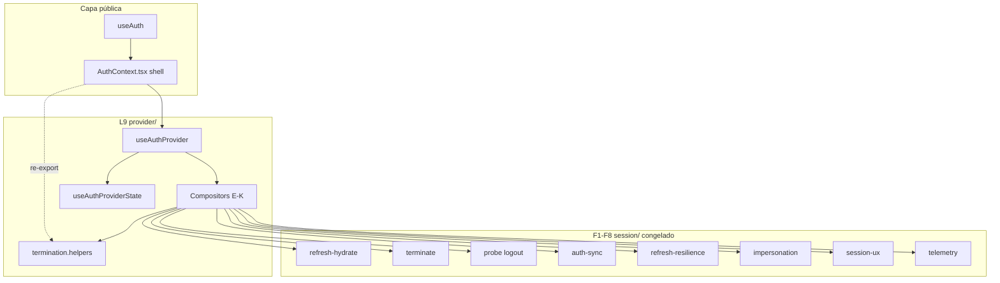

# IAM-FE-PHASE-09 — Diseño Técnico: AuthContext Decomposition

**Ticket diseño:** IAM-FE-PHASE-09-DESIGN-01  
**Ticket implementación:** IAM-FE-PHASE-09-AUTH-REFACTOR  
**Versión:** 1.0  
**Estado:** DESIGN ONLY — sin implementación  
**Fecha:** 2026-06-19  
**Referencias normativas:**
- IAM-FE-PHASE-09-KICKOFF-01 — Kickoff F9 autorizado
- IAM-FE-PHASE-08-SIGNOFF-01 — Phase-08 SIGNED OFF (2026-06-19)
- IAM-FE-PHASE-08-CLOSURE-REPORT-01
- `docs/arquitectura/IAM_SESSION_ALIGNMENT_PLAN_V1.md` v1.1 — §5 Fase 9, §8 V9.x, GAP-P1-05, GAP-P2-02/03, H8
- `docs/arquitectura/IAM_FE_PHASE_08_TECHNICAL_DESIGN.md` v1.0 — congelada
- SIGNOFF oficiales **F1–F8**

> Este documento define **cómo** se implementará la Fase 9.  
> No contiene parches ni modificaciones a código o documentos existentes.  
> **Las Fases 1–8 quedan completamente congeladas.**

---

## Declaraciones normativas (Fase 9)

1. **F1–F8 permanecen completamente congeladas** — cuerpos en `src/core/auth/session/` y wiring UX L7/L8.
2. **No modificar OpenAPI.**
3. **No modificar `useAuth()`** — campos, tipos, semántica, export path.
4. **No modificar UX** — F7 congelada; modal, gates, copy, flujos visibles.
5. **No modificar comportamiento observable** — login, refresh, terminate, probe, impersonation, cross-tab, telemetría.
6. **No modificar Session modules** — archivos F1–F8 en `session/` intactos salvo imports rotos por paths (prohibido cambiar cuerpos).
7. **No modificar L7** — módulos `session-ux-*`, `SessionUxBinder`, `SessionBootstrapGate`.
8. **No modificar L8** — emitter, redaction, sink, taxonomía, `session-telemetry-auth-wiring` cuerpos.
9. **La descomposición será únicamente estructural** — extracción + composición + eliminación legacy.
10. **`AuthProvider` será únicamente un compositor** — sin lógica de dominio inline post IMPL-12.
11. **Todo cambio deberá mantener V1–V8 completamente verde.**
12. **No se admitirán optimizaciones funcionales durante F9** — ni refactors de algoritmo, ni consolidación de flags F1–F8, ni cambios de orden de effects salvo copy literal.

---

## Índice

1. [Objetivos de la Fase 9](#1-objetivos-de-la-fase-9)
2. [Problema arquitectónico actual](#2-problema-arquitectónico-actual)
3. [Arquitectura propuesta (L9)](#3-arquitectura-propuesta-l9)
4. [Principios de diseño](#4-principios-de-diseño)
5. [Inventario completo de responsabilidades actuales de AuthContext](#5-inventario-completo-de-responsabilidades-actuales-de-authcontext)
6. [Clasificación de responsabilidades](#6-clasificación-de-responsabilidades)
7. [Nuevos módulos propuestos](#7-nuevos-módulos-propuestos)
8. [Dependencias entre módulos](#8-dependencias-entre-módulos)
9. [Diagrama completo de dependencias](#9-diagrama-completo-de-dependencias)
10. [AuthProvider final como compositor delgado](#10-authprovider-final-como-compositor-delgado)
11. [API pública de useAuth() (inmutable)](#11-api-pública-de-useauth-inmutable)
12. [Estrategia de extracción incremental](#12-estrategia-de-extracción-incremental)
13. [Plan IMPL-01…IMPL-14 refinado](#13-plan-impl-01impl-14-refinado)
14. [Estrategia de rollback](#14-estrategia-de-rollback)
15. [Compatibilidad obligatoria F1–F8](#15-compatibilidad-obligatoria-f1f8)
16. [Escenarios V9.1 — Contratos públicos inmutables](#16-escenarios-v91--contratos-públicos-inmutables)
17. [Escenarios V9.2 — Regresión completa V1–V8](#17-escenarios-v92--regresión-completa-v1v8)
18. [Escenarios V9.3 — ProtectedRoute / AuthGate / Provider](#18-escenarios-v93--protectedroute--authgate--provider)
19. [Riesgos](#19-riesgos)
20. [Exclusiones](#20-exclusiones)
21. [GAPs que quedarán cerrados](#21-gaps-que-quedarán-cerrados)
22. [Criterios de aceptación](#22-criterios-de-aceptación)

---

## 1. Objetivos de la Fase 9

### 1.1 Objetivos funcionales

| # | Objetivo |
|---|----------|
| 1 | Cerrar **GAP-P1-05** — eliminar monolito `AuthContext.tsx` (~3.068 líneas) como barrera de evolución |
| 2 | Cerrar **GAP-P2-02** — eliminar `src/services/auth.service.ts` legacy huérfano |
| 3 | Cerrar **GAP-P2-03** — eliminar `src/context/TenantContext.tsx` legacy huérfano |
| 4 | Completar **H8** — mantenibilidad web core ≥ 98 % alineación §19 |
| 5 | Preservar **100 %** comportamiento certificado F1–F8 |

### 1.2 Objetivo técnico formal

Introducir la capa **L9 — Auth Provider Composition** que:

1. **Extrae** responsabilidades del monolito a módulos cohesivos bajo `src/core/auth/provider/`.
2. **Compone** wiring F1–F8 mediante hooks/compositors declarativos — **sin reimplementar** dominio.
3. **Mantiene** `src/shared/context/AuthContext.tsx` como **shell público** (context + re-exports + `useAuth`).
4. **Conserva** exports de test helpers en el path `@/shared/context/AuthContext` (re-export).
5. **Gate continuo** V1–V8 + V9.x en cada paso IMPL.

### 1.3 Métricas objetivo post-IMPL-12

| Métrica | Actual | Objetivo F9 |
|---------|--------|-------------|
| `AuthContext.tsx` líneas | ~3.068 | **≤ 250** |
| Módulo compositor más grande | — (monolito) | **≤ 450** líneas |
| Imports directos session en AuthContext | ~40 | **0** (solo vía provider) |
| Archivos legacy huérfanos | 2 | **0** |

---

## 2. Problema arquitectónico actual

### 2.1 Monolito acumulado

`src/shared/context/AuthContext.tsx` concentra post-F8:

| Bloque | Líneas aprox. | Fase origen |
|--------|---------------|-------------|
| Helpers termination exportados (tests) | ~500 | F2, F3 |
| Tipos + context default | ~100 | Core |
| React state + refs | ~80 | Core |
| Helpers internos (menu, empresa, impersonation sync) | ~450 | Core + F6 |
| Termination / logout / probe wiring | ~250 | F2, F3 |
| Hydrate / bootstrap deps | ~200 | F1 |
| Interceptors request/response | ~400 | F5, F6 |
| Bootstrap effect | ~300 | F1, F6 |
| Public actions (login, empresa, impersonation) | ~400 | Core + F4 |
| Auth-sync + binders JSX | ~120 | F4, F3, F8 |
| Context value memo | ~100 | Core |

### 2.2 Síntomas

- **SRP violado:** un archivo orquesta HTTP, React state, DI F1–F8, interceptors y API pública.
- **Acoplamiento:** 40+ imports directos de `session/*`; cambio en wiring F8 obliga editar el monolito.
- **Tests acoplados:** 6+ archivos de test importan helpers **desde** AuthContext — path debe preservarse.
- **Riesgo regresión:** superficie F1–F8 certificada pero frágil ante cualquier edición no acotada.

### 2.3 Deuda legacy identificada

| Artefacto | Estado | Acción F9 |
|-----------|--------|-----------|
| `src/services/auth.service.ts` | Huérfano (~182 líneas); **0 imports** en `src/` | Eliminar IMPL-13 |
| `src/context/TenantContext.tsx` | Legacy duplicado; **0 imports** en `src/` | Eliminar IMPL-13 |
| `src/features/tenant/components/TenantContext.tsx` | **Canónico** — usado por `provider.tsx` | **No tocar** cuerpo |

---

## 3. Arquitectura propuesta (L9)

### 3.1 Capas

```
┌─────────────────────────────────────────────────────────────────────────────┐
│ CAPA PÚBLICA (sin cambio de path)                                           │
│  src/shared/context/AuthContext.tsx — shell ≤250 líneas                     │
│    createContext · AuthProvider · useAuth · re-exports test helpers         │
└───────────────────────────────┬─────────────────────────────────────────────┘
                                │
┌───────────────────────────────▼─────────────────────────────────────────────┐
│ L9 — Auth Provider Composition (NUEVO)                                      │
│  src/core/auth/provider/                                                    │
│    useAuthProvider · compositors · state · helpers exportados               │
└───────────────────────────────┬─────────────────────────────────────────────┘
                                │ consume (solo lectura / wiring)
┌───────────────────────────────▼─────────────────────────────────────────────┐
│ F1–F8 CONGELADOS — src/core/auth/session/                                   │
│  hydrate · terminate · auth-sync · refresh · impersonation · UX · telemetry │
└───────────────────────────────┬─────────────────────────────────────────────┘
                                │
┌───────────────────────────────▼─────────────────────────────────────────────┐
│ Servicios / features (sin cambio contrato)                                  │
│  features/auth/services/auth.service.ts · menu · org · session.service      │
└─────────────────────────────────────────────────────────────────────────────┘
```

### 3.2 Subcapas L9

| ID | Subcapa | Responsabilidad |
|----|---------|-----------------|
| **L9-A** | Types & contracts | Tipos internos compositor; **no** expuestos fuera provider |
| **L9-B** | State bundle | `useAuthProviderState` — useState/useRef centralizados |
| **L9-C** | Runtime singletons | `isRefreshingPromise` module-level (mismo comportamiento F5) |
| **L9-D** | Termination helpers | Funciones exportadas hoy en AuthContext (tests F2/F3) |
| **L9-E…N** | Domain compositors | Un compositor por dominio; wiring DI hacia session congelado |
| **L9-P** | `useAuthProvider` | Orquestador único; ensambla compositors + context value |
| **L9-Q** | AuthContext shell | Provider delgado delega a `useAuthProvider` |

### 3.3 Regla de congelamiento

| Dirección | Permitido |
|-----------|-----------|
| `provider/*` → `session/*` | ✅ Wiring, factories, callbacks |
| `provider/*` → `features/*` | ✅ authService, menuService (mismos calls) |
| `session/*` → `provider/*` | ❌ **Prohibido** |
| `AuthContext.tsx` → `provider/*` | ✅ Solo shell |
| `AuthContext.tsx` → `session/*` | ❌ Post IMPL-12 |

---

## 4. Principios de diseño

| # | Principio | Norma operativa |
|---|-----------|-------------------|
| P1 | **Copy-first** | Mover bloques literales; prohibido “simplificar” lógica durante extracción |
| P2 | **Compositor puro** | AuthProvider no contiene `if` de dominio post IMPL-12 — solo delegación |
| P3 | **Effects order frozen** | Mismo orden de `useEffect` en compositor que monolito actual |
| P4 | **Refs identity** | Mismos refs (`authRef`, `isTerminatingRef`, etc.) — un solo bundle L9-B |
| P5 | **Single-flight global** | `isRefreshingPromise` permanece module-level en L9-C (no React state) |
| P6 | **Re-export stability** | Test helpers export path `@/shared/context/AuthContext` inmutable |
| P7 | **Green gate** | Cada IMPL-n cierra con V1–V8 verde antes del siguiente |
| P8 | **Zero feature delta** | Prohibido flags de dominio nuevos; solo rollback F9 documentado §14 |
| P9 | **No session surgery** | Cualquier tentación de “arreglar” F1–F8 → ticket fuera F9 |

---

## 5. Inventario completo de responsabilidades actuales de AuthContext

### 5.1 Exports públicos (tests + runtime)

| Símbolo | Tipo | Consumidores |
|---------|------|--------------|
| `AUTH_REFRESH_TERMINATION_URL` | const | Tests termination |
| `getTerminateSessionDeps` | function | Tests F2/F3 |
| `createAuthTerminateRedirectToLogin` | function | Interno + tests |
| `createAuthShowTerminationToast` | function | Interno + tests |
| `LEGACY_SESSION_QUEUE_ERROR_MESSAGE` | const | Tests legacy |
| `performLegacySessionLogout` | function | Tests + runtime |
| `buildTerminationClearQueryCache` | function | Tests |
| `runSessionTerminationExit` | function | Tests + runtime |
| `extractTerminationHttpContextFromError` | function | Tests |
| `buildBootstrapTerminationClassifyInput` | function | Tests |
| `buildInterceptorRefreshTerminationClassifyInput` | function | Tests |
| `buildTerminateSessionInput` | function | Tests |
| `buildDoLogoutTerminateInput` | function | Tests |
| `executeDoLogoutTermination` | function | Tests + runtime |
| `buildLogoutAllTerminateInput` | function | Tests |
| `getLogoutAllFlowDeps` | function | Tests |
| `executeLogoutAllTermination` | function | Tests + runtime |
| `getSessionValidityProbeDeps` | function | Tests |
| `runSessionValidityProbe` | function | Tests + runtime |
| `buildInterceptorTerminationClassifyInput` | function | Tests |
| `executeClassifiedTermination` | function | Tests + runtime |
| `executeBootstrapRefreshTermination` | function | Tests + runtime |
| `executeInterceptorRefreshTermination` | function | Tests + runtime |
| `buildHydrateFailureClassifyInput` | function | Tests |
| `executeHydrateFailureTermination` | function | Tests + runtime |
| `createHydrateFetchMeWithErrorCapture` | function | Tests + runtime |
| `createTerminateFromHydrateFailure` | function | Tests |
| `AuthProvider` | component | `provider.tsx` |
| `useAuth` | hook | App-wide |

### 5.2 Estado React (AuthProvider)

| Estado / Ref | Propósito |
|--------------|-----------|
| `auth` / `authRef` | Token + user |
| `loading` / `loadingRef` | Bootstrap loading |
| `authInitialized` | Primera init completada |
| `isBootstrapped` | /auth/me bootstrap gate (F7 G1) |
| `accessLevel`, `isSuperAdmin`, `userType`, `clienteInfo` | Perfil sesión |
| `permissions`, `menuModulos`, `menuPermissionsReady` | RBAC rutas |
| `sessionMenuSnapshotRef` | Snapshot menú post-login |
| `empresaActivaId` / `empresaActivaIdRef` | Multiempresa JWT |
| `empresasElegibles`, `requiereSeleccionEmpresa`, `esAdminCliente` | Flujo empresa |
| `isImpersonation`, `impersonatedBy*`, `impersonationClienteLabel` | F6 |
| `failedQueueRef` | Cola interceptor 401 |
| `isTerminatingRef` | Single-flight termination |
| `isLogoutAllInFlightRef` | Single-flight logout_all |
| `isSessionValidityProbeInFlightRef` | Single-flight probe |
| `terminationCallerHintRef` | L8 caller hint |
| `hydrateFetchMeErrorRef` | Captura error hydrate |
| `isInitializedRef` | Bootstrap once guard |
| `isRefreshingPromise` (module) | Single-flight refresh F5 |

### 5.3 Effects registrados

| # | Effect | Línea ref. | Dominio |
|---|--------|------------|---------|
| E1 | Sync `authRef` | ~816 | React State |
| E2 | Sync `loadingRef` | ~820 | React State |
| E3 | Sync `empresaActivaIdRef` | ~824 | React State |
| E4 | DEV mount/unmount log | ~829 | Helpers |
| E5 | Request interceptor register/eject | ~1767 | Interceptors |
| E6 | Response interceptor register/eject | ~1839 | Interceptors + Refresh + Termination |
| E7 | Bootstrap `runBootstrap()` once | ~2164 | Bootstrap |

### 5.4 Callbacks / handlers internos

| Handler | Dominio |
|---------|---------|
| `determineUserType`, `clearImpersonationState`, `syncImpersonationFromToken` | Impersonation |
| `syncEmpresaSession`, `shouldSkipErpMenuLoad` | Empresa |
| `loadMenuAndPermissionsFromAuthMenu`, `updateAccessLevels`, `buildRoutePermissionsFromMenu` | Permisos |
| `skipsTokenRefresh`, `isPublicEndpoint`, `processQueue` | Interceptors |
| `performLocalAuthCleanup` | Termination |
| `sessionUxTerminationWiring`, `legacyLogoutDeps`, emitters composed | Termination + UX + Telemetry + Auth Sync |
| `terminateSessionDeps`, `runTerminateSession`, `doLogout`, `logoutAllSessions` | Termination |
| `runSessionValidityProbeForSession` | Probe F3 |
| `loadEmpresasElegiblesForSession`, `getHydrateSessionCoreDeps`, `runHydrateSessionCore` | Bootstrap F1 |
| `runPostRefreshSession`, `initializeAuth` | Refresh F1/F5 |
| `restorePlatformSession`, `runImpersonationControlledExit` | Impersonation F6 |
| `applyFullSessionToken`, `setAuthFromLogin`, `completeEmpresaSelection`, `cambiarEmpresaActiva` | Public API |
| `completePasswordChange`, `startImpersonationHandler`, `endImpersonationHandler`, `logout` | Public API |
| `emitAuthSyncSessionToken`, `getAuthSyncListenerDeps` | Auth Sync F4 |
| `hasRole`, `reloadMenuAndPermissions` | Public API / Permisos |

### 5.5 JSX children del Provider

| Componente | Flag | Fase |
|------------|------|------|
| `AuthSyncListenerBinder` | `SESSION_AUTH_SYNC_V4_ENABLED` | F4 |
| `SessionRemoteProbeBinder` | `SESSION_REMOTE_PROBE_ENABLED` | F3 |
| `SessionTelemetryAuthSyncEmittedBinder` | `SESSION_TELEMETRY_V8_ENABLED` | F8 |
| `SessionTelemetryAuthSyncBinder` | `SESSION_TELEMETRY_V8_ENABLED` | F8 |

---

## 6. Clasificación de responsabilidades

### 6.1 Bootstrap

| Item | Destino L9 | Módulo session (congelado) |
|------|------------|----------------------------|
| `initializeAuth`, `runHydrateSessionCore` | `auth-provider-bootstrap.compositor.ts` | `hydrateSessionCore` F1 |
| `getHydrateSessionCoreDeps`, `hydrateFetchMe` | ↑ | `session-refresh-hydrate` |
| Bootstrap effect E7 (`runBootstrap`) | ↑ | `executeRefreshWithResilience` F5 |
| `waitForEmpresaSelectionHydration` | ↑ | store auth |
| Impersonation bootstrap branches | `auth-provider-impersonation.compositor.ts` (invocado desde bootstrap) | F6 policies |
| Telemetry bootstrap track/emit | wiring vía compositor telemetry | L8-G congelado |

### 6.2 Refresh

| Item | Destino L9 | Módulo session |
|------|------------|----------------|
| `isRefreshingPromise` module singleton | `auth-provider-runtime.refs.ts` | — |
| Response interceptor refresh path | `auth-provider-interceptors.compositor.ts` + `auth-provider-refresh.compositor.ts` | `executeRefreshWithResilience` F5 |
| `processQueue`, `failedQueueRef` | interceptors compositor | — |
| `runPostRefreshSession` | refresh compositor | `applyPostRefreshSession` F1 |
| `emitSessionRefreshOutcomeTelemetry` | telemetry compositor | L8-G |
| L02 guard register/clear on refresh | refresh compositor | `session-cambiar-empresa-l02` |

### 6.3 Termination

| Item | Destino L9 | Módulo session |
|------|------------|----------------|
| Exported helpers §5.1 (F2/F3) | `auth-provider-termination.helpers.ts` | `terminateSession`, `classifySessionTermination` |
| `terminateSessionDeps`, `runTerminateSession` | `auth-provider-termination.compositor.ts` | F2 |
| `doLogout`, `logoutAllSessions` | ↑ | F3 `session-logout-all` |
| `performLocalAuthCleanup` | `auth-provider-cleanup.ts` | — |
| `runSessionTerminationExit` dispatcher | termination.helpers | flags F2 |
| Classified termination en interceptor/bootstrap | termination.helpers (sin mover cuerpos) | F2 reason |

### 6.4 Auth Sync

| Item | Destino L9 | Módulo session |
|------|------------|----------------|
| `emitAuthSyncSessionToken` | `auth-provider-auth-sync.compositor.ts` | `session-auth-sync-emit` F4 |
| `getAuthSyncListenerDeps` | ↑ | `session-auth-sync-apply` types |
| `AuthSyncListenerBinder` JSX | `useAuthProvider` return JSX | `useAuthSyncListener` F4 |
| Selection sync emit/clear | auth-sync + public actions | `session-auth-sync-selection` |

### 6.5 Impersonation

| Item | Destino L9 | Módulo session |
|------|------------|----------------|
| `syncImpersonationFromToken`, `clearImpersonationState` | impersonation compositor | utils |
| `restorePlatformSession`, controlled exit | ↑ | F6 exit orchestrators |
| `startImpersonationHandler`, `endImpersonationHandler` | public actions (delega) | F6 |
| Platform parent session utils | impersonation compositor | `@/core/auth/utils/platform-parent-session` |
| Support session storage | ↑ | `impersonation-support-session` |

### 6.6 Empresa

| Item | Destino L9 | Módulo session |
|------|------------|----------------|
| `syncEmpresaSession`, `loadEmpresasElegiblesForSession` | `auth-provider-empresa.compositor.ts` | utils empresa |
| `completeEmpresaSelection`, `cambiarEmpresaActiva` | public actions | authService |
| `empresaFlowInput`, `canAccessErp`, `mustSelectEmpresa` | state + public value | `empresa-access` utils |
| L02 guard on cambiar empresa | empresa compositor | `session-cambiar-empresa-l02` |

### 6.7 Permisos

| Item | Destino L9 | Módulo session |
|------|------------|----------------|
| `loadMenuAndPermissionsFromAuthMenu` | `auth-provider-permissions.compositor.ts` | `session-menu-ux` |
| `updateAccessLevels`, `buildRoutePermissionsFromMenu` | ↑ | menu service |
| `reloadMenuAndPermissions` | public actions | — |
| `hasRole` | public actions | — |

### 6.8 Interceptors

| Item | Destino L9 |
|------|------------|
| Request interceptor E5 | `auth-provider-interceptors.compositor.ts` |
| Response interceptor E6 (401/403/password/impersonation branches) | ↑ + refresh + termination compositors |
| `skipsTokenRefresh`, `isPublicEndpoint` | interceptors compositor |

### 6.9 Telemetry

| Item | Destino L9 | Módulo session |
|------|------------|----------------|
| `composedTerminationEmitter` | `auth-provider-telemetry-ux.compositor.ts` | L8-G |
| Refresh/probe/bootstrap telemetry emits | wiring en compositors respectivos | L8-G |
| `SessionTelemetry*Binder` JSX | `useAuthProvider` JSX | L8 congelado |
| `terminationCallerHintRef` | state bundle | L8 events policy |

### 6.10 UX Wiring

| Item | Destino L9 | Módulo session |
|------|------------|----------------|
| `sessionUxTerminationWiring` | telemetry-ux compositor | `session-ux-auth-wiring` L7 |
| `createAuthShowTerminationToast`, redirect | termination.helpers | L7/F2 |
| Password change 403 interceptor branch | interceptors compositor | F7 flags indirect |

### 6.11 React State

| Item | Destino L9 |
|------|------------|
| Todo §5.2 | `auth-provider-state.ts` → `useAuthProviderState()` |
| Ref sync effects E1–E3 | `useAuthProviderState` (mismo orden) |
| Context value `useMemo` | `useAuthProvider` |

### 6.12 Helpers

| Item | Destino L9 |
|------|------------|
| `determineUserType` | permissions o state helpers |
| DEV mount log E4 | `useAuthProvider` (preservar literal) |
| `applyInboundImpersonationExitStorageCleanup` | impersonation compositor |
| `invalidateSelectionSession` | empresa compositor |

### 6.13 Public API

| Item | Destino L9 |
|------|------------|
| `AuthContextType` interface | `auth-provider.types.ts` (interno) + re-export type en AuthContext si hoy exportado |
| Handlers expuestos vía context value | `auth-provider-public-actions.ts` |
| `useAuth` | `AuthContext.tsx` shell — **sin cambio** |

---

## 7. Nuevos módulos propuestos

Todos bajo **`src/core/auth/provider/`**.

| Archivo | ID | Líneas obj. | Responsabilidad |
|---------|-----|-------------|-----------------|
| `auth-provider.flags.ts` | L9-FLG | ~30 | `AUTH_PROVIDER_V9_COMPOSITOR_ENABLED` rollback |
| `auth-provider.types.ts` | L9-A | ~120 | `AuthProviderState`, `AuthProviderRefs`, compositor deps interfaces |
| `auth-provider-state.ts` | L9-B | ~180 | `useAuthProviderState()` — state + ref sync effects E1–E3 |
| `auth-provider-runtime.refs.ts` | L9-C | ~40 | `isRefreshingPromise`, accessors |
| `auth-provider-cleanup.ts` | L9-D1 | ~80 | `createPerformLocalAuthCleanup(deps)` factory |
| `auth-provider-termination.helpers.ts` | L9-D2 | ~500 | **Move literal** exports §5.1 desde AuthContext |
| `auth-provider-termination.compositor.ts` | L9-E | ~350 | Termination wiring runtime |
| `auth-provider-bootstrap.compositor.ts` | L9-G | ~400 | Bootstrap effect + hydrate deps |
| `auth-provider-interceptors.compositor.ts` | L9-H | ~450 | Interceptors E5/E6 registration |
| `auth-provider-refresh.compositor.ts` | L9-I | ~200 | Post-refresh, queue, refresh helper callbacks |
| `auth-provider-impersonation.compositor.ts` | L9-J | ~350 | Impersonation sync, restore, controlled exit |
| `auth-provider-empresa.compositor.ts` | L9-K | ~250 | Empresa sync, elegibles, selection invalidate |
| `auth-provider-permissions.compositor.ts` | L9-L | ~280 | Menu/permissions load, access levels |
| `auth-provider-auth-sync.compositor.ts` | L9-M | ~180 | Emit + listener deps |
| `auth-provider-telemetry-ux.compositor.ts` | L9-N | ~150 | F7 termination wiring + F8 emitter composition |
| `auth-provider-public-actions.ts` | L9-O | ~400 | Login, logout, empresa, password, impersonation handlers |
| `useAuthProvider.ts` | L9-P | ~200 | Compositor principal; ensambla + JSX binders |
| `index.ts` | — | ~40 | Barrel interno (no usado por app — app usa AuthContext path) |

**Tests nuevos:**

| Archivo | Propósito |
|---------|-----------|
| `src/core/auth/provider/__tests__/auth-provider-contract.test.ts` | V9.1 snapshot API |
| `src/core/auth/provider/__tests__/auth-provider-compositor.test.ts` | Smoke compositor deps |
| `src/shared/context/__tests__/auth-phase-09-regression.test.ts` | Manifesto V9 |

**AuthContext shell post-IMPL-12:**

```typescript
// Estructura normativa (no código de producción — plantilla IMPL)
export { /* todos los helpers */ } from '@/core/auth/provider/auth-provider-termination.helpers';
export { AuthProvider } from './AuthProvider'; // o inline mínimo
export const useAuth = () => useContext(AuthContext);
```

Opción preferida: **`AuthProvider` permanece en `AuthContext.tsx`** (~80 líneas) importando `useAuthProvider`; helpers re-exportados desde `auth-provider-termination.helpers.ts`.

---

## 8. Dependencias entre módulos

### 8.1 Grafo interno L9 (allowed)

```
auth-provider.types
       ↑
auth-provider-state ─────────────────────────┐
auth-provider-runtime.refs                   │
auth-provider-cleanup                        │
auth-provider-termination.helpers            │
       ↑                                     │
auth-provider-telemetry-ux.compositor         │
auth-provider-termination.compositor ←───────┤
auth-provider-permissions.compositor         │
auth-provider-empresa.compositor             │
auth-provider-impersonation.compositor       │
auth-provider-refresh.compositor             │
auth-provider-bootstrap.compositor ←─────────┤
auth-provider-interceptors.compositor ←──────┤
auth-provider-auth-sync.compositor           │
auth-provider-public-actions ←───────────────┘
       ↑
useAuthProvider
       ↑
AuthContext.tsx (shell)
```

### 8.2 Reglas de import

| Desde | Puede importar |
|-------|----------------|
| `useAuthProvider` | Todos compositors L9; **no** `session/*` directo (solo vía compositors) |
| Compositors | `session/*` congelado, `features/*` services, `auth-provider-*` |
| `termination.helpers` | `session/*` (terminate, classify, flags), axios types |
| `AuthContext.tsx` | `useAuthProvider`, `termination.helpers` (re-export) |
| `session/*` | **Nunca** `provider/*` |

### 8.3 Contrato central: `AuthProviderRuntime`

Definido en `auth-provider.types.ts` — **único bus de dependencias** entre compositors:

```typescript
// Contrato normativo — tipos exactos en IMPL-02
interface AuthProviderRuntime {
  state: AuthProviderState;
  refs: AuthProviderRefs;
  queryClient: QueryClient;
  refreshRuntime: AuthRefreshRuntime;      // isRefreshingPromise accessors
  cleanup: AuthCleanupApi;
  termination: AuthTerminationRuntime;       // runTerminateSession, doLogout, deps
  bootstrap: AuthBootstrapRuntime;           // initializeAuth, runHydrateSessionCore
  interceptors: AuthInterceptorsRuntime;     // registerEffects()
  impersonation: AuthImpersonationRuntime;
  empresa: AuthEmpresaRuntime;
  permissions: AuthPermissionsRuntime;
  authSync: AuthAuthSyncRuntime;
  telemetryUx: AuthTelemetryUxRuntime;
}
```

Compositors reciben `runtime: AuthProviderRuntime` (o slice) — **prohibido** import circular entre compositors; dependencias unidireccionales según §8.1.

---

## 9. Diagrama completo de dependencias

### 9.1 Vista sistema

```
                    ┌──────────────── AppProviders ────────────────┐
                    │  AuthProvider (shell)                        │
                    │    └─ useAuthProvider                        │
                    │         ├─ L9 compositors                    │
                    │         └─ binders (F3/F4/F8 JSX)            │
                    │  SessionUxBinder (F7 — congelado)            │
                    │  AuthGate → useAuth().isBootstrapped         │
                    │  TenantProvider (canónico — sin cambio)      │
                    └──────────────────────────────────────────────┘
                                      │
                    useAuth() ◄───────┘
                                      │
        ┌─────────────────────────────┼─────────────────────────────┐
        ▼                             ▼                             ▼
 ProtectedRoute                  Header / Pages              PermissionContext
 (isAuthenticated)              (cambiarEmpresa…)           (menuPermissionsReady)
```

### 9.2 Vista L9 → F1–F8

```
useAuthProvider
 │
 ├─► bootstrap.compositor ──► hydrateSessionCore (F1)
 │                      └──► executeRefreshWithResilience (F5)
 │
 ├─► interceptors.compositor ──► auth-http.utils, error.service
 │         └─► refresh.compositor ──► applyPostRefreshSession (F1)
 │         └─► termination.helpers ──► terminateSession (F2)
 │
 ├─► termination.compositor ──► session-logout-all (F3)
 │         └─► session-ux-auth-wiring (F7) via telemetry-ux
 │
 ├─► impersonation.compositor ──► session-impersonation-exit (F6)
 │
 ├─► auth-sync.compositor ──► session-auth-sync-* (F4)
 │
 ├─► telemetry-ux.compositor ──► session-telemetry-auth-wiring (F8)
 │                            └─► session-ux-auth-wiring (F7)
 │
 └─► JSX binders ──► useAuthSyncListener (F4)
                 └─► useSessionRemoteProbe (F3)
                 └─► SessionTelemetry*Binder (F8)
```

### 9.3 Mermaid — capas



---

## 10. AuthProvider final como compositor delgado

### 10.1 Estructura normativa `AuthContext.tsx` post-IMPL-12

| Sección | Líneas máx. | Contenido |
|---------|-------------|-----------|
| Re-exports helpers | ~40 | `export { … } from '@/core/auth/provider/auth-provider-termination.helpers'` |
| Re-exports probe | ~5 | `export { runSessionValidityProbe } from helpers` |
| Context create | ~40 | `createContext<AuthContextType>(defaultValue)` — **mismos defaults** |
| AuthProvider | ~30 | `const api = useAuthProvider(); return <Provider value={api.value}>…binders…</Provider>` |
| useAuth | ~10 | `useContext` + error si null |
| **Total** | **≤ 250** | |

### 10.2 Estructura normativa `useAuthProvider.ts`

```typescript
// Pseudocontrato — orden obligatorio de ensamblaje
function useAuthProvider() {
  const queryClient = useQueryClient();
  const { state, refs, setters } = useAuthProviderState();
  const refreshRuntime = useAuthRefreshRuntime(refs);
  const cleanup = useAuthCleanup({ state, refs, setters, queryClient });
  const telemetryUx = useAuthTelemetryUxRuntime(refs);
  const termination = useAuthTerminationRuntime({ cleanup, telemetryUx, refs, queryClient });
  const permissions = useAuthPermissionsRuntime({ state, refs, setters });
  const empresa = useAuthEmpresaRuntime({ state, refs, setters, permissions });
  const impersonation = useAuthImpersonationRuntime({ termination, refs, setters, queryClient });
  const bootstrap = useAuthBootstrapRuntime({ termination, impersonation, permissions, empresa, refreshRuntime });
  const refresh = useAuthRefreshRuntimeWiring({ bootstrap, termination, refreshRuntime, refs });
  const authSync = useAuthAuthSyncRuntime({ bootstrap, termination, refresh, refs, queryClient });
  const interceptors = useAuthInterceptorsRuntime({ refresh, termination, impersonation, refs });
  const publicActions = useAuthPublicActions({ bootstrap, termination, impersonation, empresa, authSync, … });
  useAuthInterceptorsEffects(interceptors);      // E5, E6 — mismo orden
  useAuthBootstrapEffect(bootstrap);             // E7
  const value = useMemo(() => buildAuthContextValue(state, publicActions), [deps]);
  return { value, binders: buildAuthProviderBinders(authSync, termination, refs, state) };
}
```

### 10.3 JSX binders (orden invariante)

```tsx
<AuthContext.Provider value={value}>
  <AuthSyncListenerBinder … />           {/* 1 — F4 */}
  <SessionRemoteProbeBinder … />         {/* 2 — F3 */}
  <SessionTelemetryAuthSyncEmittedBinder … />  {/* 3 — F8 */}
  <SessionTelemetryAuthSyncBinder … />   {/* 4 — F8 */}
  {children}
</AuthContext.Provider>
```

**Prohibido** alterar orden, props o flags de binders.

---

## 11. API pública de useAuth() (inmutable)

### 11.1 Interface `AuthContextType` — congelada

Campos y semántica **exactos** — ningún add/remove/rename/retype:

| Campo | Tipo | Semántica (inmutable) |
|-------|------|------------------------|
| `auth` | `{ user: UserData \| null; token: string \| null }` | Estado sesión |
| `setAuthFromLogin` | `(response: Token) => Promise<AuthLoginSession \| null>` | Post-login Schema A/B |
| `completeEmpresaSelection` | `(empresaId: string) => Promise<UserData \| null>` | Schema A selección |
| `cambiarEmpresaActiva` | `(empresaId: string) => Promise<UserData \| null>` | Header cambio empresa |
| `logout` | `() => Promise<void>` | Logout manual |
| `logoutAllSessions` | `() => Promise<void>` | F3 logout_all |
| `runSessionValidityProbe` | `() => Promise<void>` | F3 probe |
| `isAuthenticated` | `boolean` | `!!token && !!user` |
| `loading` | `boolean` | Bootstrap in progress |
| `authInitialized` | `boolean` | Init completada |
| `isBootstrapped` | `boolean` | AuthGate / F7 G1 |
| `hasRole` | `(...roles: string[]) => boolean` | Synonyms roles |
| `accessLevel` | `number` | Nivel acceso |
| `isSuperAdmin` | `boolean` | platform_admin && !impersonation |
| `userType` | `string` | user_type |
| `clienteInfo` | `ClienteInfo \| null` | Cliente tenant |
| `permissions` | `UserPermissions \| null` | Indexados /auth/menu |
| `menuModulos` | `AuthMenuModulo[] \| null` | Menú ERP |
| `menuPermissionsReady` | `boolean` | PermissionGuard gate |
| `empresaActivaId` | `string \| null` | JWT scope |
| `empresasElegibles` | `EmpresaOption[]` | Cambio empresa |
| `empresasDisponibles` | `EmpresaOption[]` | **Deprecated alias** — mantener |
| `requiereSeleccionEmpresa` | `boolean` | Selection pending |
| `esAdminCliente` | `boolean` | Admin cliente |
| `hasEmpresaActivaFlag` | `boolean` | hasEmpresaActiva() |
| `canAccessErp` | `boolean` | computeCanAccessErp |
| `mustSelectEmpresa` | `boolean` | computeMustSelectEmpresa |
| `reloadMenuAndPermissions` | `() => Promise<void>` | Reload menú |
| `isImpersonation` | `boolean` | Modo soporte |
| `impersonatedBy` | `string \| null` | UUID interno — no UI nueva |
| `impersonatedByUsername` | `string \| null` | Display soporte |
| `impersonationClienteLabel` | `string \| null` | Label cliente |
| `startImpersonation` | `(clienteId, options?) => Promise<{ requiresEmpresaSelection: boolean }>` | F6 enter |
| `endImpersonation` | `() => Promise<void>` | F6 exit |
| `requiresPasswordChange` | `boolean` | Gate password |
| `completePasswordChange` | `(payload) => Promise<AuthLoginSession \| null>` | POST change |

### 11.2 Export paths inmutables

| Export | Path |
|--------|------|
| `useAuth`, `AuthProvider` | `@/shared/context/AuthContext` |
| Test helpers §5.1 | `@/shared/context/AuthContext` (re-export) |
| `AUTH_REFRESH_TERMINATION_URL` | `@/shared/context/AuthContext` |

### 11.3 Provider tree inmutable (`provider.tsx`)

Orden **exacto** preservado:

`QueryClientProvider → ThemeProvider → AuthProvider → SessionUxBinder → AuthGate → TenantProvider → PermissionProvider → AppReadyGate → …`

**Prohibido** reordenar, insertar providers, o mover binders F7 fuera de AuthProvider.

---

## 12. Estrategia de extracción incremental

### 12.1 Strangler fig — secuencia obligatoria

1. **IMPL-01/02:** Crear carpeta `provider/` + tipos + state bundle **sin** conectar AuthProvider.
2. **IMPL-03/04:** Flags + contract tests V9.1 baseline contra monolito actual.
3. **IMPL-05:** Extraer termination.helpers (move literal) → re-export AuthContext → **V1–V8**.
4. **IMPL-06:** State bundle + cleanup → AuthProvider aún no switch.
5. **IMPL-07:** Bootstrap compositor — AuthProvider delega bootstrap effect; resto inline.
6. **IMPL-08:** Interceptors + refresh compositors.
7. **IMPL-09:** Termination compositor runtime (deps wiring).
8. **IMPL-10:** Impersonation compositor.
9. **IMPL-11:** Empresa + permissions compositors.
10. **IMPL-12:** Auth-sync + telemetry-ux + public-actions + slim shell.
11. **IMPL-13:** Delete legacy files.
12. **IMPL-14:** Regresión V9 completa.

### 12.2 Reglas copy-first

| Regla | Detalle |
|-------|---------|
| R1 | Copiar bloque a nuevo archivo; importar en AuthContext; verificar tests; eliminar bloque original |
| R2 | **Prohibido** renombrar variables durante extracción |
| R3 | **Prohibido** fusionar effects |
| R4 | **Prohibido** convertir callbacks a custom hooks con deps distintas en primera pasada |
| R5 | Compositor hooks pueden introducirse en IMPL-12 **solo** si deps array idéntico al monolito |

### 12.3 Gate per IMPL

Cada IMPL-n termina con:

```bash
npm run test -- src/shared/context/__tests__/auth-phase-0*-regression.test.ts  # manifesto
npm run test -- src/core/auth/session/__tests__/
npx tsc --noEmit
```

---

## 13. Plan IMPL-01…IMPL-14 refinado

| ID | Entregable | Archivos touch | Gate | Done criteria |
|----|------------|----------------|------|---------------|
| **IMPL-01** | Inventario firmado + snapshot línea base AuthContext | doc only + `AuthContext.legacy.snapshot` (copy read-only ref en repo **opcional** `.ref`) | Review | Mapa §5 validado vs 3068 líneas |
| **IMPL-02** | `auth-provider.types.ts` + `AuthProviderRuntime` | `provider/auth-provider.types.ts` | tsc | Tipos compilan; 0 runtime wire |
| **IMPL-03** | `auth-provider.flags.ts` | `AUTH_PROVIDER_V9_COMPOSITOR_ENABLED` default `true` | unit flag test | §14 rollback flag |
| **IMPL-04** | V9.1 contract test baseline | `auth-provider-contract.test.ts` | V9.1 | Snapshot keys `AuthContextType` + default context |
| **IMPL-05** | Move termination helpers | `auth-provider-termination.helpers.ts`; AuthContext re-exports | V2,V3 tests | 0 body change; grep exports OK |
| **IMPL-06** | State + cleanup + runtime refs | `auth-provider-state.ts`, `auth-provider-cleanup.ts`, `auth-provider-runtime.refs.ts` | tsc + V1–V8 | Refs bundle equivalente |
| **IMPL-07** | Bootstrap compositor | `auth-provider-bootstrap.compositor.ts`; wire effect E7 | V1 + bootstrap tests | Bootstrap smoke manual Schema A/B |
| **IMPL-08** | Interceptors + refresh | `auth-provider-interceptors.compositor.ts`, `auth-provider-refresh.compositor.ts`; E5,E6 | V5 + interceptor tests | Single-flight refresh intacto |
| **IMPL-09** | Termination compositor | `auth-provider-termination.compositor.ts` | V2 + V2.6 + V3 | Terminate + logout_all |
| **IMPL-10** | Impersonation compositor | `auth-provider-impersonation.compositor.ts` | V6 + smoke platform | Enter/exit/controlado |
| **IMPL-11** | Empresa + permissions | `auth-provider-empresa.compositor.ts`, `auth-provider-permissions.compositor.ts` | V1.3 + ORG gates | cambiarEmpresa + menu |
| **IMPL-12** | Auth-sync + telemetry-ux + public-actions + `useAuthProvider` + slim shell | resto L9 + AuthContext ≤250 líneas | V9.1 + V7 + V8 | Compositor completo |
| **IMPL-13** | Legacy delete | Delete `src/services/auth.service.ts`, `src/context/TenantContext.tsx` | grep 0 imports + V1–V8 | GAP-P2-02/03 cerrados |
| **IMPL-14** | Regresión V9 + manifesto | `auth-phase-09-regression.test.ts` | **V9.2 + V9.3** | 116/116 + smoke §8 |

### 13.1 Criterio “copy literal” verificable

Diff entre monolito pre-IMPL y compositor post-IMPL para cada bloque: **≥ 95 %** similitud línea (allow imports/path changes only). Auditoría DESIGN REVIEW opcional con herramienta diff.

---

## 14. Estrategia de rollback

### 14.1 Flag rollback (único permitido F9)

**Archivo:** `auth-provider.flags.ts`

```typescript
export const AUTH_PROVIDER_V9_COMPOSITOR_ENABLED =
  import.meta.env.VITE_AUTH_PROVIDER_V9_COMPOSITOR !== 'false';
```

| Valor | Comportamiento |
|-------|----------------|
| `true` (default) | `useAuthProvider` compositor L9 |
| `false` | AuthProvider importa implementación snapshot `AuthContext.monolith.ts` preservada al inicio IMPL-05 |

**Norma:** snapshot monolith solo para rollback emergencia; eliminado en SIGNOFF F9.

### 14.2 Niveles rollback

| Nivel | Acción | Cuándo |
|-------|--------|--------|
| **L1** | `VITE_AUTH_PROVIDER_V9_COMPOSITOR=false` | Regresión en VALIDATION pre-merge |
| **L2** | Revert commit IMPL-n | Fallo aislado dominio |
| **L3** | Revert rama F9 completa | Fallo multi-dominio / V9.1 roto |
| **L4** | Hotfix P0 sobre F8 congelado | Fuera flujo F9 — ticket independiente |

### 14.3 Criterios activación

- Cualquier escenario V1–V8 rojo post-IMPL
- V9.1 contract diff detectado
- Smoke platform impersonation roto
- Interceptors duplicados (401 loop / double refresh)

---

## 15. Compatibilidad obligatoria F1–F8

| Fase | Punto verificación F9 | Test manifesto |
|------|----------------------|----------------|
| **F1** | `hydrateSessionCore` deps idénticos; post-refresh apply | V1.1–V1.4 |
| **F2** | `terminateSession` deps factory; classify paths | V2.1–V2.6 |
| **F3** | probe binder; logout_all; remote revoke | V3.1–V3.4 |
| **F4** | auth-sync emit/apply; anti-loop; selection | V4.1–V4.5 |
| **F5** | refresh resilience; retry; outcomes telemetry wiring | V5.1–V5.5 |
| **F6** | impersonation enter/exit; platform restore | V6.1–V6.4 |
| **F7** | `isBootstrapped`; SessionUxBinder external; gates | V7.1–V7.3 |
| **F8** | telemetry passive; L8 master ON/OFF; redaction | V8.1–V8.2 |

**Smoke manual obligatorio (Alignment §8):** login Schema A/B · F5 refresh · cambio empresa · password change · platform impersonate → ERP → exit.

---

## 16. Escenarios V9.1 — Contratos públicos inmutables

| ID | Escenario | Criterio éxito | Automatización |
|----|-----------|----------------|----------------|
| V9.1.a | Keys `AuthContextType` | Set igual pre/post F9 | Snapshot test |
| V9.1.b | Default context value | Mismos defaults (stubs async) | Snapshot |
| V9.1.c | `useAuth()` en test render | 34 campos accesibles | Contract test |
| V9.1.d | Re-exports helpers | 28+ símbolos exportados desde AuthContext path | Static test |
| V9.1.e | `isAuthenticated` derivación | `!!token && !!user` | Unit |
| V9.1.f | `empresasDisponibles` alias | `=== empresasElegibles` | Unit |

**Archivo test canónico:** `src/core/auth/provider/__tests__/auth-provider-contract.test.ts`

---

## 17. Escenarios V9.2 — Regresión completa V1–V8

| Bloque | Escenarios | Archivo manifesto |
|--------|------------|-------------------|
| V1 | V1.1–V1.4 | `auth-phase-01-regression.test.ts` |
| V2 | V2.1–V2.6 | `auth-phase-02-regression.test.ts` |
| V3 | V3.1–V3.4 | `auth-phase-03-regression.test.ts` |
| V4 | V4.1–V4.5 | `auth-phase-04-regression.test.ts` |
| V5 | V5.1–V5.5 | `auth-phase-05-regression.test.ts` |
| V6 | V6.1–V6.4 | `auth-phase-06-regression.test.ts` |
| V7 | V7.1–V7.3 | `auth-phase-07-regression.test.ts` |
| V8 | V8.1–V8.2 | `auth-phase-08-regression.test.ts` |

**Criterio:** **116/116** verde (baseline post-F8 SIGNOFF).  
**Prohibido** modificar expectativas de manifesto para “hacer pasar” F9.

---

## 18. Escenarios V9.3 — ProtectedRoute / AuthGate / Provider

| ID | Componente | Verificación |
|----|------------|--------------|
| V9.3.a | `ProtectedRoute` | Render children cuando `isAuthenticated`; redirect login cuando no |
| V9.3.b | `AuthGate` | Spinner hasta `isBootstrapped`; respeta `isSessionBootstrapGateActive` F7 |
| V9.3.c | `provider.tsx` | Árbol providers orden invariante §11.3 |
| V9.3.d | `AppReadyGate` | `loading` auth + permission gates sin regresión |
| V9.3.e | `SessionUxBinder` | Sibling bajo AuthProvider — no movido dentro compositor |

**Nota:** tests ProtectedRoute actuales son placeholders — IMPL-14 **implementará** mocks mínimos sin cambiar contrato `useAuth`. Criterio: tests dejan de ser placeholder y pasan con compositor.

**Archivos:**

- `src/shared/components/__tests__/ProtectedRoute.test.tsx` — implementar mocks
- `src/core/auth/__tests__/AuthGate.test.tsx` — crear si no existe
- `src/app/__tests__/provider-tree.test.tsx` — smoke orden providers

---

## 19. Riesgos

| ID | Riesgo | Prob. | Sev. | Mitigación |
|----|--------|-------|------|------------|
| R1 | Regresión V1–V8 | Alta | Crítica | Gate per IMPL; copy-first; manifesto CI |
| R2 | Orden effects alterado | Media | Crítica | E5→E6→E7 orden documentado §10.2; no merge effects |
| R3 | `useMemo` deps context value | Media | Alta | Copiar deps array literal del monolito |
| R4 | Interceptors double register | Baja | Crítica | eject en cleanup preservado |
| R5 | Circular imports provider↔session | Media | Alta | Regla §8.2; lint import/no-cycle en provider/ |
| R6 | Test helpers path roto | Media | Alta | Re-export AuthContext; static test V9.1.d |
| R7 | Scope creep optimización | Media | Media | Exclusiones §20; review IMPL |
| R8 | Closure stale refs en compositors | Media | Alta | Single refs bundle L9-B; no duplicate refs |

---

## 20. Exclusiones

| Tema | Razón |
|------|-------|
| Modificar cuerpos F1–F8 | Fuera alcance estructural |
| GAP-P2-04 selection store cross-tab | No bloquea H8 |
| GAP-P2-07 axios locales | Fuera core auth provider |
| GAP-P3-04 mobile | Fuera web ERP |
| Sinks telemetría externos (Datadog/Sentry) | F8 MVP DEV only |
| Consolidar dual `/auth/menu` + `/auth/permissions/me` (GAP-P1-07) | Optimización funcional |
| Refactor `PermissionContext` | Fuera F9 |
| Cambiar `features/tenant/components/TenantContext.tsx` cuerpo | Solo delete legacy duplicate |
| Nuevas pantallas / rutas / UX | Prohibido |
| Reducir console DEV logs | Optimización — no F9 |
| F1 hydrate `tokenPrefix` log (deuda A-P2-01) | Ticket hygiene separado |

---

## 21. GAPs que quedarán cerrados

| GAP / Hito | Evidencia cierre |
|------------|------------------|
| **GAP-P1-05** | AuthContext ≤250 líneas; compositors L9; SRP |
| **GAP-P2-02** | `src/services/auth.service.ts` eliminado; grep 0 |
| **GAP-P2-03** | `src/context/TenantContext.tsx` eliminado; canónico único |
| **H8** | Mantenibilidad ≥98 % §19; arquitectura documentada L9 |

**Permanece abierto (no F9):** GAP-P1-07, GAP-P2-04, GAP-P2-07, GAP-P3-04, F1 hydrate log debt.

---

## 22. Criterios de aceptación

### 22.1 Gates implementación

| Gate | Criterio |
|------|----------|
| G0 | DESIGN-01 aprobado (este documento) |
| G1 | IMPL-01…14 completados secuencialmente |
| G2 | V9.1 — contract tests verde |
| G3 | V9.2 — **116/116** manifesto V1–V8 |
| G4 | V9.3 — ProtectedRoute + AuthGate + provider tree |
| G5 | Smoke §8 manual documentado en VALIDATION |
| G6 | AuthContext ≤250 líneas |
| G7 | 0 imports `session/*` en AuthContext.tsx |
| G8 | Legacy files eliminados |
| G9 | `npx tsc --noEmit` + ESLint sin errores nuevos |
| G10 | Rollback L1 verificado en VALIDATION (opcional documentar) |

### 22.2 Criterio SIGNOFF F9

1. DESIGN REVIEW aprobado (0 P0; P1 resueltos antes SIGNOFF).
2. PRODUCTION AUDIT READ ONLY → READY.
3. CLOSURE REPORT + SIGNOFF acta.
4. Flag rollback snapshot monolith **eliminado**.
5. H8 declarado alcanzado en Alignment Plan.

### 22.3 Definition of Done — arquitectura

- [ ] Capa L9 completa según §7
- [ ] Diagrama §9 implementado sin violaciones import
- [ ] API §11 byte-compatible
- [ ] Comportamiento observable indistinguible pre/post F9
- [ ] Documentación IMPL por ticket en epic `IAM-FE-PHASE-09-AUTH-REFACTOR`

---

## Referencias cruzadas

| Documento | Uso F9 |
|-----------|--------|
| `IAM_FE_PHASE_09_KICKOFF.md` | Alcance, roadmap base |
| `IAM_SESSION_ALIGNMENT_PLAN_V1.md` | §5 Fase 9, §8 V9, H8 |
| `IAM_FE_PHASE_01…08_TECHNICAL_DESIGN.md` | Módulos congelados por fase |
| `IAM_SESSION_FRONTEND_ARCHITECTURE_V1.md` | FE-P1-05 legacy auth.service |

---

## Tickets derivados

| Ticket | Contenido |
|--------|-----------|
| IAM-FE-PHASE-09-DESIGN-01 | Este documento |
| IAM-FE-PHASE-09-DESIGN-REVIEW-01 | Review READ ONLY |
| IAM-FE-PHASE-09-IMPL-01…14 | Implementación mecánica |
| IAM-FE-PHASE-09-VALIDATION | V9.x + smoke |
| IAM-FE-PHASE-09-PRODUCTION-AUDIT | Audit pre-SIGNOFF |
| IAM-FE-PHASE-09-CLOSURE-REPORT | Cierre |
| IAM-FE-PHASE-09-SIGNOFF-01 | SignOff F9 |

---

**Fin del diseño IAM-FE-PHASE-09 — AuthContext Decomposition**

PHASE-09 DESIGN COMPLETE
