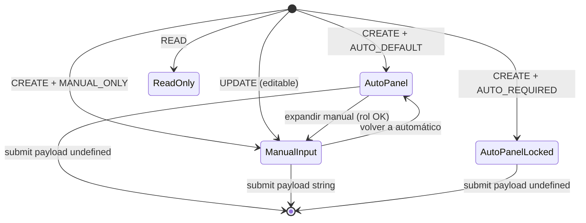

# Especificación — `CodigoField` (componente plataforma)

**Capa:** Shared UI — desacoplado de ORG, INV, LOG, COM, POS, HCM  
**Estado:** Especificación — sin implementación  
**Ubicación propuesta:** `src/shared/components/codigo/`

---

## 1. Objetivo

Un único componente React que encapsule **toda** la UX del Motor de Códigos según `generation_policy`, eliminando lógica ad hoc en páginas de catálogo.

---

## 2. Estructura de archivos propuesta

```
src/shared/components/codigo/
├── CodigoField.tsx              # Componente UI
├── CodigoField.types.ts         # Tipos públicos
├── CodigoFieldAutoPanel.tsx     # Panel informativo AUTO_*
├── CodigoFieldManualSection.tsx # Textbox + toggle manual
├── codigo-field.constants.ts    # Copy CTX-* centralizado
└── index.ts                     # Export público

src/core/codigo/
├── codigo-payload.utils.ts      # buildCodigoPayloadValue()
├── codigo-policy.types.ts       # GenerationPolicy enum
└── codigo-error.utils.ts        # mapCodigoFieldError() — 409/400
```

**Regla import:** `features/*` → `@/shared/components/codigo` + `@/core/codigo`.  
**Prohibido:** `shared` → `features`.

---

## 3. Tipos públicos

```typescript
/** Alineado con SequenceCatalog Backend */
export type CodigoGenerationPolicy =
  | 'AUTO_DEFAULT'
  | 'AUTO_REQUIRED'
  | 'MANUAL_ONLY';

/** EXTERNAL no es policy de CodigoField — usar input dominio */

export type CodigoFieldMode = 'create' | 'update' | 'read';

/** Solo AUTO_DEFAULT */
export type CodigoAssignmentMode = 'auto' | 'manual';

export interface CodigoSequenceMeta {
  sequenceKey: string;
  /** Ej. "SUC" — solo hint visual, no binding */
  prefixHint?: string;
  /** Ej. "SUC001" — ilustrativo */
  exampleFormat?: string;
  /** TENANT | EMPRESA — para copy de unicidad */
  scopeLabel?: 'tenant' | 'empresa';
}

export interface CodigoFieldProps {
  /** Policy Backend de la entidad */
  policy: CodigoGenerationPolicy;

  /** Contexto formulario */
  mode: CodigoFieldMode;

  /** Nombre API del campo — solo para id/htmlFor/errores */
  fieldKey: string;

  /** Label visible — default "Código" */
  label?: string;

  /** Valor controlado (manual o existente en UPDATE) */
  value: string;

  onChange: (value: string) => void;

  /** AUTO_DEFAULT: modo asignación */
  assignmentMode?: CodigoAssignmentMode;
  onAssignmentModeChange?: (mode: CodigoAssignmentMode) => void;

  /** Emite valor listo para payload API */
  onPayloadValueChange?: (payloadValue: string | undefined) => void;

  /** Metadata secuencia — hints contextuales */
  sequenceMeta?: CodigoSequenceMeta;

  /** Error inline (409, 400, validación cliente) */
  error?: string;

  disabled?: boolean;

  /** Override manual — default: false prod, true implantación */
  allowManualOverride?: boolean;

  /** Preview estimado futuro — API cfg admin */
  estimatedNextCode?: string | null;

  /** Clases input — uppercase default para códigos motor */
  inputClassName?: string;

  /** id/htmlFor accesibilidad */
  id?: string;
}
```

---

## 4. Máquina de estados



---

## 5. Render por policy × mode

| policy | create | update | read |
|--------|--------|--------|------|
| AUTO_DEFAULT | AutoPanel ± ManualSection | Textbox + warning | ReadOnly |
| AUTO_REQUIRED | AutoPanelLocked | ReadOnly | ReadOnly |
| MANUAL_ONLY | Textbox required | Textbox required | ReadOnly |

---

## 6. Utilidad payload — contrato API

```typescript
/**
 * undefined → omitir propiedad del JSON (auto)
 * string    → enviar manual
 */
export function buildCodigoPayloadValue(params: {
  policy: CodigoGenerationPolicy;
  mode: CodigoFieldMode;
  assignmentMode: CodigoAssignmentMode;
  value: string;
}): string | undefined;
```

| Entrada | Salida |
|---------|--------|
| AUTO_DEFAULT + create + auto | `undefined` |
| AUTO_DEFAULT + create + manual + `"SUC99"` | `"SUC99"` |
| AUTO_DEFAULT + create + manual + `""` | `undefined` (normalizar) |
| MANUAL_ONLY + create + `"X"` | `"X"` |
| AUTO_REQUIRED + create | `undefined` |
| UPDATE | `value.trim()` o según reglas entidad |

**Integración formulario:** el `handleCreate` llama `buildCodigoPayloadValue` — no lógica inline por página.

---

## 7. Integración dirty forms (B.1.1)

| Evento | Dirty |
|--------|-------|
| Toggle auto → manual | Sí |
| Escribir en manual | Sí |
| Volver a auto con texto | ConfirmDialog warning |
| Solo ver panel auto | No (baseline compatible PR-1) |

**Hook opcional:** `useCodigoFieldState()` — encapsula `value`, `assignmentMode`, baseline para `useOrgModalCreateDirty` / equivalentes INV.

```typescript
export function useCodigoFieldState(options: {
  policy: CodigoGenerationPolicy;
  mode: CodigoFieldMode;
  initialValue?: string;
}) {
  // returns { value, assignmentMode, payloadValue, isDirty, reset, ... }
}
```

No reemplaza dirty guards existentes — los alimenta.

---

## 8. Accesibilidad y diseño (Capa 1)

| Elemento | Clase / token |
|----------|---------------|
| Panel auto | `bg-subtle border border-border-base rounded-md p-3` |
| Título panel | `text-text-base text-sm font-medium` |
| Descripción | `text-text-soft text-xs` |
| Link colapsable | `text-brand-primary text-sm hover:underline` |
| Textbox | `border-border-base bg-surface focus:ring-brand-primary uppercase` |
| Error | `text-error text-xs` |
| Badge read | `bg-info/10 text-info text-xs px-2 py-0.5 rounded` |
| Warning UPDATE | `bg-warning/10 text-warning text-xs p-2 rounded` |

**Prohibido:** `gray-*`, `bg-brand-surface*`, mostrar UUID.

---

## 9. Errores HTTP — mapeo campo

| HTTP | Cuándo | UX CodigoField |
|------|--------|----------------|
| 409 | Duplicado | `error` prop — inline bajo textbox manual |
| 400 | Formato motor | Idem |
| 404 | cfg ausente | Toast global + panel error técnico |
| 422 | Required MANUAL_ONLY | Inline si aplica |

Util `mapCodigoFieldError(axiosError, fieldKey)` — reutiliza `getErrorMessage` existente (ER-01).

**Regla ER-02:** toast en hook `onError`; inline solo si componente setea `error` desde catch local — no duplicar.

---

## 10. Config declarativa por entidad (ejemplo ORG)

```typescript
// src/features/org/config/codigo-field.config.ts
import type { CodigoEntityConfig } from '@/core/codigo/codigo-policy.types';

export const ORG_CODIGO_CONFIG = {
  empresa: {
    policy: 'AUTO_DEFAULT',
    fieldKey: 'codigo_empresa',
    sequenceMeta: {
      sequenceKey: 'org_empresa',
      prefixHint: 'EMP',
      exampleFormat: 'EMP002',
      scopeLabel: 'tenant',
    },
  },
  sucursal: {
    policy: 'AUTO_DEFAULT',
    fieldKey: 'codigo',
    sequenceMeta: {
      sequenceKey: 'org_sucursal',
      prefixHint: 'SUC',
      exampleFormat: 'SUC001',
      scopeLabel: 'empresa',
    },
  },
  // departamento, centro_costo, cargo — idem
} as const satisfies Record<string, CodigoEntityConfig>;
```

Páginas ORG importan config — **no** hardcodean policy en JSX.

---

## 11. API mínima del componente — wireframe JSX

```tsx
<CodigoField
  policy="AUTO_DEFAULT"
  mode="create"
  fieldKey="codigo"
  label="Código"
  value={codigoValue}
  onChange={setCodigoValue}
  assignmentMode={assignmentMode}
  onAssignmentModeChange={setAssignmentMode}
  onPayloadValueChange={setCodigoPayload}
  sequenceMeta={ORG_CODIGO_CONFIG.sucursal.sequenceMeta}
  allowManualOverride={canManualOverride}
  error={fieldErrors.codigo}
  disabled={submitting}
  id="codigo"
/>
```

En `handleCreate`:

```typescript
const payload = { ...form, /* otros campos */ };
const codigoPayload = buildCodigoPayloadValue({ ... });
if (codigoPayload !== undefined) {
  payload.codigo = codigoPayload;
} else {
  delete payload.codigo;
}
```

---

## 12. Testing del componente

| Caso | Assert |
|------|--------|
| AUTO_DEFAULT create default | No textbox; panel visible |
| AUTO_DEFAULT manual expand | Textbox visible |
| Volver a auto | Textbox oculto; payload undefined |
| MANUAL_ONLY | Textbox + required |
| AUTO_REQUIRED | Panel locked; no manual link |
| UPDATE AUTO_DEFAULT | Textbox + warning on change |
| allowManualOverride=false | No link manual |
| error 409 | Mensaje inline |

Tests en `src/shared/components/codigo/__tests__/CodigoField.test.tsx`.

---

## 13. Anti-patrones prohibidos

| Anti-patrón | Razón |
|-------------|-------|
| `<input codigo required>` directo en páginas motor | Duplica UX |
| Calcular `SUC00${n+1}` en FE | Confunde con Backend |
| Policy en string mágico por página | Usar config |
| CodigoField para RUC / CIIU | EXTERNAL |
| Import org types en shared | Acoplamiento |
| Preview local como required UX | Solo estimado futuro opcional |

---

## 14. Extensibilidad futura

| Feature | Integración |
|---------|-------------|
| API preview cfg | Prop `estimatedNextCode` |
| BR-M-30 UPDATE read-only | `mode="update"` + flag `codigoReadOnlyOnUpdate` |
| Import CSV masivo | Flujo aparte — no CodigoField modal |
| i18n | Copy en `codigo-field.constants.ts` |

---

*Consistencia ERP: [`03_ERP_CONSISTENCY_GUIDELINES.md`](03_ERP_CONSISTENCY_GUIDELINES.md)*
