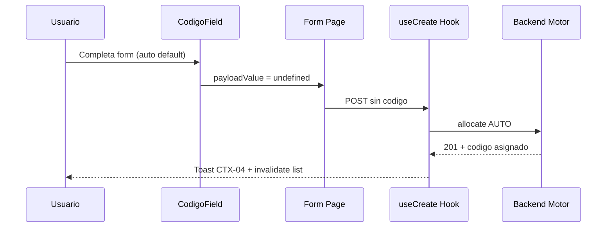

# Guías de consistencia ERP — Motor de Códigos UX

**Norma:** Todo módulo que consuma el Motor de Códigos MUST seguir este documento.  
**Precedencia:** Contrato Backend > **este documento** > implementación local de módulo.

---

## 1. Principio de una sola verdad UX

| Capa | Responsabilidad |
|------|-----------------|
| Backend `generation_policy` | Comportamiento API |
| `CodigoField` + config | Comportamiento UI |
| Página módulo | Declarar config + integrar payload |
| Página módulo | **MUST NOT** diseñar UI código ad hoc |

---

## 2. Mapa de adopción por módulo

| Módulo | Estado | Policy esperada | Entidades ejemplo |
|--------|--------|-----------------|-------------------|
| **ORG** | Ola 1 — referencia | AUTO_DEFAULT ×5 | empresa, sucursal, depto, CC, cargo |
| **INV** | Futuro | AUTO_DEFAULT / AUTO_REQUIRED | producto SKU, almacén, categoría |
| **LOG** | Futuro | AUTO_DEFAULT | transportista, ruta |
| **COM** | Futuro | AUTO_DEFAULT | cliente, pedido |
| **POS** | Futuro | AUTO_REQUIRED | ticket, turno |
| **HCM** | Futuro | AUTO_DEFAULT | concepto planilla (si motor) |

Cada módulo crea `{modulo}/config/codigo-field.config.ts` — **misma forma**, distinto contenido.

---

## 3. Posición en formulario (Plantilla A / A+)

| Regla | Detalle |
|-------|---------|
| Sección | «Información general» — primera sección del modal |
| Orden campos | 1) Empresa sesión (si company-scoped) 2) **CodigoField** 3) Nombre/descripción |
| Excepción tenant | Empresa ORG: CodigoField antes de razón social |
| Modal A+ | CodigoField no scroll independiente — dentro DialogBody |
| B-F transaccional | CodigoField en header documento solo READ post-create — no en líneas |

---

## 4. Flujo CREATE unificado

---

## 5. Flujo post-201 — feedback obligatorio

| Momento | Acción | Copy |
|---------|--------|------|
| Toast éxito | MUST incluir código asignado | «{Entidad} creada ({codigo})» |
| Cierre modal | Tras 201 | Modal cierra — listado refetch |
| Listado | Columna código | Poblada — sin acción extra |
| Onboarding ORG | Tras primera empresa | Toast + navegación — incluir código si espacio |

**Implementación:** en `handleCreate` de página (conservador) o helper `formatCreateSuccessToast(entityLabel, codigo)` en `@/core/codigo`.

---

## 6. Flujo UPDATE unificado

| Policy | UX UPDATE |
|--------|-----------|
| AUTO_DEFAULT | Textbox editable + banner CTX-06 al cambiar |
| AUTO_REQUIRED | Read-only recomendado |
| MANUAL_ONLY | Textbox editable + unicidad |

Motor **no interviene** en UPDATE — unicidad 409 igual que CREATE manual.

---

## 7. Listados y filtros — sin cambio UX

| Elemento | Regla |
|----------|-------|
| Columna código | Visible — dato descriptivo principal |
| Sort por código | Permitido |
| `buscar` | Backend — incluye código |
| FK selects | `{codigo} — {nombre}` — E-ME4 |
| Empty state | Sin mención especial código |

CodigoField **no afecta** listados — solo formularios.

---

## 8. React Query — invalidaciones

Sin cambio respecto PR-1. CodigoField no altera hooks.

| Evento | Invalidación |
|--------|--------------|
| CREATE éxito | `['org', '{entidad}', 'list']` |
| UPDATE éxito | list + detail |
| Error 409 | No invalidar — error inline |

---

## 9. Dirty forms — integración

| Patrón módulo | Integración CodigoField |
|---------------|-------------------------|
| ORG `isCreate*Dirty` | Incluir `assignmentMode` + manual value en snapshot |
| INV `useOrgModalCreateDirty` | Extender normalize con codigo state |
| B.1.1 discard | Toggle manual → dirty; volver auto con texto → ConfirmDialog |

**Baseline CREATE AUTO_DEFAULT:** `{ assignmentMode: 'auto', value: '' }` — compatible PR-1.

---

## 10. RBAC y gating manual override

| Permiso propuesto | Efecto |
|-------------------|--------|
| Operativo estándar | `allowManualOverride=false` |
| `org.implantacion` o rol admin tenant | `allowManualOverride=true` |
| Super-admin platform | Override en cualquier tenant |

Hasta existir permiso dedicado: feature flag tenant `CODIGO_MANUAL_OVERRIDE`.

---

## 11. Errores — tabla unificada

| HTTP | Campo | Toast | Inline CodigoField |
|------|-------|-------|-------------------|
| 409 código | codigo / codigo_empresa | No (si inline) | Sí |
| 400 formato | codigo | No | Sí |
| 404 cfg | — | Sí (técnico) | Panel error |
| 403 | — | Sí | — |
| 422 otros campos | — | Según ER-01 | — |

---

## 12. EXTERNAL — campos que NO son CodigoField

Documentar en config de módulo como `externalFields` — inputs normales:

| Módulo | Campo | Tratamiento |
|--------|-------|-------------|
| ORG | `ruc` | Input 11 dígitos — required |
| ORG | `codigo_ciiu` | Input catálogo optional |
| ORG | `codigo_parametro` | MANUAL_ONLY — CodigoField policy MANUAL_ONLY |
| INV | `codigo_sku` | Futuro — según policy motor INV |

**Nunca** mezclar RUC y CodigoField en mismo bloque visual.

---

## 13. Checklist certificación módulo

Antes de cerrar adopción en un módulo:

- [ ] Config `{modulo}/config/codigo-field.config.ts` declarada
- [ ] Todos los CREATE motor usan `CodigoField`
- [ ] Ningún `<input codigo required>` ad hoc en CREATE AUTO_*
- [ ] Payload usa `buildCodigoPayloadValue`
- [ ] Toast post-201 incluye código
- [ ] 409 inline en manual
- [ ] UPDATE probado sin regresión
- [ ] Listados/filtros sin regresión
- [ ] Dirty guard probado auto↔manual
- [ ] Tokens Capa 1 — audit visual
- [ ] Tests `CodigoField` + smoke entidad

---

## 14. ORG como módulo certificador

ORG es el **golden reference**:

1. Primero en adoptar `CodigoField` completo.  
2. Documentar screenshots / casos QA en `frontend-ux/org-reference/`.  
3. INV y resto copian config pattern — no renegocian UX.

---

## 15. Evolución normativa

| Versión | Cambio |
|---------|--------|
| UX v1.0 | Este paquete — AUTO_DEFAULT panel + manual colapsado |
| UX v1.1 | Preview API cfg admin |
| UX v2.0 | UPDATE read-only global (BR-M-30) |

Incrementos de versión requieren actualización de este documento — no cambios silenciosos por módulo.

---

*Plan rollout ORG: [`04_ORG_REFERENCE_ROLLOUT_PLAN.md`](04_ORG_REFERENCE_ROLLOUT_PLAN.md)*
