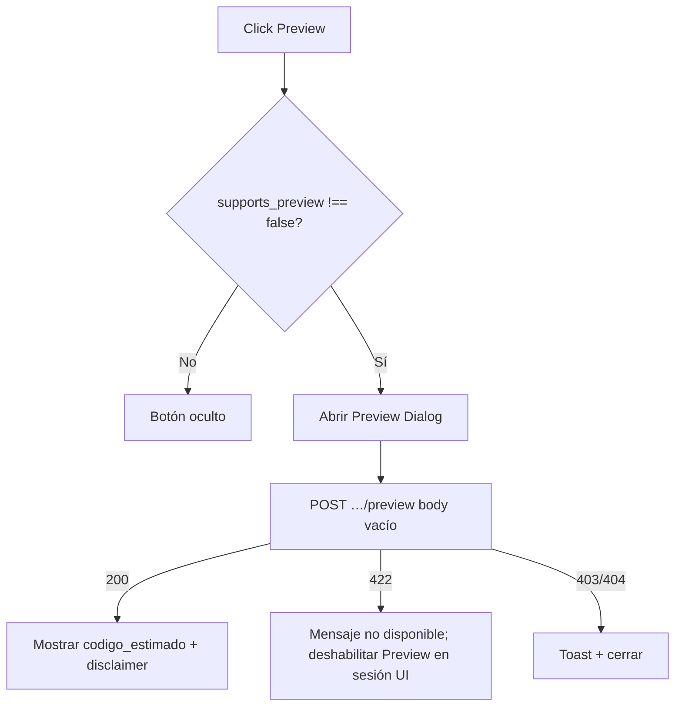

# CFG — Flujos de usuario

**Versión:** 1.0  
**Ruta base:** `/app/cfg/secuencias`

---

## 1. Entrada al módulo

```mermaid
flowchart TD
  A[Usuario autenticado shell /app] --> B{Menú visible<br/>Secuencias de código?}
  B -->|No| Z[No ve el ítem]
  B -->|Sí| C[Navega a /app/cfg/secuencias]
  C --> D{PermissionGuard cfg.ver}
  D -->|No| U[/unauthorized]
  D -->|Sí| E{hasPermission consultar?}
  E -->|No| U
  E -->|Sí| F[Carga listado GET secuencias]
  F --> G[SecuenciasPage idle]
```

**Precondiciones:** sesión ERP, `cfg.secuencias.consultar`, ítem de menú Backend.

---

## 2. Flujo listado (happy path)

1. Montaje → `loading_list` (skeleton).
2. `GET /api/v1/cfg/secuencias?page=1&limit=50&…filtros`.
3. Render tabla + `ErpPagination`.
4. Usuario cambia filtro / buscar / sort / página → refetch listado (`page=1` si cambian filtros o buscar).

---

## 3. Flujo abrir edición / detalle

```mermaid
flowchart TD
  A[Click Editar / Ver en fila] --> B[Abrir Dialog edición]
  B --> C[loading_detail]
  C --> D[GET /secuencias/{id}]
  D -->|200| E{config_locked o solo consultar?}
  E -->|Sí| F[Modo solo lectura]
  E -->|No| G[Modo edición formato]
  D -->|404| H[Toast/mensaje + cerrar dialog]
  D -->|403| I[Toast permiso + cerrar]
```

- Con `actualizar` y no locked → campos formato editables + Guardar / Desactivar|Reactivar.
- Solo `consultar` o locked → lectura + Preview (si aplica); sin Guardar/Desactivar/Reactivar.

---

## 4. Flujo Guardar (PATCH)

1. Usuario modifica ≥1 campo de formato.
2. Validación local (prefijo, separador, longitudes).
3. Si body vacío de cambios → no llamar API; mensaje inline.
4. Click Guardar → `saving`; form disabled.
5. `PATCH` solo campos dirty.
6. **200** → toast “Configuración actualizada.”; actualizar form con response; invalidar listado; baseline dirty reset.
7. **422** campo → error bajo campo; form permanece.
8. **422** locked → forzar solo lectura; refetch detail.
9. **403/404** → toast; 404 cierra dialog y refresca listado.

---

## 5. Flujo Desactivar

1. Desde dialog o fila (activa, no locked, `actualizar`).
2. Cerrar Dialog edición si está abierto (B11-11) → abrir `ConfirmDialog` danger.
3. Confirmar → `DELETE /secuencias/{id}` (`toggling_active`).
4. **200** → toast “Secuencia desactivada.”; invalidar listado (+ detail); UI refleja inactiva.
5. Idempotente ya inactiva → 200 sin error falso.

---

## 6. Flujo Reactivar

1. Fila o dialog inactiva, no locked, `actualizar`.
2. Misma regla B11-11 si viene de Dialog.
3. `ConfirmDialog` info → `POST …/reactivar`.
4. **200** → toast “Secuencia reactivada.”; invalidar listado/detail.

---

## 7. Flujo Preview



- No invalidar listado ni asumir cambio de `ultimo_numero`.
- Permitido con secuencia inactiva (aviso adicional).

---

## 8. Flujo discard dirty (edición)

1. Usuario edita formato → dirty.
2. Intenta cerrar (X, ESC, overlay, Cancelar).
3. `OrgDiscardConfirmDialog` (warning).
4. “Seguir editando” → vuelve al dialog.
5. “Sí, descartar” → cierra sin PATCH.

Stack: Dialog Radix cerrado antes de Confirm (B11-10).

---

## 9. Flujos de error globales

| HTTP | UX |
|------|-----|
| 401 | Flujo sesión existente (relogin) |
| 403 | Toast “No tienes permiso…” / mensaje contrato |
| 404 list | Empty/error recuperable + reintentar |
| 404 detail/mutación | Mensaje + volver a listado |
| 422 sort | Quitar sort inválido / mensaje |
| 5xx / red | Banner/toast + botón Reintentar |

---

## 10. Flujos explícitamente inexistentes (MVP)

- Crear secuencia.
- Eliminar físico.
- Alinear contador / diagnóstico.
- Toggle `es_activo` vía PATCH.
- Navegación a página detalle dedicada.
