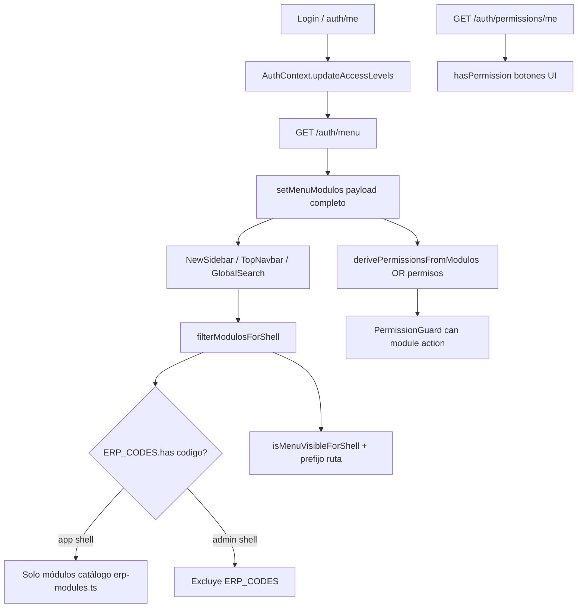
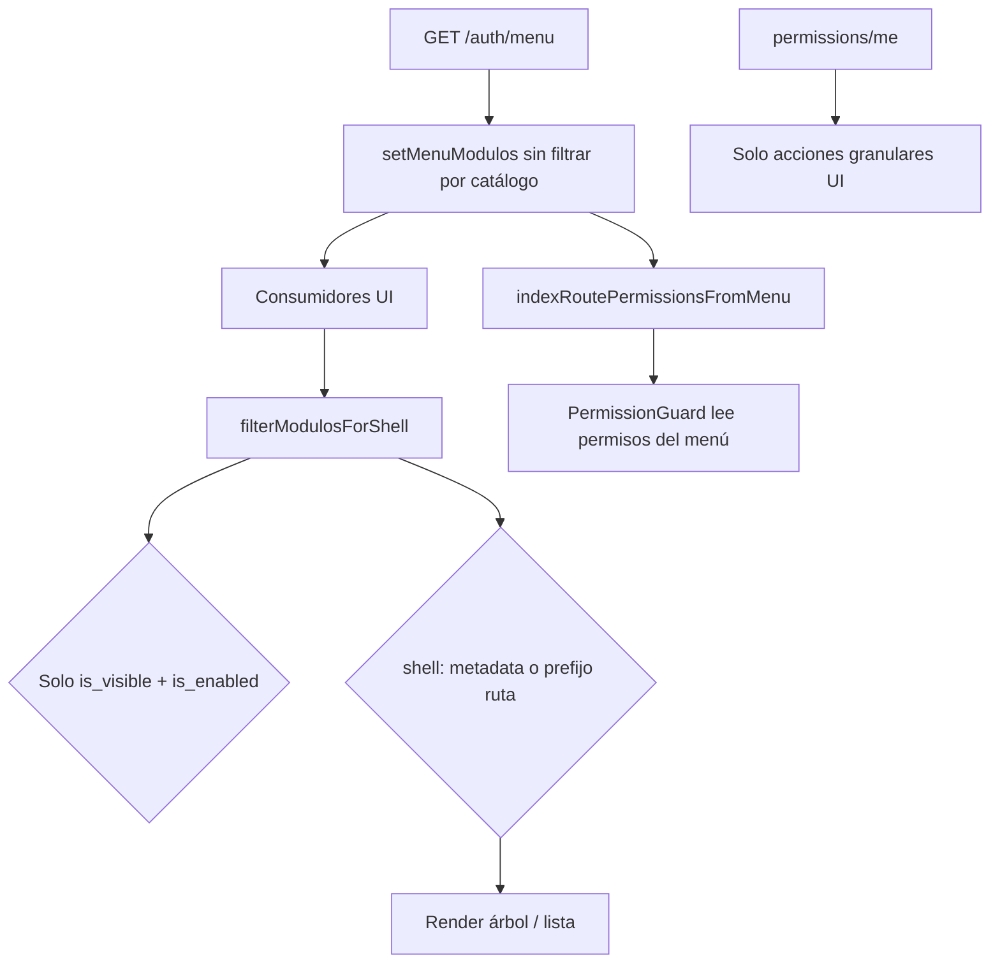

# Alineación frontend — Menú / sidebar (`GET /auth/menu`)

**Fecha:** mayo 2026  
**Alcance:** solo frontend. Backend ya resuelve `cliente_modulo`, `rol_permiso`, `rol_menu_permiso` y devuelve el menú efectivo.

---

## 1. Flujo actual (antes de esta fase)

### Problemas identificados

| # | Problema | Efecto |
|---|----------|--------|
| P1 | `ERP_CODES` decide visibilidad en shell `app` | Módulo en `/auth/menu` pero no en catálogo FE → oculto (ej. código distinto) |
| P2 | `!ERP_CODES` en menú admin | SYS_ADMIN visible; ORG oculto en `/admin` aunque el usuario esté en `/app` |
| P3 | `access_level >= 4` en ruta `/admin` | RBAC paralelo al menú |
| P4 | `derivePermissionsFromModulos` | Nombre sugiere recálculo; en práctica indexa `menu.permisos` del payload |
| P5 | Doble filtro `is_visible` + catálogo ERP | Lógica duplicada FE/BE |

---

## 2. Flujo objetivo (después)

### Principios

1. **Visibilidad** = solo `is_visible` && `is_enabled` (backend ya aplicó contrato + RBAC menú).
2. **Shell** = partición de **presentación** por `menu_scope` / `tipo_modulo` (opcional BE) o prefijo de `ruta` (`/app`, `/admin`, `/super-admin`).
3. **Sin** `ERP_CODES`, `ADMIN_MODULE_CODES` ni `access_level` para mostrar módulos.
4. **`erp-modules.ts`** queda para rutas (`PermissionGuard`, `toAppPath`), no para el sidebar.

---

## 3. Contrato de metadata (opcional, retrocompatible)

Campos opcionales en `AuthMenuModulo` / `AuthMenuItem`:

| Campo | Valores | Uso FE |
|-------|---------|--------|
| `menu_scope` | `app` \| `admin` \| `platform` | Prioridad 1 para asignar shell |
| `tipo_modulo` | `erp` \| `admin` \| `platform` | Prioridad 2 (alias semántico) |

**Fallback** si no vienen: inferir por `ruta` del ítem (`/app/*`, `/admin/*`, `/super-admin/*`, legacy `/org`, `/inv`, …).

`platform` en payload ↔ shell `super-admin` en layout.

---

## 4. Código a eliminar / obsoleto

| Elemento | Archivo | Acción |
|----------|---------|--------|
| `ERP_CODES` / `isModuloErp` en filtro menú | `sidebar-menu.utils.ts` | Eliminar de visibilidad |
| `ADMIN_MODULE_CODES` en filtro menú | `sidebar-menu.utils.ts` | Solo utilidad reporte rutas (sin filtro módulos) |
| `ERP_CODES` en `MenuSelector` | `MenuSelector.tsx` | Usar `filterModulosForShell` |
| Comentarios "access_level Wave 3" en sidebar | `NewSidebar.tsx` | Aclarar filtro por ruta |
| `requiredLevel={4}` en `/admin` | `router.tsx` | `requireTenantAdmin` por `user_type` |

**Se mantiene (no es RBAC de menú):**

- `derivePermissionsFromModulos` → renombrado `indexRoutePermissionsFromMenu` (índice de `menu.permisos` para guards).
- `GET /auth/permissions/me` en `PermissionContext`.
- `ProtectedRoute.requireOperationalUser` / `requireSuperAdmin` (routing por tipo de usuario).

---

## 5. Separación ORG / SYS_ADMIN sin hardcode

| Módulo | Shell visual | Criterio FE |
|--------|--------------|-------------|
| ORG, INV, … | `app` (`/app/*`) | `menu_scope=app` o ruta `/app/...` o legacy `/org/...` |
| SYS_ADMIN tenant | `admin` | `menu_scope=admin` o ruta `/admin/...` |
| SYS_ADMIN platform | `super-admin` | `menu_scope=platform` o ruta `/super-admin/...` |

El backend ya no envía ítems que el usuario no debe ver; el FE solo **agrupa por layout**, no vuelve a evaluar roles.

---

## 6. Riesgos y mitigación

| Riesgo | Mitigación |
|--------|------------|
| Rutas legacy sin prefijo `/app` | Fallback `inferScopeFromRoute` + `mapLegacyErpPath` |
| BE sin `menu_scope` aún | Fallback por prefijo de ruta (comportamiento actual mejorado) |
| `tenant_admin` con `access_level < 4` pierde `/admin` | Guard por `user_type === 'tenant_admin'` |
| Menú visible pero guard deniega | Alinear clave módulo vía `getERPModuleByCodigo` al indexar permisos |
| Ítems con ruta ambigua | Priorizar `menu_scope` del backend cuando exista |

---

## 7. Migración mínima segura (esta entrega)

1. Nuevo módulo `menu-shell.utils.ts` (resolución shell + visibilidad payload).
2. Reescribir `filterModulosForShell` / `isMenuVisibleForShell` sin catálogo ERP.
3. Unificar `MenuSelector` con el mismo filtro + `useLayoutShell`.
4. Renombrar indexación de permisos en `AuthContext` (misma lógica, nombre honesto).
5. `ProtectedRoute`: `requireTenantAdmin` sustituye `requiredLevel={4}` en `/admin`.
6. Actualizar `SIDEBAR_ENDPOINTS_MENU.md`.

**Fuera de alcance:** cambios OpenAPI/backend, SQL, JWT, fusionar `/auth/permissions/me` con guards.

---

## 9. Fase A (tenant_admin + ORG) — superseded

La whitelist ORG-only (`tenant-org-app-access.ts`) fue **eliminada**. `tenant_admin` accede a `/app/*` como operativos; visibilidad y rutas por módulo vienen de `GET /auth/menu` + `PermissionGuard`.

---

## 8. Archivos tocados

- `src/core/auth/types/auth-menu.types.ts`
- `src/core/auth/utils/menu-shell.utils.ts` (nuevo)
- `src/shared/components/layout/sidebar-menu.utils.ts`
- `src/shared/components/layout/MenuSelector.tsx`
- `src/shared/components/layout/NewSidebar.tsx`
- `src/shared/context/AuthContext.tsx`
- `src/app/router.tsx`
- `src/shared/components/ProtectedRoute.tsx`
- `docs/SIDEBAR_ENDPOINTS_MENU.md`
