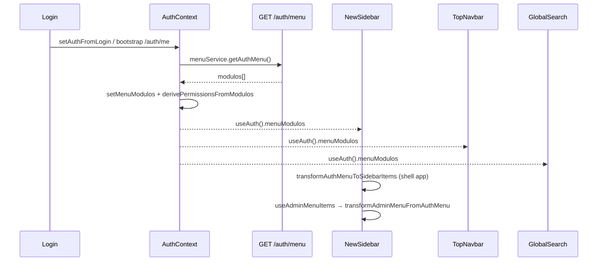

# Auditoría — Sidebar y contextos (Punto 4)

**Fecha:** mayo 2026  
**Alcance:** Fase 1 — solo auditoría estática (sin cambios de código de aplicación).  
**Referencias:** `contexto-refactorizacion.mdc`, `docs/frontend/auditoria/AUDITORIA_RUTAS_LAYOUTS.md` (Implementación mayo 2026), `docs/SIDEBAR_ENDPOINTS_MENU.md`, `.cursorrules`.

**Fuera de alcance:** empresa/JWT, selección de empresa, migración BD del menú, Punto 5 impersonación, backend.

---

## Resumen ejecutivo

| Área | Estado |
|------|--------|
| Fuente de datos del menú | Una sola: `GET /auth/menu` vía `AuthContext` — sin fetch duplicado en `NewSidebar` |
| Documentación `SIDEBAR_ENDPOINTS_MENU.md` | **Obsoleta** (describe `getMenuMe` y fetch en sidebar que ya no existen) |
| Shells post Punto 3 | Filtrado por `LayoutShellVariant` coherente en navbar y búsqueda; **divergencia** sidebar app vs `TopNavbar` (criterio ERP) |
| Permisos vs visibilidad | Sidebar solo `is_visible` / `is_enabled`; rutas protegidas con `PermissionGuard` + permisos derivados del mismo menú |
| Breadcrumbs | **Doble fuente** (`NewSidebar` + `Header`) en modo sidebar — riesgo de carrera |
| Deuda Punto 3 | **8/8** enlaces hardcodeados sin `/app` siguen presentes |
| Código muerto | `superAdminMenu.ts` (×2), `src/context/AuthContext.tsx`, duplicados `BreadcrumbContext` |

---

## 1. Flujo de datos del menú

### 1.1 Fuente real hoy

**Respuesta:** el menú del sidebar/navbar/búsqueda sale **únicamente** de `AuthContext.menuModulos`, cargado con **una** llamada a `GET /auth/menu` (`menuService.getAuthMenu()`).

- **No** existe `menuService.getMenuMe()` en el repositorio.
- **No** hay `useEffect` / `fetchData` en `NewSidebar.tsx` que llame al API de menú.
- `GET /modulos-menus/me/` **no** se usa para el sidebar; solo aparece en CRUD/admin (`menu.service.ts`: `getUserMenu`, POST/PUT menús, etc.) y en comentarios de tipos.

### 1.2 Diagrama de flujo



### 1.3 Bootstrap (login → menú)

| Paso | Archivo | Comportamiento |
|------|---------|----------------|
| Login OK | `src/features/auth/pages/Login.tsx` | `setAuthFromLogin` → redirección vía `resolvePostLoginPath` |
| Usuario en sesión | `src/shared/context/AuthContext.tsx` | `updateAccessLevels(userData)` → `loadMenuAndPermissionsFromAuthMenu(userData)` |
| API | `src/features/admin/services/menu.service.ts` | `getAuthMenu()` → `GET /auth/menu` |
| Estado | `AuthContext` | `menuModulos: AuthMenuModulo[] \| null`; `null` = aún no cargado |
| Permisos ERP | `AuthContext` | `derivePermissionsFromModulos` → `permissions[modulo.codigo.toLowerCase()]` |
| `platform_admin` | `AuthContext` | Menú cargado; `permissions = null` (bypass en `usePermissions().can`) |
| Sin roles | `AuthContext` | `menuModulos = null`, `permissions = {}` |
| Error API | `AuthContext` | `menuModulos = []`, `permissions = {}` (menú vacío silencioso) |

**Paralelo (no alimenta el sidebar):** `PermissionProvider` (`src/core/auth/PermissionContext.tsx`) llama `GET /auth/permissions/me` → `string[]` de códigos. Lo usa `ProtectedRoute` solo para `permissionsInitialized` (evitar race al montar rutas), **no** para filtrar ítems del menú.

### 1.4 Transformaciones y consumidores

| Consumidor | Transformación | Entrada |
|------------|----------------|---------|
| `NewSidebar` (shell `app`) | `transformAuthMenuToSidebarItems(modulos, 'app')` + filtro `ADMIN_MODULE_CODES` | `menuModulos` |
| `NewSidebar` (admin / super-admin) | `useAdminMenuItems` → `transformAdminMenuFromAuthMenu` + filtro por prefijo `/admin` \| `/super-admin` | `menuModulos` |
| `TopNavbar` | Sin árbol `SidebarMenuItem`; filtra `AuthMenuModulo` por `ERP_CODES` + prefijos | `menuModulos` |
| `GlobalSearch` | `searchMenuItems(..., shell)` + `normalizeNavRoute` | `menuModulos` |
| `Header` (breadcrumb) | Recorre `menuModulos` crudos + `normalizeNavRoute` | `menuModulos` |

### 1.5 Tipos y archivos

| Tipo | Definición | Uso |
|------|------------|-----|
| `AuthMenuModulo`, `AuthMenuItem`, `AuthMenuResponse` | `src/core/auth/types/auth-menu.types.ts` | Respuesta `/auth/menu`, estado en `AuthContext` |
| `SidebarMenuItem` | `src/features/admin/types/menu.types.ts` | Árbol renderizado en sidebar (incl. `isSeparator`, `level`, `children`) |
| `LayoutShellVariant` | `src/shared/components/layout/layout-shell.types.ts` | `app` \| `admin` \| `super-admin` |
| Utilidades | `src/shared/components/layout/sidebar-menu.utils.ts` | `normalizeNavRoute`, `transformAuthMenuToSidebarItems`, `listMenuRoutesWithoutAppPrefix` |
| Admin flat | `src/shared/components/layout/MenuSelector.tsx` | `useAdminMenuItems`, `transformAdminMenuFromAuthMenu` |

**Normalización rutas ERP (shell `app`):** `normalizeNavRoute` → `mapLegacyErpPath` (`src/core/routing/post-login-path.ts`), p. ej. `/inv/productos` → `/app/inv/productos`.

---

## 2. Comportamiento por shell (post Punto 3)

Layouts: `AppLayout` / `AdminLayout` / `SuperAdminLayout` → `NewLayout` + `LayoutShellProvider` (`variant`).

`NavModeContext`: `sidebar` monta `NewSidebar`; `navbar` monta `TopNavbar` (mismo `menuModulos`, distinta presentación).

### 2.1 Matriz por `LayoutShellVariant`

| Shell | Layout | Sección sidebar (`NewSidebar`) | Sección navbar (`TopNavbar`) | Título sección |
|-------|--------|--------------------------------|------------------------------|----------------|
| `app` | `AppLayout` | Árbol ERP (módulo → sección → menú → submenú), rutas `/app/*` | Solo módulos con `ERP_CODES` | «Módulos» |
| `admin` | `AdminLayout` | Bloque «Administración General»: ítems con `ruta` `/admin/*` | Módulos no-ERP con menús `/admin/*` | — |
| `super-admin` | `SuperAdminLayout` | Bloque «Administración Global»: `/super-admin/*` | Módulos no-ERP con menús `/super-admin/*` | — |

Constantes: `SHELL_MODULE_SECTION_TITLE`, `SHELL_ADMIN_SECTION_TITLE` en `layout-shell.types.ts`.

### 2.2 Reglas de filtrado

| Mecanismo | Shell `app` | Shell `admin` | Shell `super-admin` |
|-----------|-------------|---------------|---------------------|
| Códigos admin explícitos | Excluye `ADMIN_MODULE_CODES` (`SYS_ADMIN`, `ADMIN_SYSTEM`, `ADMINISTRACION`) del árbol ERP | — | — |
| Códigos ERP (`ERP_MODULES`) | **TopNavbar / menuSearch:** solo `ERP_CODES` | Excluye módulos ERP | Excluye módulos ERP |
| Prefijo ruta | Normaliza a `/app/*` | Solo `/admin/*` | Solo `/super-admin/*` |
| `tenant_admin` en `/app/*` | Bloqueado por `ProtectedRoute.requireOperationalUser` (no llega al shell app) | — | — |
| `platform_admin` en `/app/*` | Redirige a `/super-admin/dashboard` | — | — |

### 2.3 Divergencia sidebar vs navbar (importante)

- **`TopNavbar` / `menuSearch.ts`:** en shell `app`, solo módulos cuyo `modulo.codigo` ∈ `ERP_CODES`.
- **`NewSidebar`:** en shell `app`, incluye **todos** los módulos excepto `ADMIN_MODULE_CODES` (no exige `ERP_CODES`).

Si el backend devolviera un módulo no-ERP y no listado en `ADMIN_MODULE_CODES`, aparecería en el **sidebar** pero **no** en navbar ni búsqueda global (misma fuente, distinto filtro).

### 2.4 Estado activo y breadcrumbs con `/app/*`

| Componente | Estado activo | Breadcrumbs |
|------------|---------------|-------------|
| `NewSidebar` (árbol ERP) | `NavLink` / `getLinkClasses` sobre rutas **ya normalizadas** en `menuItems` | `findBreadcrumbPath(menuItems, currentPath)` — correcto con `/app/*` |
| `NewSidebar` (admin) | `NavLink` a `item.ruta` **sin** `normalizeNavRoute` (correcto: `/admin`, `/super-admin`) | Match por ruta cruda del ítem admin |
| `Header.tsx` | N/A | `useEffect` sobre `menuModulos` + `normalizeNavRoute(raw, shell)` — alineado con Punto 3 |
| Modo **navbar** | `TopNavbar` usa `normalizeNavRoute` en clicks y `isModuleActive` | Sidebar **no montado**; solo `Header` actualiza breadcrumb (comentario en código) |
| Modo **sidebar** | Sidebar correcto | **Dos escritores:** `NewSidebar` y `Header` llaman `setBreadcrumbs` en el mismo `pathname` — orden de efectos no garantizado |

**Popover (sidebar colapsado):** usa `child.ruta` del árbol ya normalizado en modo app; `isChildActive` con `currentPath.startsWith(childPath)` — coherente si `currentPath` es `/app/...`.

### 2.5 Paridad `NavModeContext`

| Aspecto | Sidebar | Navbar |
|---------|---------|--------|
| Fuente datos | `menuModulos` | `menuModulos` |
| Filtro shell `app` | `!ADMIN_MODULE_CODES` | `ERP_CODES.has(codigo)` |
| Normalización rutas app | Sí (`transformAuthMenuToSidebarItems`) | Sí (`normalizeNavRoute` al navegar) |
| Menú admin | Bloque separado con separadores | No muestra bloque admin plano; solo mega-menú por categorías de módulos filtrados |
| Vacío | Sin mensaje si `menuItems.length === 0` | `return null` si `filteredModulos.length === 0` |

---

## 3. Permisos vs visibilidad

### 3.1 Capas

| Capa | Mecanismo | Qué controla |
|------|-----------|--------------|
| Backend + menú BD | `is_visible`, `is_enabled` en cada `AuthMenuItem` | Qué nodos devuelve `/auth/menu` y qué pinta el sidebar (filtro en transformaciones) |
| `AuthContext.permissions` | OR de `menu.permisos.*` por `modulo.codigo.toLowerCase()` | `PermissionGuard` / `usePermissions().can(module, action)` |
| `PermissionContext` | `GET /auth/permissions/me` → códigos string | `hasPermission('wms.zona.crear')` — **no** usado en sidebar |
| Rutas `/app/*` | `ProtectedRoute.requireOperationalUser` | Excluye `platform_admin` y `tenant_admin` del ERP |

### 3.2 ¿El sidebar oculta sin permiso `ver`?

**No a nivel frontend granular.** Solo filtra `is_visible && is_enabled`. Se asume que el backend ya no incluye (o marca no visible) menús sin permiso `ver`.

El sidebar **no** llama `can(modulo, 'ver')` por ítem. Un menú visible en JSON con `permisos.ver: false` seguiría mostrándose si el backend lo enviara visible (inconsistencia de contrato).

### 3.3 Casos de uso

| Casuario | Menú sidebar | Acceso ruta |
|----------|--------------|-------------|
| Operativo sin permiso en módulo X | Backend debería ocultar ítems; si no, ítem visible pero `PermissionGuard` redirige a `/unauthorized` | `can('x','ver')` false |
| `tenant_admin` | No usa shell `app`; ve `/admin/*` en `AdminLayout` | ERP bloqueado en router |
| `platform_admin` | Shell `super-admin`; menú global `/super-admin/*` | `permissions === null` → `can()` siempre true en guards ERP si llegara (no llega a `/app/*`) |

### 3.4 Alineación clave módulo permisos

`derivePermissionsFromModulos` usa `modulo.codigo.toLowerCase()` (ej. `inv`, `inv_bill` → revisar coincidencia con `permissionModule` en `ERP_MODULES` y rutas `PermissionGuard`). Desalineación `INV_BILL` vs `inv-bill` es riesgo 🟡 para guards, no para visibilidad del menú.

---

## 4. Admin menu (`MenuSelector` / `useAdminMenuItems`)

### 4.1 Construcción

1. Filtra módulos con `!ERP_CODES.has(modulo.codigo)` (más amplio que `ADMIN_MODULE_CODES` del sidebar ERP).
2. Por cada sección con menús visibles: inserta **separador** `isSeparator: true` con `nombre = seccion.nombre` y `ruta = firstMenuRuta` (para que el filtro global/tenant por prefijo funcione).
3. Añade menús planos ordenados por `orden` compuesto.
4. `NewSidebar` parte en `globalAdminItems` (`/super-admin`) y `tenantAdminItems` (`/admin`).

### 4.2 Separadores y orden

- Separadores no son `NavLink`; solo título en sidebar expandido (ocultos colapsado).
- Orden: `sort` por campo `orden` calculado en transformación.

### 4.3 Rutas sin normalizar

Correcto por diseño: rutas admin ya vienen como `/admin/...` o `/super-admin/...`; **no** deben pasar por `mapLegacyErpPath`.

### 4.4 ¿Duplicación con `transformAuthMenuToSidebarItems`?

**Sí, lógica paralela (no unificada):**

| Función | Forma | Filtros |
|---------|-------|---------|
| `transformAuthMenuToSidebarItems` | Árbol 4 niveles | `is_visible`, `is_enabled`, normaliza rutas en `app` |
| `transformAdminMenuFromAuthMenu` | Lista plana + separadores | `is_visible`, `is_enabled`, sin normalización |

Comparten fuente `menuModulos` pero **no** comparten código de transformación. Recomendación Fase 2: extraer filtros comunes (`isMenuVisibleForShell`) ya presentes en `menuSearch.ts` como referencia.

### 4.5 Debug en producción dev

`MenuSelector.tsx` y `NewSidebar.tsx` hacen `console.log` del menú en `import.meta.env.DEV` — ruido y posible fuga de estructura en consola.

---

## 5. Header, GlobalSearch, breadcrumbs

### 5.1 `Header.tsx`

- Breadcrumb: recorre `menuModulos` con mismos filtros de shell que búsqueda (`ADMIN_MODULE_CODES` / `ERP_CODES` / prefijos).
- Aplica `normalizeNavRoute` en shell `app` antes de comparar con `location.pathname`.
- Comentario explícito: en modo navbar es la «única fuente» — en modo sidebar compite con `NewSidebar`.
- Badge usuario: `useUserType` + `clienteInfo` (sin selector de empresa).
- Toggle `NavModeContext` (sidebar ↔ navbar).

### 5.2 `GlobalSearch.tsx` + `menuSearch.ts`

- Filtra con `isMenuVisibleForShell` (alineado con **TopNavbar**, no con filtro sidebar ERP).
- Navegación: `normalizeNavRoute(raw, shell)` en `handleItemClick`.
- Atajo **Ctrl/Cmd+K** global.
- Sin filtro por permiso `ver`; solo flags de menú.

### 5.3 Inconsistencias / atajos cruzados

| Issue | Detalle |
|-------|---------|
| Breadcrumb dual | Sidebar + Header en modo sidebar |
| Filtro app distinto | Sidebar vs Search/Navbar (sección 2.3) |
| Admin sin breadcrumb jerárquico en Header | Header no recorre `useAdminMenuItems`; depende de match plano en `menuModulos` o del sidebar |
| `ProtectedRoute` vs menú | Espera `permissionsInitialized` de **otro** endpoint (`/auth/permissions/me`) además del menú |

---

## 6. Documentación vs código

### 6.1 `docs/SIDEBAR_ENDPOINTS_MENU.md` — desactualizado

| Documento dice | Código actual |
|----------------|---------------|
| `GET /api/v1/modulos-menus/me/` | `GET /auth/menu` (`menu.service.getAuthMenu`) |
| `menuService.getMenuMe()` | **No existe** |
| Fetch en `NewSidebar` `useEffect` / `fetchData` | Solo `useAuth().menuModulos` |
| `transformModulosToSidebarItems` en NewSidebar | `transformAuthMenuToSidebarItems` en `sidebar-menu.utils.ts` |

**Acción Fase 2:** reescribir el doc o redirigir a esta auditoría + `AUDITORIA_RUTAS_LAYOUTS.md`.

### 6.2 Comentarios obsoletos en código (sidebar/menú)

| Ubicación | Texto / problema |
|-----------|------------------|
| `NewSidebar.tsx` ~L810 | «hasPermission dentro de cada menú» — **no implementado** |
| `NewSidebar.tsx` | Comentarios «FASE 1», «SIN CAMBIOS» heredados |
| `menu.service.ts` | Varios `@deprecated` (`getSidebarMenu`, `getMenuTreeByArea`) — no usados por sidebar |
| `docs/SIDEBAR_ENDPOINTS_MENU.md` | Íntegro desalineado |

### 6.3 Docs alineados

- `AUDITORIA_RUTAS_LAYOUTS.md` — Implementación mayo 2026: coherente con shells y `normalizeNavRoute`.
- `contexto-refactorizacion.mdc` — Punto 3 ✅; Punto 4 pendiente (este documento cierra Fase 1 auditoría).

---

## 7. Deuda conocida (desde Punto 3)

### 7.1 Ocho archivos con `navigate` / `Link` sin `/app`

**Confirmado:** los 8 archivos siguen en el repo (redirect legacy los tolera).

| Archivo | Patrón |
|---------|--------|
| `src/features/inv/pages/StockPage.tsx` | `navigate(\`/inv/kardex?...\`)` |
| `src/features/inv/pages/InventarioFisicoPage.tsx` | `Link to={\`/inv/inventario-fisico/${id}/editar\`}` |
| `src/features/inv/pages/MovimientosPage.tsx` | `Link to={\`/inv/movimientos/${id}/editar\`}` (×2) |
| `src/features/fin/pages/AsientosPage.tsx` | `navigate(\`/fin/asientos/${id}/detalles\`)` |
| `src/features/prc/pages/ListasPrecioPage.tsx` | `navigate(\`/prc/listas-precio/${id}/detalles\`)` |
| `src/features/log/pages/GuiasRemisionPage.tsx` | `navigate(\`/log/guias-remision/${id}/detalles\`)` |
| `src/features/log/pages/DespachosPage.tsx` | `navigate(\`/log/despachos/${id}/guias\`)` |
| `src/features/tax/pages/PlePage.tsx` | `navigate(\`/tax/ple/${id}\`)` |

**Fase 2:** migrar a `/app/...` o helper `toAppPath(path)` centralizado en `post-login-path.ts`.

### 7.2 `listMenuRoutesWithoutAppPrefix`

**Ubicación:** `sidebar-menu.utils.ts` — recorre menús ERP (excluye `ADMIN_MODULE_CODES`), devuelve rutas que no empiezan por `/app/`, `/admin`, `/super-admin`.

**Ejecución en Fase 1:** no se invocó en runtime (requiere sesión y respuesta real de `/auth/menu`). Uso recomendado en devtools tras login:

```ts
import { listMenuRoutesWithoutAppPrefix } from '@/shared/components/layout/sidebar-menu.utils';
// con menuModulos del AuthContext:
listMenuRoutesWithoutAppPrefix(menuModulos);
```

**Expectativa:** mientras la BD no migre rutas, la muestra será predominantemente rutas legacy (`/inv/...`, `/fin/...`, etc.) — coherente con Punto 3 (normalización solo en frontend).

### 7.3 Código muerto / legacy

| Artefacto | Estado |
|-----------|--------|
| `src/shared/config/superAdminMenu.ts` | `superAdminNavItems` hardcodeado — **0 imports** en `src/` |
| `src/config/superAdminMenu.ts` | Duplicado del anterior — **0 imports** |
| `src/context/AuthContext.tsx` | Duplicado de `shared/context` — **0 imports** (`@/context/AuthContext`) |
| `src/context/BreadcrumbContext.tsx` vs `shared/context/BreadcrumbContext.tsx` | Duplicado; layout usa `../../context/BreadcrumbContext` |
| Fetch legacy en `NewSidebar` | **Eliminado** (no hay deuda activa) |
| `getMenuMe` | **No existe** en codebase |

---

## 8. Gaps funcionales (sin implementar)

| Gap | Estado actual |
|-----|----------------|
| Selector de empresa en sidebar/header | **Ausente** (fuera de alcance Punto 4 backend/JWT) |
| Menú vacío (`menuModulos === []`) | Sin mensaje «Sin módulos»; sección ERP simplemente no se renderiza |
| Error de carga menú | `AuthContext` deja `[]`; UI igual que vacío |
| Loading | Spinner «Cargando...» solo si `auth.user && menuModulos === null` |
| `useAdminMenuItems.loading` | No usado en UI del sidebar |
| Accesibilidad | **Sin** `aria-*` / `role` en `NewSidebar`; botones con `title` solo; `GlobalSearch` tiene teclado (Escape, Ctrl+K) |
| Impersonación | No auditado (Punto 5) |

---

## 9. Diagnóstico y prioridades (Fase 2)

### 9.1 Tabla de severidad

| ID | Hallazgo | Sev. |
|----|----------|------|
| S1 | `docs/SIDEBAR_ENDPOINTS_MENU.md` obsoleto | 🟡 |
| S2 | Filtro ERP sidebar vs navbar/search divergente | 🟡 |
| S3 | Breadcrumb dual Header + NewSidebar (modo sidebar) | 🟡 |
| S4 | 8 enlaces hardcodeados sin `/app` | 🟡 |
| S5 | Dos sistemas de permisos (`/auth/menu` vs `/auth/permissions/me`) | 🟡 |
| S6 | Menú vacío/error sin feedback UX | 🟡 |
| S7 | `console.log` menú en DEV (`MenuSelector`, `NewSidebar`) | 🟢 |
| S8 | Código muerto `superAdminMenu.ts`, `context/AuthContext.tsx` | 🟢 |
| S9 | Comentario falso «hasPermission dentro de cada menú» | 🟢 |
| S10 | Sin selector empresa (producto) | 🔴 (bloqueado por alcance JWT/BD) |
| S11 | Posible desalineación `permissionModule` vs `modulo.codigo` | 🟡 |

### 9.2 Orden sugerido de correcciones (Fase 2)

1. **Unificar filtro shell `app`:** usar `ERP_CODES` (o helper compartido con `menuSearch.isMenuVisibleForShell`) en `NewSidebar` al construir `menuItems`.
2. **Breadcrumbs:** una sola fuente — p. ej. hook `useShellBreadcrumbs(menuModulos, shell)` usado solo en `Header`, quitar efecto de `NewSidebar` (o viceversa).
3. **Migrar 8 enlaces** a `/app/...` o `toAppPath()`.
4. **Actualizar** `docs/SIDEBAR_ENDPOINTS_MENU.md`.
5. **Opcional:** fusionar transformaciones admin/ERP o compartir capa de filtrado; eliminar `console.log` DEV.
6. **UX:** estado vacío/error al cargar menú; revisar `useAdminMenuItems.loading`.
7. **Limpieza:** borrar `superAdminMenu.ts` duplicados y `src/context/AuthContext.tsx` si no hay referencias externas.
8. **No hacer en Punto 4:** migración BD rutas `/app`, selector empresa, impersonación.

---

## Anexo — Archivos clave

```
src/shared/context/AuthContext.tsx          # menuModulos, permissions, loadMenu
src/features/admin/services/menu.service.ts # getAuthMenu → /auth/menu
src/shared/components/layout/
  NewSidebar.tsx, TopNavbar.tsx, Header.tsx, GlobalSearch.tsx
  MenuSelector.tsx, sidebar-menu.utils.ts, layout-shell.types.ts
  LayoutShellContext.tsx, NewLayout.tsx
src/shared/utils/menuSearch.ts
src/core/routing/post-login-path.ts         # mapLegacyErpPath
src/core/auth/hooks/usePermissions.ts       # can() → AuthContext
src/core/auth/PermissionContext.tsx         # /auth/permissions/me
src/app/router/guards/PermissionGuard.tsx
```

---

## Implementación (mayo 2026) — Fase 2

| ID | Acción | Estado |
|----|--------|--------|
| S2 | `filterModulosForShell` / `isMenuVisibleForShell` en `sidebar-menu.utils.ts`; `NewSidebar`, `TopNavbar`, `menuSearch` alineados | ✅ |
| S3 | Hook `useShellBreadcrumbs` + `resolveShellBreadcrumbs`; solo `Header` escribe breadcrumbs | ✅ |
| S4 | `toAppPath()` en `post-login-path.ts`; 8 archivos migrados; sin más `navigate`/`Link` ERP legacy en `src/features` | ✅ |
| S1 | `docs/SIDEBAR_ENDPOINTS_MENU.md` reescrito (`/auth/menu`, shells, sin getMenuMe) | ✅ |
| S8 | Eliminados `superAdminMenu.ts` (×2), `src/context/AuthContext.tsx` | ✅ |
| S6 | Mensaje «Sin módulos disponibles» en sidebar app cuando `menuModulos !== null` y árbol vacío | ✅ |
| S5 | Comentario aclaratorio en `PermissionContext.tsx` (sin fusionar endpoints) | ✅ |
| S7 | Eliminados `console.log` DEV en `MenuSelector` / `NewSidebar` | ✅ |

**Archivos nuevos:** `src/shared/components/layout/useShellBreadcrumbs.ts`

**Pendiente fuera de alcance:** migración BD `/app`, selector empresa, unificación `transformAdminMenuFromAuthMenu`, S11 alineación `permissionModule`.

---

*Fase 1 (auditoría) + Fase 2 (implementación) completadas — mayo 2026.*
